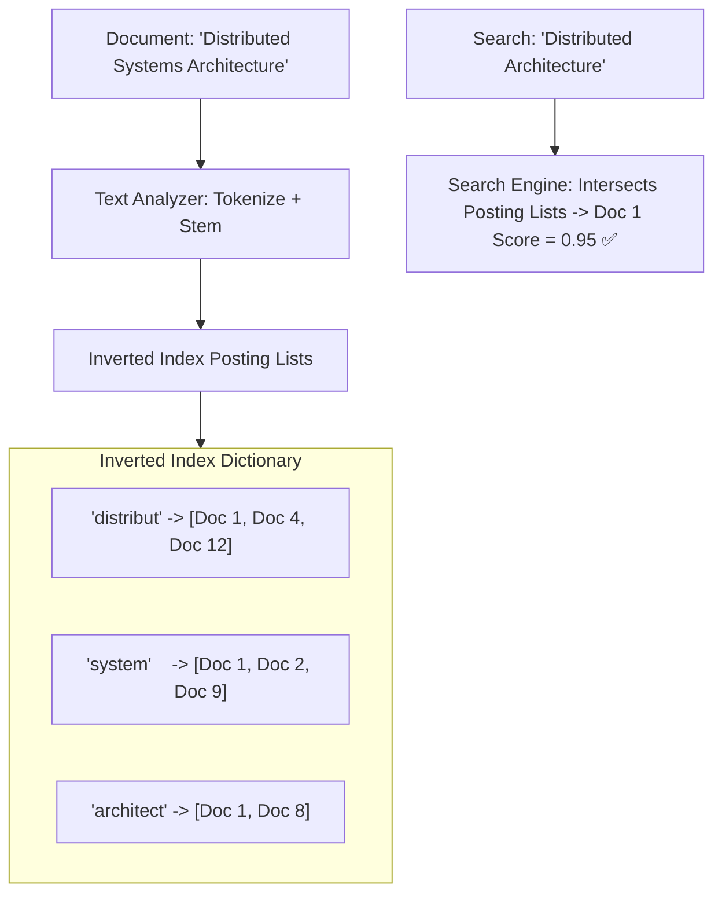

# Building Block 15: Distributed Search (Elasticsearch & Inverted Index)

> **Module**: `06-building-blocks`
> **Reusability Category**: Ingress / Storage / Messaging / Coordination / Reliability / Telemetry

---

## 1. Problem
Relational SQL databases perform full table scans when executing `LIKE '%keyword%'` queries, resulting in multi-second timeouts across millions of unstructured documents.

## 2. Requirements
- **Functional Requirements**: Provide robust, highly available, low-latency primitives for client and microservice workloads.
- **Non-Functional Requirements**:
  - **Availability**: $99.999\%$ uptime SLA (Five Nines).
  - **Latency**: $\text{p}99 < 5\text{ms}$ in-memory / $\text{p}99 < 50\text{ms}$ network hop.
  - **Scalability**: Linearly scale to millions of concurrent requests.

## 3. Why It Exists
Distributed search engines build an Inverted Index mapping every unique word/token to the exact list of document IDs containing it, enabling sub-50ms full-text fuzzy search and relevance scoring.

## 4. Mental Model
The index at the back of a textbook mapping every topic word to the exact page numbers where it appears.

## 5. Core Concepts
Inverted Index, Postings List, Tokenization, Stemming, Stop Words, TF-IDF / BM25 Relevance Scoring, Shards (Primary vs Replica), Segment Merging, Lucene.

## 6. Architecture

## 7. Request/Data Flow
1. Ingestion: Document text analyzed -> tokenized -> stemmed -> added to in-memory Lucene segment. 2. Query: Query parsed into tokens -> queries inverted index -> fetches postings lists -> calculates BM25 score -> returns top-K documents.

## 8. Data Model
Document Schema: `_id (STRING)`, `fields (JSON)`, Inverted Index Posting List: `Term -> Array of {DocID, TermFrequency, Positions}`.

## 9. API Design
RESTful Elasticsearch API: `POST /index/_search { query: { match: { 'content': 'distributed systems' } } }`.

## 10. Algorithms
BM25 (Best Matching 25) relevance ranking algorithm, Finite State Transducers (FST) for term dictionary compression.

## 11. Scaling
Index partitioned across $N$ primary shards; scale read QPS by adding replica shards to cluster nodes.

## 12. Partitioning
Document routing: `hash(doc_id) % num_primary_shards`.

## 13. Replication
Primary-Replica shard replication. Writes go to primary shard and replicate to replica shards before ACK.

## 14. Consistency
Near Real-Time (NRT) consistency. Search index refreshes segments every 1 second.

## 15. Failure Scenarios
Primary shard node crash (replica promoted), Unbalanced shard distribution, High-frequency write indexing bottlenecks.

## 16. Recovery
Automatic replica shard promotion via master node coordinator; asynchronous segment background merging.

## 17. Observability
Search Query Latency (p99 < 50ms), Indexing Rate (docs/sec), Heap Memory Usage, Segment Count, Garbage Collection pauses.

## 18. Security
Shield / OpenSearch security: TLS node-to-node encryption, field-level and document-level security access control.

## 19. Performance
Doc Values for fast aggregations, FST term dictionary held in RAM, OS file system cache for Lucene segments.

## 20. Trade-offs
Fast Full-Text Search (Inverted Index) vs Exact ACID Transactions (Relational B-Tree).

## 21. When to Use
Full-text search, e-commerce product search, log analytics (ELK), autocomplete fuzzy search.

## 22. When NOT to Use
Primary source of truth for transactional financial accounts (use PostgreSQL/Spanner instead).

## 23. Implementation Strategy
Deploy Elasticsearch / OpenSearch cluster with custom analyzers, index templates, and asynchronous Kafka ingestion pipeline.

## 24. Practical Exercise
Create an Elasticsearch index with BM25 similarity, index 10,000 product documents, and execute a multi-match fuzzy search query.

## 25. Interview Questions
1. How does an Inverted Index work? 2. What is the difference between BM25 and TF-IDF? 3. Why is Elasticsearch considered 'Near Real-Time' (NRT)?

## 26. Common Mistakes
Using Elasticsearch as the primary database without backing it up with an authoritative persistent database.

## 27. Quick Revision
Inverted Index = Words map to Document IDs -> BM25 relevance scoring -> Primary/Replica sharding for search scale.

## 28. Related Building Blocks
`BB-03` (RDBMS), `BB-12` (Kafka), `BB-16` (Logging Pipeline)

## 29. Related Case Studies
`CS-02` (Quora), `CS-04` (Yelp), `CS-12` (Search Autocomplete)
