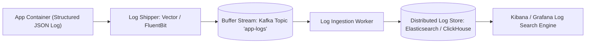

# Building Block 16: Distributed Logging Pipeline (ELK & Vector)

> **Module**: `06-building-blocks`
> **Reusability Category**: Ingress / Storage / Messaging / Coordination / Reliability / Telemetry

---

## 1. Problem
When microservices run across thousands of containers and virtual machines, logs written to local disks are fragmented, ephemeral, and impossible to search during an active production outage.

## 2. Requirements
- **Functional Requirements**: Provide robust, highly available, low-latency primitives for client and microservice workloads.
- **Non-Functional Requirements**:
  - **Availability**: $99.999\%$ uptime SLA (Five Nines).
  - **Latency**: $\text{p}99 < 5\text{ms}$ in-memory / $\text{p}99 < 50\text{ms}$ network hop.
  - **Scalability**: Linearly scale to millions of concurrent requests.

## 3. Why It Exists
A distributed logging pipeline collects, parses, buffers, and indexes structured logs (JSON) in near real-time, enabling centralized search, correlation by `trace_id`, and anomaly detection.

## 4. Mental Model
A citywide sewer and water network routing wastewater from every individual home into a centralized water treatment and testing facility.

## 5. Core Concepts
Log Shippers (Vector, FluentBit, Filebeat), Buffering Message Queue (Kafka), Log Transformation Engine (Logstash), Search & Storage Tier (Elasticsearch/ClickHouse), Visualization (Kibana/Grafana).

## 6. Architecture

## 7. Request/Data Flow
1. Application outputs structured JSON log line with `trace_id`. 2. FluentBit tail-reads log file. 3. Pushes batch to Kafka buffer topic. 4. Ingestion workers parse and enrich metadata. 5. Bulk index into daily Elasticsearch/ClickHouse index. 6. Searchable in Kibana.

## 8. Data Model
Log Document: `timestamp (ISO8601)`, `trace_id (UUID)`, `service_name (STRING)`, `level (INFO/ERROR)`, `message (TEXT)`, `context (MAP)`.

## 9. API Design
HTTP / OpenTelemetry Log Ingestion API: `POST /v1/logs` with compressed batch payload.

## 10. Algorithms
Index Lifecycle Management (ILM): Hot (SSD) -> Warm (HDD) -> Cold (S3) -> Deletion after 30 days.

## 11. Scaling
Log shippers use local disk buffers; Kafka buffers spike volume; Elasticsearch cluster scales horizontally via daily indices.

## 12. Partitioning
Indices partitioned by time and service: `logs-orderservice-YYYY-MM-DD`.

## 13. Replication
Elasticsearch 1 Primary + 1 Replica shard per index.

## 14. Consistency
Near Real-Time (NRT) consistency (logs visible in search within 1–5 seconds of emission).

## 15. Failure Scenarios
Log avalanche during critical outage (Kafka absorbs burst), Logstash parsing bottleneck, Storage disk full.

## 16. Recovery
Index Lifecycle Management automatically deletes oldest indices when disk reaches 85% capacity; Kafka prevents data loss.

## 17. Observability
Log ingestion throughput (MB/s), Indexing latency, Kafka log buffer lag, Dropped log lines rate.

## 18. Security
Masking / Redacting sensitive PII (credit cards, social security numbers, auth tokens) in log shipper before network transmission.

## 19. Performance
Asynchronous non-blocking log appenders (Logback AsyncAppender), bulk indexing in batches of 5MB.

## 20. Trade-offs
Full Text Indexing (Elasticsearch: expensive, fast ad-hoc search) vs Columnar Raw Append (ClickHouse / Grafana Loki: 10x cheaper, grep-style search).

## 21. When to Use
Centralized production log aggregation, root cause incident debugging, security compliance audits.

## 22. When NOT to Use
Real-time metric counter alerting (use Prometheus instead for numeric time-series).

## 23. Implementation Strategy
Configure Logback in Spring Boot with Logstash JSON encoder, publish to Kafka, and ingest into Elasticsearch with ILM.

## 24. Practical Exercise
Simulate a high-throughput microservice generating 50,000 JSON logs/sec through Kafka into OpenSearch and search by `trace_id`.

## 25. Interview Questions
1. Why is Kafka necessary as a buffer in a distributed logging pipeline? 2. Explain Index Lifecycle Management (ILM). 3. How do you redact PII from production logs at scale?

## 26. Common Mistakes
Using synchronous file logging inside request processing threads (causes total thread lock during disk I/O spikes).

## 27. Quick Revision
App JSON log -> Shipper -> Kafka Buffer -> Ingestion -> Elasticsearch / ClickHouse -> Kibana search by trace_id.

## 28. Related Building Blocks
`BB-07` (Monitoring), `BB-08` (Server Errors), `BB-12` (Kafka)

## 29. Related Case Studies
All Case Studies (`CS-01` to `CS-20`)
