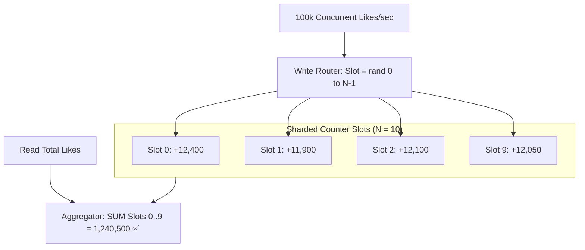

# Building Block 18: Sharded Counter (Distributed High-Write Counter)

> **Module**: `06-building-blocks`
> **Reusability Category**: Ingress / Storage / Messaging / Coordination / Reliability / Telemetry

---

## 1. Problem
A viral post (e.g. celebrity tweet with 10M likes) causes 100,000 concurrent write requests per second to hit a single database row, creating severe row lock contention, database crashes, and high latency.

## 2. Requirements
- **Functional Requirements**: Provide robust, highly available, low-latency primitives for client and microservice workloads.
- **Non-Functional Requirements**:
  - **Availability**: $99.999\%$ uptime SLA (Five Nines).
  - **Latency**: $\text{p}99 < 5\text{ms}$ in-memory / $\text{p}99 < 50\text{ms}$ network hop.
  - **Scalability**: Linearly scale to millions of concurrent requests.

## 3. Why It Exists
A single atomic counter integer in a database or Redis saturates a single CPU core/row lock. A Sharded Counter splits a single logical counter into $N$ independent physical counter slots, spreading writes across shards and aggregating them on read.

## 4. Mental Model
A bank branch opening 10 separate teller windows to collect deposit coins, then summing all 10 cash drawers at the end of the day.

## 5. Core Concepts
Counter Shards / Slots, Write Dispersion (`rand(0, N-1)`), Aggregation on Read, Approximate vs Exact Reads, Redis `INCRBY`, Atomic CAS.

## 6. Architecture

## 7. Request/Data Flow
1. Write: Client increments counter. 2. Client randomly picks slot $i \in [0, N-1]$. 3. Executes atomic increment on `counter:{entity_id}:slot:{i}`. 4. Read: Queries all $N$ slots, computes $\sum_{i=0}^{N-1} \text{slot}_i$, and returns total.

## 8. Data Model
Redis Key: `counter:{entity_id}:{slot_id} (INT64)` or SQL Table: `(entity_id, slot_id, count)` with composite primary key.

## 9. API Design
`POST /v1/counters/{entity_id}/increment`, `GET /v1/counters/{entity_id}`.

## 10. Algorithms
Randomized Write Dispersion, Parallel Scatter-Gather Read Aggregation, Periodic Background Aggregation Cache.

## 11. Scaling
Scale write throughput linearly by increasing slot count $N$. With $N=50$, a Redis cluster can handle $2,000,000\text{ increments/sec}$.

## 12. Partitioning
Partitioned across Redis shards using slot key `hash(entity_id + ':' + slot_id)`.

## 13. Replication
Standard Redis Cluster replication per shard.

## 14. Consistency
Eventual consistency for aggregated reads; atomic monotonic consistency per slot.

## 15. Failure Scenarios
Redis slot node crash (slot counter restored from AOF/RDB snapshot), Write skew during slot count changes.

## 16. Recovery
Background reconciliation job periodically sums all slots and flushes total to primary database.

## 17. Observability
Increment Rate (Ops/sec), Read Aggregation Latency, Shard distribution uniformity.

## 18. Security
Authentication tokens verifying client permission to increment counter.

## 19. Performance
Local in-memory batching before flushing increments to Redis slots (accumulate 100 likes in memory, then send single `INCRBY 100`).

## 20. Trade-offs
High Write Throughput (Large $N$ slots, fast writes, slower read aggregation) vs Low Read Overhead (Small $N$ slots).

## 21. When to Use
Viral post likes, video view counters, high-traffic poll voting, distributed analytics metrics.

## 22. When NOT to Use
Low-frequency counters ($< 100\text{ writes/sec}$) where a single Redis key or SQL row suffices.

## 23. Implementation Strategy
Implement a Sharded Counter in Java with Spring Boot and Redis, using a configurable slot count and cached aggregated reader.

## 24. Practical Exercise
Benchmark 50,000 concurrent increments across 16 threads in Java comparing a single Redis key (lock contention) vs a 20-slot Sharded Counter.

## 25. Interview Questions
1. How does a Sharded Counter eliminate row lock contention? 2. What is the trade-off between write throughput and read latency in sharded counters? 3. How do you dynamically adjust slot count?

## 26. Common Mistakes
Setting $N=1000$ for low-traffic items, causing massive read amplification when summing 1000 empty slots.

## 27. Quick Revision
Sharded Counter = Split single counter into $N$ slots -> Random write dispersion -> Parallel sum on read = Massive write scale.

## 28. Related Building Blocks
`BB-03` (RDBMS), `BB-04` (KV Store), `BB-10` (Distributed Cache)

## 29. Related Case Studies
`CS-01` (YouTube Video Views), `CS-06` (Twitter Tweet Likes), `CS-07` (Newsfeed)
