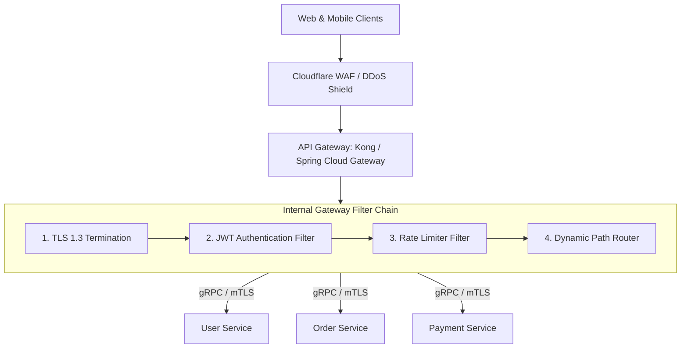

# Building Block 19: API Gateway & Reverse Proxy

> **Module**: `06-building-blocks`
> **Reusability Category**: Ingress / Storage / Messaging / Coordination / Reliability / Telemetry

---

## 1. Problem
Exposing dozens of internal microservices directly to external clients causes tight coupling, security vulnerabilities, repetitive authentication logic across every service, and inefficient network chatter.

## 2. Requirements
- **Functional Requirements**: Provide robust, highly available, low-latency primitives for client and microservice workloads.
- **Non-Functional Requirements**:
  - **Availability**: $99.999\%$ uptime SLA (Five Nines).
  - **Latency**: $\text{p}99 < 5\text{ms}$ in-memory / $\text{p}99 < 50\text{ms}$ network hop.
  - **Scalability**: Linearly scale to millions of concurrent requests.

## 3. Why It Exists
An API Gateway acts as the single entry point for all external clients, centralizing cross-cutting concerns: authentication, SSL termination, dynamic routing, rate limiting, request transformation, and observability.

## 4. Mental Model
The grand lobby of a corporate skyscraper where security guards check badges, receptionists direct visitors to the right floor, and elevators manage traffic flow.

## 5. Core Concepts
Reverse Proxy, Request Routing, Authentication & Token Validation (JWT), SSL/TLS Termination, Distributed Rate Limiting, Request/Response Transformation, Backend for Frontend (BFF), Circuit Breaking.

## 6. Architecture

## 7. Request/Data Flow
1. Client sends HTTPS request. 2. Gateway terminates TLS. 3. Validates JWT signature against public key. 4. Evaluates Rate Limiter filter in Redis. 5. Rewrites headers and paths. 6. Proxies request to upstream microservice over internal mTLS. 7. Streams response back.

## 8. Data Model
Routing Table: `Path Pattern (/api/v1/orders/**) -> Upstream Cluster (http://order-service-cluster)`.

## 9. API Design
Standard REST API Gateway routing configuration, gRPC JSON-transcoding.

## 10. Algorithms
Radix Tree / Prefix Trie for microsecond URL path matching, Non-blocking Netty event loops for high-concurrency connection handling.

## 11. Scaling
Stateless gateway instances scale horizontally behind an L4 Load Balancer (AWS ALB / NLB).

## 12. Partitioning
Routes partitioned by API domain or service namespace.

## 13. Replication
Stateless multi-AZ active-active deployment across all availability zones.

## 14. Consistency
Stateless proxy tier; routing configurations synchronized via etcd / Control Plane.

## 15. Failure Scenarios
Gateway node crash (ALB removes from pool), Upstream microservice outage (Circuit breaker trips to fallback), CPU saturation during TLS handshake storm.

## 16. Recovery
Automated horizontal pod autoscaling (HPA) based on CPU and connection count; circuit breakers fast-fail dead backends.

## 17. Observability
Inbound QPS, Latency overhead added by gateway (p99 < 5ms), HTTP 4xx/5xx error rates, Upstream connect timeouts.

## 18. Security
TLS 1.3, JWT verification, CORS policy enforcement, IP whitelisting/blacklisting, WAF integration against SQL injection and XSS.

## 19. Performance
Asynchronous non-blocking I/O (Spring WebFlux / Netty), Keep-Alive upstream connection pooling, response gzip/brotli compression.

## 20. Trade-offs
Centralized Gateway (Single entry, simple governance) vs Decentralized Service Mesh (Sidecar proxies, higher operational complexity).

## 21. When to Use
Microservice architectures, mobile/web client ingress, public developer APIs, multi-tenant SaaS platforms.

## 22. When NOT to Use
Monolithic single-tier applications with a single backend server.

## 23. Implementation Strategy
Build a reactive API Gateway using Spring Cloud Gateway (Java 21 / WebFlux) with custom JWT validation and Redis rate limiting filters.

## 24. Practical Exercise
Configure a Spring Cloud Gateway routing `/api/orders/**` to an upstream service, attach a JWT filter, and test unauthorized request rejection.

## 25. Interview Questions
1. Explain the difference between an API Gateway and a Load Balancer. 2. What is the Backend for Frontend (BFF) pattern? 3. How does non-blocking I/O enable an API Gateway to handle 50k concurrent connections?

## 26. Common Mistakes
Putting heavy business logic or database queries inside API Gateway filters (destroys throughput and violates separation of concerns).

## 27. Quick Revision
API Gateway = Single Ingress Entry Point -> Auth + Rate Limit + SSL + Routing -> Non-blocking Netty = 50k+ conns/node.

## 28. Related Building Blocks
`BB-02` (Load Balancer), `BB-13` (Rate Limiter), `BB-20` (Service Discovery)

## 29. Related Case Studies
All Case Studies (`CS-01` to `CS-20`)
