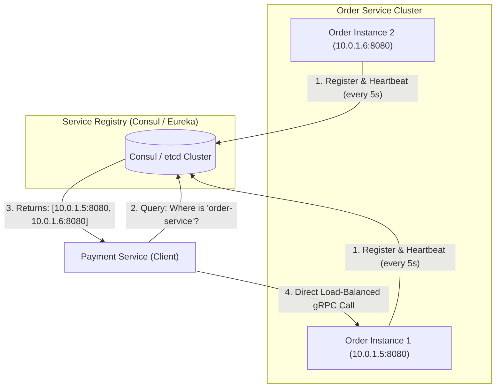

# Building Block 20: Service Discovery & Registry (Consul & Eureka)

> **Module**: `06-building-blocks`
> **Reusability Category**: Ingress / Storage / Messaging / Coordination / Reliability / Telemetry

---

## 1. Problem
In elastic cloud environments (Kubernetes/AWS), microservice container instances dynamically spin up, crash, autoscale, and change private IP addresses continuously, making hardcoded IP configurations impossible.

## 2. Requirements
- **Functional Requirements**: Provide robust, highly available, low-latency primitives for client and microservice workloads.
- **Non-Functional Requirements**:
  - **Availability**: $99.999\%$ uptime SLA (Five Nines).
  - **Latency**: $\text{p}99 < 5\text{ms}$ in-memory / $\text{p}99 < 50\text{ms}$ network hop.
  - **Scalability**: Linearly scale to millions of concurrent requests.

## 3. Why It Exists
A Service Registry acts as a dynamic distributed phonebook where service instances register their health and IP address on startup, and deregister on shutdown, allowing clients to discover healthy instances dynamically.

## 4. Mental Model
A live airport departures and arrivals board that continuously updates flight status and gate numbers in real time.

## 5. Core Concepts
Service Registry, Client-Side Discovery (Netflix Ribbon), Server-Side Discovery (AWS ALB / K8s CoreDNS), Heartbeats & TTL, Gossip Protocol (HashiCorp Consul), Health Check Probes.

## 6. Architecture

## 7. Request/Data Flow
1. Microservice boots up, registers its IP/port in Service Registry. 2. Sends periodic heartbeat every 5s. 3. Calling client queries registry for healthy instances (or caches list locally). 4. Client load balances directly across instances. 5. If heartbeat misses 3 times, registry removes instance.

## 8. Data Model
Service Instance Record: `service_id (STRING)`, `instance_id (UUID)`, `ip_address (STRING)`, `port (INT)`, `health_status (UP/DOWN)`, `metadata (MAP)`.

## 9. API Design
HTTP / gRPC Service Registry API: `POST /v1/agent/service/register`, `GET /v1/health/service/{service_name}`.

## 10. Algorithms
SWIM Gossip Protocol (Consul) for decentralized node failure detection, Raft consensus for leader state replication.

## 11. Scaling
Scale registry reads via local client caching and long-polling DNS/HTTP watches; scale writes via distributed Raft clusters.

## 12. Partitioning
Services partitioned by namespace and datacenter region.

## 13. Replication
Consul Raft cluster (3 or 5 server nodes) replicated across availability zones.

## 14. Consistency
Strong consistency within Raft leader (Consul); AP eventual consistency in Eureka.

## 15. Failure Scenarios
Network partition isolates worker instances (heartbeat failure causes false deregistration), Registry cluster outage.

## 16. Recovery
Client-side caching: clients continue using last-known healthy instance list even if the service registry goes completely offline.

## 17. Observability
Registered Instances Count, Heartbeat Churn Rate, Registry Lookup Latency (p99 < 2ms), Deregistration frequency.

## 18. Security
mTLS certificate generation via HashiCorp Vault integration, ACL tokens restricting service registration.

## 19. Performance
Client-side local caching with long-polling watch notifications eliminates 99.9% of registry network lookups.

## 20. Trade-offs
Client-Side Discovery (Direct point-to-point, zero hop, language dependent) vs Server-Side Discovery (Language agnostic, extra proxy hop).

## 21. When to Use
Microservice architectures, dynamic Kubernetes pod discovery, multi-datacenter service meshes (Istio/Consul).

## 22. When NOT to Use
Static monoliths with fixed static IP deployments.

## 23. Implementation Strategy
Integrate Spring Cloud Netflix Eureka or HashiCorp Consul in Spring Boot microservices with automated health probes.

## 24. Practical Exercise
Deploy 3 Spring Boot services with Consul in Docker Compose, kill one instance, and observe automatic deregistration within 10 seconds.

## 25. Interview Questions
1. Explain Client-Side Discovery vs Server-Side Discovery. 2. How does the SWIM Gossip protocol detect node failures? 3. What happens to microservice communication if the Service Registry crashes?

## 26. Common Mistakes
Failing to implement local instance caching on client services, causing total cascading failure when the registry restarts.

## 27. Quick Revision
Service Discovery = Dynamic IP Registry -> Heartbeats evict dead nodes -> Client caches locally + Load balances directly.

## 28. Related Building Blocks
`BB-02` (Load Balancer), `BB-19` (API Gateway), `BB-22` (Configuration Service)

## 29. Related Case Studies
All Case Studies (`CS-01` to `CS-20`)
