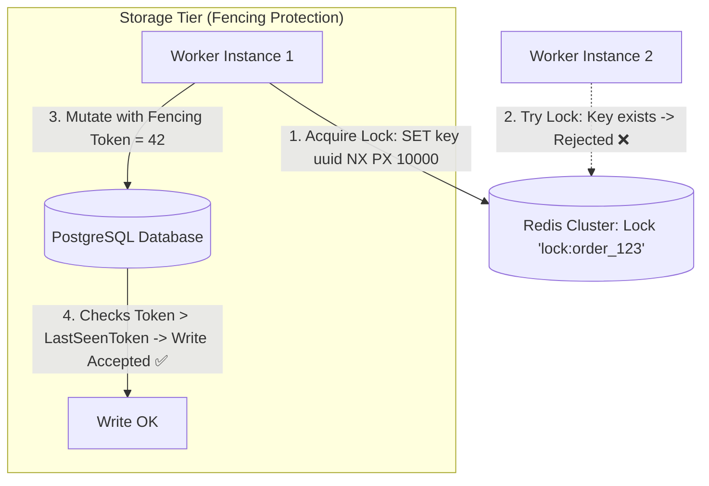

# Building Block 21: Distributed Lock Manager (Redlock & Zookeeper)

> **Module**: `06-building-blocks`
> **Reusability Category**: Ingress / Storage / Messaging / Coordination / Reliability / Telemetry

---

## 1. Problem
When multiple independent microservice instances perform concurrent operations on shared resources (e.g. inventory checkout, leader election, billing a customer once), race conditions cause severe double-allocation and data corruption.

## 2. Requirements
- **Functional Requirements**: Provide robust, highly available, low-latency primitives for client and microservice workloads.
- **Non-Functional Requirements**:
  - **Availability**: $99.999\%$ uptime SLA (Five Nines).
  - **Latency**: $\text{p}99 < 5\text{ms}$ in-memory / $\text{p}99 < 50\text{ms}$ network hop.
  - **Scalability**: Linearly scale to millions of concurrent requests.

## 3. Why It Exists
Local in-memory locks (like Java `synchronized` or `ReentrantLock`) only synchronize threads within a single JVM. A Distributed Lock coordinates exclusive mutual exclusion across a cluster of separate physical servers.

## 4. Mental Model
A single physical golden key to a room; whoever holds the key has exclusive access to the room until they return it or their timer runs out.

## 5. Core Concepts
Mutual Exclusion, Deadlock Freedom, Fault Tolerance, Time-To-Live (TTL / Lease), Fencing Tokens, Redlock Algorithm, Zookeeper Ephemeral Sequential Nodes, Lock Auto-Renewal.

## 6. Architecture

## 7. Request/Data Flow
1. Client generates unique UUID token. 2. Attempts atomic write in Redis `SET key token NX PX 10000` (or creates Zookeeper ephemeral node). 3. If acquired, returns Fencing Token. 4. Starts background lease renewal thread. 5. Performs critical section. 6. Releases lock via atomic Lua script checking matching UUID.

## 8. Data Model
Redis Key: `lock:{resource_id} -> {uuid_token}` with expiration TTL. Zookeeper ZNode: `/locks/{resource_id}/lock-000000001`.

## 9. API Design
`AcquireLock(resource, ttl) -> FencingToken`, `ReleaseLock(resource, token)`, `RenewLock(resource, token, ttl)`.

## 10. Algorithms
Redlock Algorithm (multi-node quorum acquisition across $N$ independent Redis masters), Monotonic Fencing Token generation.

## 11. Scaling
Scale horizontally by partitioning lock keys across independent Redis shards based on `hash(resource_id)`.

## 12. Partitioning
Partitioned by Resource ID hash across Redis cluster nodes.

## 13. Replication
Zookeeper/etcd Raft consensus replication; Redlock across 5 independent Redis master instances.

## 14. Consistency
Linearizable consistency required for lock mutual exclusion.

## 15. Failure Scenarios
Long GC pause / network freeze causes lock TTL to expire while worker is still processing (Fencing Token prevents stale write), Redis node crash.

## 16. Recovery
Storage engine validates monotonically increasing Fencing Token, rejecting writes from zombie workers whose lock expired.

## 17. Observability
Lock Acquisition Latency (p99 < 2ms), Lock Contention Rate, Lock Expiration / Timeout Rate, Failed Lock Attempts.

## 18. Security
Randomized secret UUID tokens to prevent unauthorized lock release by other workers.

## 19. Performance
Atomic Redis Lua scripts for lock release; non-blocking asynchronous lock polling via Redis Pub/Sub notification.

## 20. Trade-offs
High Performance (Redis Redlock: AP-leaning, sub-millisecond) vs High Correctness (Zookeeper/etcd: CP, Raft consensus, strict linearizability).

## 21. When to Use
Preventing duplicate scheduled job executions, exclusive inventory reservation, leader election, payment mutation synchronization.

## 22. When NOT to Use
Fine-grained optimistic concurrency control where database version numbers (`UPDATE ... WHERE version = 1`) suffice.

## 23. Implementation Strategy
Implement Redlock or Zookeeper Curator distributed lock in Java 21 with automatic background lease renewal and monotonic fencing tokens.

## 24. Practical Exercise
Write a multithreaded Spring Boot test simulating 20 concurrent threads attempting to deduct the same inventory item using Redlock, verifying exactly one deduction.

## 25. Interview Questions
1. Explain why Fencing Tokens are mandatory to prevent split-brain mutations in distributed locks. 2. How does the Redlock algorithm work across 5 Redis nodes? 3. What happens if a Java thread encounters a 15-second Stop-The-World GC pause while holding a lock?

## 26. Common Mistakes
Releasing a lock using a plain `DEL key` command without verifying that the lock still belongs to the calling worker (deletes another worker's newly acquired lock!).

## 27. Quick Revision
Distributed Lock = Mutual exclusion across machines -> TTL prevents deadlocks -> Fencing tokens protect against GC pauses.

## 28. Related Building Blocks
`BB-03` (RDBMS), `BB-10` (Distributed Cache), `BB-31` (Leader Election)

## 29. Related Case Studies
`CS-14` (CI/CD Deployment), `CS-15` (Payment Gateway), `CS-16` (Online Judge)
