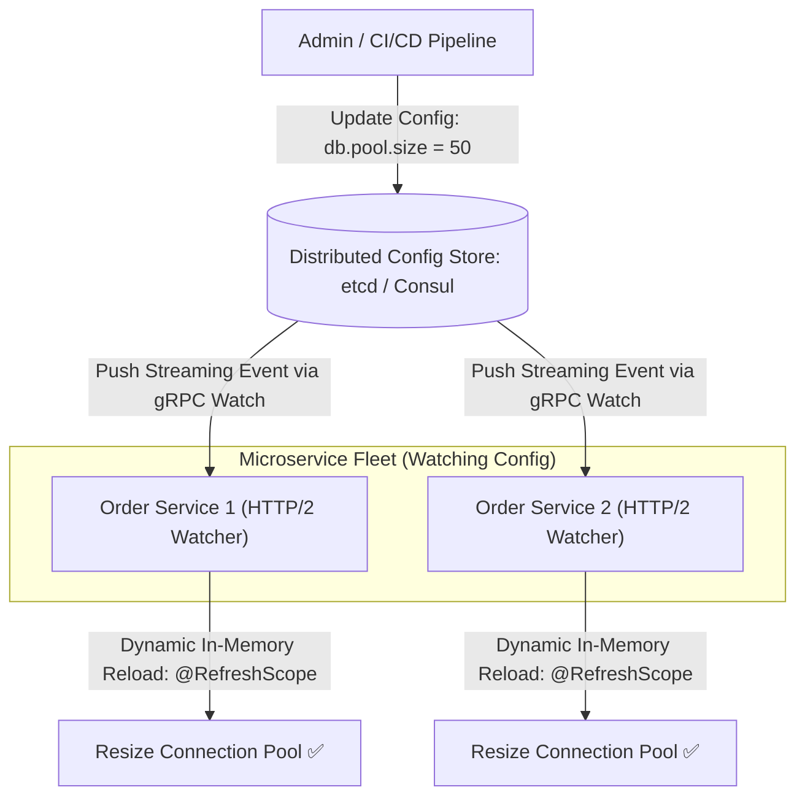

# Building Block 22: Distributed Configuration Service (etcd & Consul)

> **Module**: `06-building-blocks`
> **Reusability Category**: Ingress / Storage / Messaging / Coordination / Reliability / Telemetry

---

## 1. Problem
Hardcoding configuration properties (database connection strings, feature flags, rate limits) inside application code requires full re-compilation and redeployment across thousands of servers just to change a single configuration value.

## 2. Requirements
- **Functional Requirements**: Provide robust, highly available, low-latency primitives for client and microservice workloads.
- **Non-Functional Requirements**:
  - **Availability**: $99.999\%$ uptime SLA (Five Nines).
  - **Latency**: $\text{p}99 < 5\text{ms}$ in-memory / $\text{p}99 < 50\text{ms}$ network hop.
  - **Scalability**: Linearly scale to millions of concurrent requests.

## 3. Why It Exists
A Distributed Configuration Service provides a centralized, strongly consistent, dynamic key-value store where microservices can watch for real-time property changes without restarts.

## 4. Mental Model
A central loudspeaker broadcast system in a train station instantly notifying all platforms of track updates.

## 5. Core Concepts
Hierarchical Key-Value Trees, Watchers & Long-Polling, Dynamic Property Reloading, etcd / Consul, Spring Cloud Config, Raft Consensus, Encryption of Secrets.

## 6. Architecture

## 7. Request/Data Flow
1. Microservice boots up, reads config hierarchy `/config/orderservice/prod/`. 2. Opens long-lived gRPC Watch stream to etcd. 3. Operator updates property in etcd. 4. etcd commits via Raft and streams update event to all watching instances. 5. Instances reload in-memory state dynamically (`@RefreshScope`).

## 8. Data Model
Hierarchical Key-Value: `/app/{service_name}/{environment}/{property_name} -> Value (STRING/JSON)`.

## 9. API Design
`GET /v3/kv/range`, `PUT /v3/kv/put`, `POST /v3/watch` (gRPC streaming bidirectional watch API).

## 10. Algorithms
Raft Consensus for configuration durability and linearizability, Radix Tree index for fast prefix key lookups.

## 11. Scaling
Scale reads by allowing follower replicas to serve linearizable read queries; scale watchers via multiplexed HTTP/2 streams.

## 12. Partitioning
Namespaced partitioning by service domain or environment.

## 13. Replication
3 or 5 node Raft consensus cluster replicated across independent Availability Zones.

## 14. Consistency
Strict Linearizable Consistency (CP in CAP theorem).

## 15. Failure Scenarios
Config service cluster outage (microservices continue running on local cached config), Malformed configuration pushed globally.

## 16. Recovery
Local fallback in-memory cache on every microservice node; schema validation before committing configuration mutations.

## 17. Observability
Active Watcher count, Watch notification latency (p99 < 5ms), Config mutation rate, Raft commit latency.

## 18. Security
Role-Based Access Control (RBAC), Secret encryption at rest with KMS, TLS certificate authentication.

## 19. Performance
HTTP/2 multiplexed streaming watchers eliminate continuous polling overhead.

## 20. Trade-offs
Strong Consistency (etcd/Consul: Raft-backed, strict order) vs High Scale Eventual Consistency (Spring Cloud Config + Git).

## 21. When to Use
Dynamic database connection pool sizing, circuit breaker threshold adjustments, dynamic feature toggle parameters.

## 22. When NOT to Use
High-frequency transactional state storage (use Redis/Cassandra instead).

## 23. Implementation Strategy
Deploy etcd or Spring Cloud Config with Spring Boot `@RefreshScope` and automated Git webhook reload.

## 24. Practical Exercise
Set up a Spring Boot service watching a configuration property in Consul, mutate the value via REST API, and verify dynamic reload without restarting the JVM.

## 25. Interview Questions
1. How does etcd's gRPC Watch mechanism work under the hood? 2. What happens to running microservices if the configuration service crashes? 3. How do you prevent invalid config values from crashing production clusters?

## 26. Common Mistakes
Restarting entire container clusters to apply a minor rate limit change instead of using dynamic config watchers.

## 27. Quick Revision
Config Service = Centralized dynamic properties -> Raft consistency -> gRPC Watch streams updates instantly -> Zero-downtime reconfiguration.

## 28. Related Building Blocks
`BB-20` (Service Discovery), `BB-26` (Feature Flags), `BB-31` (Leader Election)

## 29. Related Case Studies
All Case Studies (`CS-01` to `CS-20`)
