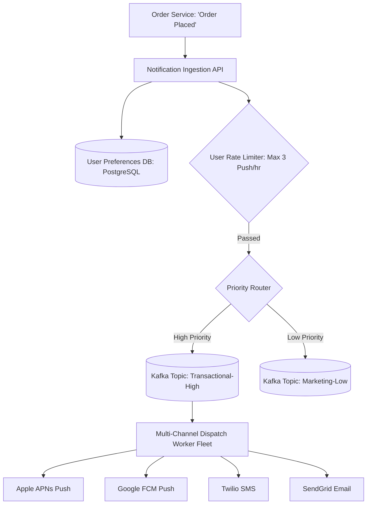

# Building Block 23: Multi-Channel Notification Service

> **Module**: `06-building-blocks`
> **Reusability Category**: Ingress / Storage / Messaging / Coordination / Reliability / Telemetry

---

## 1. Problem
Modern platforms must dispatch billions of push notifications (APNS/FCM), transactional SMS (Twilio), and marketing emails (SendGrid) with user preference filtering, rate limiting, and third-party provider failovers.

## 2. Requirements
- **Functional Requirements**: Provide robust, highly available, low-latency primitives for client and microservice workloads.
- **Non-Functional Requirements**:
  - **Availability**: $99.999\%$ uptime SLA (Five Nines).
  - **Latency**: $\text{p}99 < 5\text{ms}$ in-memory / $\text{p}99 < 50\text{ms}$ network hop.
  - **Scalability**: Linearly scale to millions of concurrent requests.

## 3. Why It Exists
Coupling individual business microservices to external third-party notification APIs causes severe latency spikes, vendor lock-in, and spam violations. A centralized notification engine manages templates, prioritization, user rate limits, and fallback routing.

## 4. Mental Model
A central logistics post office that takes raw parcels, formats them according to shipping rules (Air, Sea, Road), and automatically switches couriers if one carrier strikes.

## 5. Core Concepts
Notification Fan-Out, User Notification Preferences, Priority Queues (Transactional vs Promotional), Third-Party Gateway Adaptors, Deduplication & Anti-Spam Throttling, Delivery Status Webhooks.

## 6. Architecture

## 7. Request/Data Flow
1. Event received: `POST /v1/notifications`. 2. Checks User Notification Preferences (Opt-in/out). 3. Applies user-level rate limiting. 4. Enriches template with dynamic variables. 5. Pushes to prioritized Kafka topic. 6. Worker dispatches to third-party API. 7. Webhook captures delivery receipt.

## 8. Data Model
Notification Record: `notification_id (UUID)`, `user_id (STRING)`, `channel (PUSH/SMS/EMAIL)`, `template_id (STRING)`, `status (QUEUED/SENT/DELIVERED/FAILED)`, `payload (JSON)`.

## 9. API Design
`POST /v1/notifications/send { user_id, channel, template_id, params }`, `GET /v1/notifications/{id}/status`.

## 10. Algorithms
Token Bucket rate limiting per user, Exponential Backoff with Multi-Vendor Circuit Breaking.

## 11. Scaling
Scale ingestion via API Gateway + Kafka; scale delivery workers horizontally to absorb 100k messages/sec.

## 12. Partitioning
Kafka topics partitioned by `hash(user_id)` to maintain user message ordering.

## 13. Replication
Notification history stored in sharded document store with 3x replication.

## 14. Consistency
At-least-once delivery; idempotent client tokens prevent duplicate push alerts.

## 15. Failure Scenarios
Third-party vendor outage (e.g. Twilio down -> Circuit breaker routes SMS to Sinch fallback), User unsubscribe race conditions.

## 16. Recovery
Automated vendor failover routing rules; Dead-Letter Queues for invalid phone numbers and expired push tokens.

## 17. Observability
Delivery Success Rate (Target > 99%), Dispatch Latency (p99 < 3s for OTP), Vendor Error Rates, Queue Depth.

## 18. Security
Encrypted PII payloads in transit and at rest, Opt-out compliance with GDPR and CAN-SPAM regulations.

## 19. Performance
Bulk dispatch batching for promotional marketing campaigns; persistent HTTP/2 connection pooling to Apple APNs.

## 20. Trade-offs
Transactional Immediate Priority (OTP, Payment SMS: sub-second) vs Marketing Batching (Bulk Email: background throughput).

## 21. When to Use
E-commerce order updates, two-factor authentication OTP codes, social media friend activity alerts.

## 22. When NOT to Use
Synchronous inter-service RPC communication (use gRPC instead).

## 23. Implementation Strategy
Build a Spring Boot notification service integrating Kafka topics for high and low priorities with Spring Cloud CircuitBreaker for vendor fallback.

## 24. Practical Exercise
Simulate a Twilio SMS gateway failure in Java, verifying that the Circuit Breaker trips and automatically reroutes OTPs to a secondary provider within 500ms.

## 25. Interview Questions
1. How do you ensure high-priority transactional OTPs are not delayed by bulk marketing email campaigns? 2. How does multi-vendor fallback routing work during a major carrier outage? 3. How do you prevent notification spamming of individual users?

## 26. Common Mistakes
Sending bulk promotional marketing messages through the same single Kafka topic used for critical 2FA authentication SMS.

## 27. Quick Revision
Notification Service = Ingestion -> User Prefs + Rate Limit -> Priority Queues -> Multi-Channel Dispatchers with Vendor Fallbacks.

## 28. Related Building Blocks
`BB-11` (Queue), `BB-12` (Kafka), `BB-13` (Rate Limiter)

## 29. Related Case Studies
`CS-06` (Twitter / X), `CS-11` (WhatsApp), `CS-15` (Payment Gateway)
