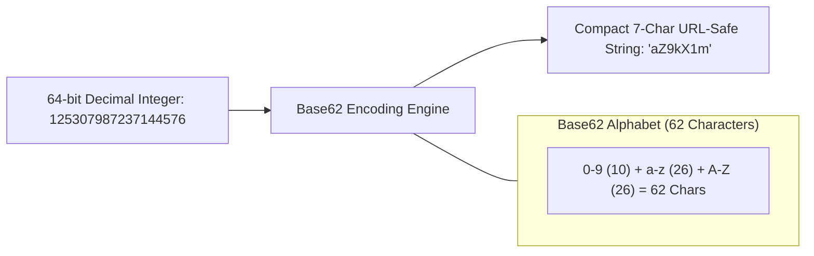

# Building Block 24: Unique ID Generator (Base62 & UUIDv7)

> **Module**: `06-building-blocks`
> **Reusability Category**: Ingress / Storage / Messaging / Coordination / Reliability / Telemetry

---

## 1. Problem
Distributed systems require globally unique, URL-safe, compact, and index-friendly identifiers for URL shorteners, tracking links, document IDs, and API entity handles.

## 2. Requirements
- **Functional Requirements**: Provide robust, highly available, low-latency primitives for client and microservice workloads.
- **Non-Functional Requirements**:
  - **Availability**: $99.999\%$ uptime SLA (Five Nines).
  - **Latency**: $\text{p}99 < 5\text{ms}$ in-memory / $\text{p}99 < 50\text{ms}$ network hop.
  - **Scalability**: Linearly scale to millions of concurrent requests.

## 3. Why It Exists
Standard auto-increment integers expose business metrics to scrapers (e.g. sequential order IDs reveal daily volume). UUIDv4 is 36 characters long and non-monotonic. Unique ID Generators produce compact, collision-free, URL-friendly identifiers.

## 4. Mental Model
A custom cryptographic license plate generator producing compact, unguessable, ordered serial codes.

## 5. Core Concepts
Base62 Encoding (`[0-9][a-z][A-Z]`), URL Safety, Base58 (Bitcoin address format without ambiguous chars), UUIDv7 (Unix timestamp + random bits), Hash-based vs Counter-based IDs.

## 6. Architecture

## 7. Request/Data Flow
1. System obtains unique 64-bit integer from Distributed Sequencer (Snowflake / Ticket Server). 2. Converts base-10 integer to Base62 string using division and modulo 62. 3. Appends/pads to fixed length (e.g. 7 characters = $62^7 \approx 3.52\text{ Trillion}$ combinations). 4. Returns compact string to client.

## 8. Data Model
Representation: 7-character alphanumeric string `[0-9a-zA-Z]{7}`.

## 9. API Design
`Encode(int64_id) -> string`, `Decode(string) -> int64_id`.

## 10. Algorithms
Base62 Encoding Algorithm: Repeated division by 62: `rem = num % 62`, `num = num / 62`, map remainder to alphabet.

## 11. Scaling
Pure in-memory algorithmic conversion ($> 50,000,000\text{ operations/sec per CPU core}$).

## 12. Partitioning
Stateless library function; zero database partitioning required.

## 13. Replication
Stateless local execution on all application microservice instances.

## 14. Consistency
Deterministic 1-to-1 bijective mapping between integers and Base62 strings.

## 15. Failure Scenarios
Collision impossible when backed by a unique 64-bit sequencer (Snowflake).

## 16. Recovery
Zero state recovery needed; purely deterministic mathematical function.

## 17. Observability
ID generation rate (Ops/sec), Encoding latency (< 100 nanoseconds).

## 18. Security
Randomized salt or Feistel cipher obfuscation to prevent sequential scraping attacks.

## 19. Performance
Pre-computed character lookup tables and bitwise division operations.

## 20. Trade-offs
Compact 7-char Base62 (Requires unique integer sequencer) vs Self-Contained 128-bit UUIDv7 (Timestamp + Random, longer string).

## 21. When to Use
URL shorteners (TinyURL), shortened share links, referral codes, public object handles.

## 22. When NOT to Use
Cryptographic secret tokens or session keys (use CSPRNG 256-bit keys instead).

## 23. Implementation Strategy
Implement an optimized, thread-safe Java Base62 encoder and decoder supporting `long` and `BigInteger`.

## 24. Practical Exercise
Write a Java benchmark encoding 10,000,000 unique integers into Base62 strings and decode them back, verifying 100% equality and zero collisions.

## 25. Interview Questions
1. Why is Base62 preferred over Base64 for URL shorteners? 2. How many unique URLs can be represented with a 7-character Base62 string? 3. What is UUIDv7 and why is it better for database indexing than UUIDv4?

## 26. Common Mistakes
Using Base64 encoding with `+` and `/` characters in web URLs without URL-encoding (breaks HTTP query routing).

## 27. Quick Revision
Base62 = 62 characters ([0-9a-zA-Z]) -> $62^7 = 3.52$ Trillion unique IDs -> Bijective integer mapping = URL safe.

## 28. Related Building Blocks
`BB-06` (Snowflake Sequencer), `BB-04` (KV Store)

## 29. Related Case Studies
`CS-09` (TinyURL / URL Shortener), `CS-06` (Twitter / X)
