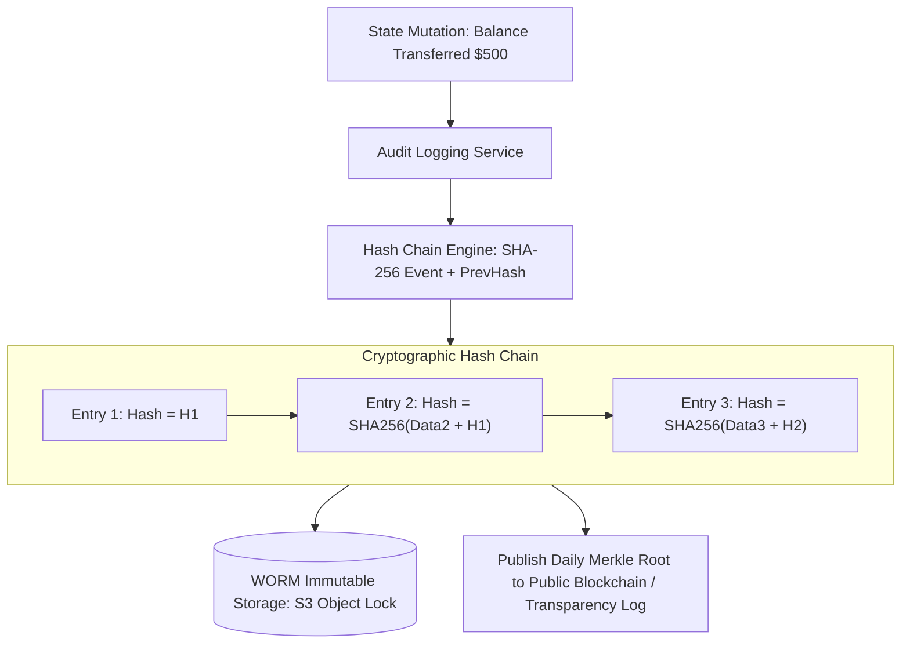

# Building Block 30: Immutable Audit Log (Append-Only & Merkle Tree)

> **Module**: `06-building-blocks`
> **Reusability Category**: Ingress / Storage / Messaging / Coordination / Reliability / Telemetry

---

## 1. Problem
Financial, healthcare, and enterprise security platforms require a tamper-evident, unalterable record of all state mutations (who did what, when, and from where) that satisfies strict regulatory compliance (SOC2, HIPAA, PCI-DSS).

## 2. Requirements
- **Functional Requirements**: Provide robust, highly available, low-latency primitives for client and microservice workloads.
- **Non-Functional Requirements**:
  - **Availability**: $99.999\%$ uptime SLA (Five Nines).
  - **Latency**: $\text{p}99 < 5\text{ms}$ in-memory / $\text{p}99 < 50\text{ms}$ network hop.
  - **Scalability**: Linearly scale to millions of concurrent requests.

## 3. Why It Exists
Traditional database tables allow `UPDATE` and `DELETE` queries; a malicious insider or compromised admin account can erase or alter historical audit rows. An Immutable Audit Log uses append-only storage and cryptographic Merkle tree hash chains to guarantee tamper evidence.

## 4. Mental Model
A sealed judicial notary ledger where every new entry is permanently signed with wax, stamped, and linked with the cryptographic seal of the previous page.

## 5. Core Concepts
Append-Only Log, Cryptographic Hash Chains (SHA-256), Merkle Trees, WORM Storage (Write Once, Read Many), Digital Signatures, Tamper-Evident Verification.

## 6. Architecture

## 7. Request/Data Flow
1. Business event occurs. 2. Audit service constructs audit payload. 3. Fetches hash of previous audit record. 4. Computes `CurrentHash = SHA256(Payload + PrevHash)`. 5. Appends record to WORM storage (S3 Object Lock). 6. Emits daily Merkle root hash to immutable transparency ledger.

## 8. Data Model
Audit Record: `record_id (INT64)`, `timestamp (ISO8601)`, `actor_id (STRING)`, `action (TRANSFER_FUNDS)`, `resource_id (STRING)`, `payload (JSON)`, `prev_hash (HEX)`, `hash (HEX)`, `signature (HEX)`.

## 9. API Design
`POST /v1/audit/log`, `GET /v1/audit/verify?start_id=1&end_id=1000`.

## 10. Algorithms
SHA-256 Cryptographic Hash Chaining, Merkle Tree Root Calculation, Digital Signature Verification (Ed25519).

## 11. Scaling
Scale write ingestion via Kafka; scale long-term storage infinitely on Amazon S3 with Object Lock in Compliance Mode.

## 12. Partitioning
Partitioned by Time Bucket and Tenant ID (`/audit/tenant_id/YYYY-MM/`).

## 13. Replication
Multi-Region WORM object storage replication with strict delete protections.

## 14. Consistency
Strict Append-Only Immutability; zero mutation or deletion allowed.

## 15. Failure Scenarios
Storage tampering attempt (instantly detected because computed hash chain breaks), Missing record in sequence.

## 16. Recovery
Verification auditor scans hash chain from genesis block; any altered byte breaks all subsequent hashes in the chain.

## 17. Observability
Audit Log Ingestion Rate, Verification Audit Duration, Hash Chain Integrity Status (Pass/Fail).

## 18. Security
S3 Object Lock (Compliance Mode: even root AWS account cannot delete objects), Asymmetric digital signing of every audit block.

## 19. Performance
Batch hashing of audit records into hourly Merkle tree roots to minimize verification tree depth.

## 20. Trade-offs
Tamper-Evident Cryptographic Chain (Guaranteed audit integrity, append-only overhead) vs Plain Relational Log Table (Mutable, vulnerable to tampering).

## 21. When to Use
Financial money transfers, medical record access logs, security credential changes, administrative permission grants.

## 22. When NOT to Use
High-frequency ephemeral debugging logs (use ELK/Vector instead).

## 23. Implementation Strategy
Implement a Java Immutable Audit Logger with SHA-256 hash chaining and verify tamper-detection upon modifying an intermediate record.

## 24. Practical Exercise
Write a Java test constructing a 1,000-entry cryptographic audit hash chain, maliciously tamper with entry #450, and assert that the verification audit detects the corruption.

## 25. Interview Questions
1. How does a cryptographic hash chain guarantee tamper evidence? 2. What is Amazon S3 Object Lock Compliance Mode? 3. How do Merkle Trees allow efficient verification of individual audit entries?

## 26. Common Mistakes
Storing audit logs in a standard SQL database where an admin with `DROP` or `UPDATE` privileges can alter historical records.

## 27. Quick Revision
Audit Log = Append-only WORM storage -> SHA-256 hash linked to previous block -> Cryptographic proof of zero tampering.

## 28. Related Building Blocks
`BB-03` (RDBMS), `BB-14` (Blob Store / S3), `BB-36` (Payment Idempotency)

## 29. Related Case Studies
`CS-15` (Payment Gateway / Stripe), `CS-14` (CI/CD Deployment)
