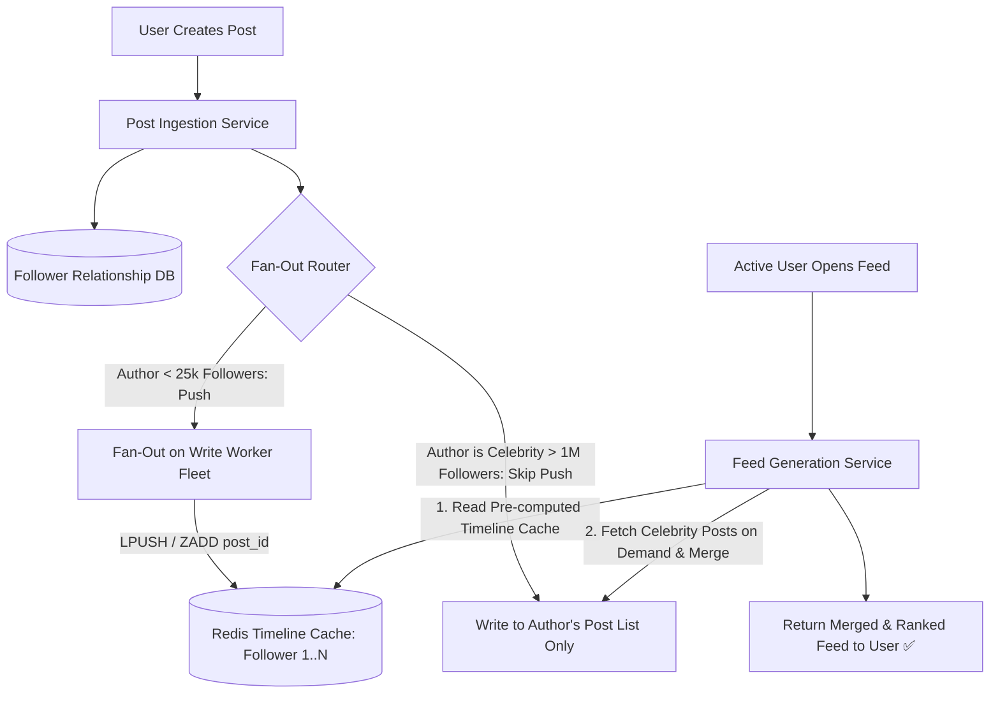

# Building Block 33: Timeline & Feed Generation Engine

> **Module**: `06-building-blocks`
> **Reusability Category**: Ingress / Storage / Messaging / Coordination / Reliability / Telemetry / AI Infrastructure

---

## 1. Problem
Social network users expect real-time, reverse-chronological or ranked feeds of posts from hundreds of followed accounts to load in $< 50\text{ms}$, while millions of new posts are created per minute.

## 2. Requirements
- **Functional Requirements**: Provide robust, highly available, low-latency primitives for client and microservice workloads.
- **Non-Functional Requirements**:
  - **Availability**: $99.999\%$ uptime SLA (Five Nines).
  - **Latency**: $\text{p}99 < 5\text{ms}$ in-memory / $\text{p}99 < 50\text{ms}$ network hop.
  - **Scalability**: Linearly scale to millions of concurrent requests.

## 3. Why It Exists
Querying the database for all friends' posts and sorting on every feed refresh causes massive multi-table join bottlenecks. A Timeline Generator pre-computes and caches personalized feed lists for active users.

## 4. Mental Model
A personalized digital newspaper printing press delivering fresh edition feeds into each subscriber's personal mailbox.

## 5. Core Concepts
Fan-Out on Write (Push Model), Fan-Out on Read (Pull Model), Hybrid Fan-Out (Celebrity Optimization), Timeline Cache (Redis List / ZSET), Activity Graphs, Feed Ranking Algorithms.

## 6. Architecture

## 7. Request/Data Flow
1. Normal user posts: Fan-out worker pushes post ID to all followers' Redis timeline lists (`ZADD timeline:user_id timestamp post_id`). 2. Celebrity posts: Writes only to celebrity's personal post list (skips 80M follower fan-out). 3. Reader opens feed: Reads pre-computed timeline from Redis, merges celebrity posts on-demand, fetches post metadata from cache, and returns feed.

## 8. Data Model
Timeline Cache: `timeline:{user_id} -> Redis Sorted Set of {score: timestamp, member: post_id}` capped at 800 items.

## 9. API Design
`GET /v1/feed?limit=20&cursor=1672531200`, `POST /v1/posts`.

## 10. Algorithms
Hybrid Fan-Out Algorithm, K-Way Merge of sorted timeline arrays, Reverse-Chronological Cursor Pagination.

## 11. Scaling
Scale fan-out via Kafka topic partitions and worker fleets; scale timeline reads via Redis Cluster.

## 12. Partitioning
Timelines partitioned by `hash(user_id)` across Redis cluster nodes.

## 13. Replication
Redis Cluster primary-standby replication; persistent posts stored in Cassandra / PostgreSQL.

## 14. Consistency
Eventual consistency; follower timelines update within 1–2 seconds of post creation.

## 15. Failure Scenarios
Celebrity posting (Push model would crash Redis with 80M writes -> Hybrid model prevents this), Inactive user cache bloat.

## 16. Recovery
Only maintain timeline caches in Redis for active users (DAU logged in within last 7 days; inactive user feeds generated on-demand).

## 17. Observability
Fan-out Latency (p99 < 1s), Feed Render Latency (p99 < 30ms), Redis Memory Usage, Inactive User Cache Eviction Rate.

## 18. Security
Post visibility filters (blocked users, private accounts) applied during feed generation.

## 19. Performance
Storing only 64-bit `post_id`s in Redis timeline caches (not full post JSON), fetching full metadata via multi-key `MGET` from post cache.

## 20. Trade-offs
Fan-Out on Write (Fast reads $\mathcal{O}(1)$, heavy write amplification) vs Fan-Out on Read (Fast writes $\mathcal{O}(1)$, slow $\mathcal{O}(K \log N)$ multi-table read joins).

## 21. When to Use
Twitter/X home timeline, Facebook Newsfeed, Instagram feed, LinkedIn activity stream.

## 22. When NOT to Use
Low-scale personal blogs with few followers where simple SQL `ORDER BY created_at DESC` suffices.

## 23. Implementation Strategy
Implement a hybrid Feed Generation engine in Java using Spring Boot and Redis Sorted Sets (`ZSET`) with an asynchronous Kafka fan-out worker.

## 24. Practical Exercise
Write a Java test simulating a normal user post (fanning out to 1,000 followers) vs a celebrity post (skipping fan-out and merging on read), asserting sub-20ms feed retrieval.

## 25. Interview Questions
1. Explain the difference between Fan-Out on Write (Push) and Fan-Out on Read (Pull). 2. How does the Hybrid Fan-Out model solve the 'Celebrity / Justin Bieber Problem'? 3. Why do we store only post IDs in timeline caches rather than full post objects?

## 26. Common Mistakes
Attempting Fan-Out on Write for users with 80 million followers, saturating the message queue and causing a 30-minute system-wide lag.

## 27. Quick Revision
Timeline Generator = Push for regular users + Pull on-demand for celebrities -> Redis Sorted Set stores post IDs -> Sub-30ms feed rendering.

## 28. Related Building Blocks
`BB-10` (Distributed Cache), `BB-12` (Kafka), `BB-18` (Sharded Counter)

## 29. Related Case Studies
`CS-06` (Twitter / X), `CS-07` (Newsfeed), `CS-08` (Instagram)
