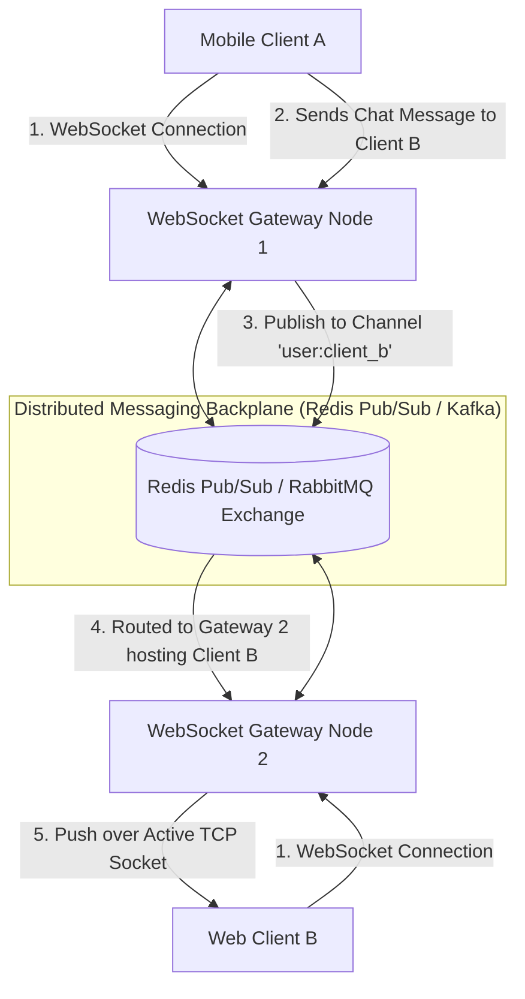

# Building Block 37: WebSocket Gateway (Stateful Connection Manager)

> **Module**: `06-building-blocks`
> **Reusability Category**: Ingress / Storage / Messaging / Coordination / Reliability / Telemetry / AI Infrastructure

---

## 1. Problem
HTTP request-response polling introduces severe latency and massive network header overhead for real-time applications (chat, live sports scores, stock tickers, collaborative editing).

## 2. Requirements
- **Functional Requirements**: Provide robust, highly available, low-latency primitives for client and microservice workloads.
- **Non-Functional Requirements**:
  - **Availability**: $99.999\%$ uptime SLA (Five Nines).
  - **Latency**: $\text{p}99 < 5\text{ms}$ in-memory / $\text{p}99 < 50\text{ms}$ network hop.
  - **Scalability**: Linearly scale to millions of concurrent requests.

## 3. Why It Exists
WebSockets establish a long-lived, full-duplex TCP connection over a single socket, allowing servers to push real-time events to clients with sub-millisecond latency and minimal framing overhead (2 bytes).

## 4. Mental Model
A dedicated telephone hotline kept continuously open between two offices so either person can speak instantly without dialing.

## 5. Core Concepts
Full-Duplex TCP Sockets, WebSocket Handshake (`Upgrade: websocket`), Connection Epoll Event Loops, Distributed Connection Registry, Redis Pub/Sub Backplane, Heartbeat Pings/Pongs, Connection Draining.

## 6. Architecture

## 7. Request/Data Flow
1. Client initiates HTTP connection with `Upgrade: websocket`. 2. Gateway upgrades connection to TCP WebSocket. 3. Gateway registers `user_id -> gateway_instance_ip` in Redis Session Registry. 4. Message sent to user: published to Redis Pub/Sub backplane. 5. Target Gateway node receives event and writes directly to client's open socket.

## 8. Data Model
Session Registry: `user_id (STRING) -> { gateway_node_ip, connection_id, connected_at }`.

## 9. API Design
WebSocket Text/Binary Frames (RFC 6455): JSON payload over bi-directional frame.

## 10. Algorithms
Epoll / Kqueue non-blocking I/O multiplexing (handles 100,000+ active idle sockets per server node).

## 11. Scaling
Scale out gateway servers horizontally; scale inter-node message routing using a distributed Redis Pub/Sub or Kafka cluster.

## 12. Partitioning
Connections sharded naturally across gateway nodes; session mapping sharded in Redis by `hash(user_id)`.

## 13. Replication
Stateless gateway nodes; if a gateway crashes, clients reconnect to any healthy gateway node.

## 14. Consistency
Real-time event delivery; message history persisted in Cassandra / PostgreSQL.

## 15. Failure Scenarios
Gateway node crash (10,000 clients disconnect simultaneously and trigger thundering herd reconnects), Network blip.

## 16. Recovery
Exponential backoff with full jitter on client reconnects; WebSocket Heartbeat Pings (every 30s) to detect dead half-open TCP connections.

## 17. Observability
Active Open Connections Count, Inbound/Outbound Message Rate (msg/s), Gateway Memory per Socket, Reconnect Storm Rate.

## 18. Security
TLS 1.3 encryption (`wss://`), JWT authentication passed in initial connection handshake query parameter or cookie.

## 19. Performance
Linux kernel socket tuning (`sysctl` max file descriptors `nofile = 1,000,000`), Netty byte buffer pooling.

## 20. Trade-offs
WebSocket (Full-duplex, low latency, stateful server management) vs Server-Sent Events (SSE: unidirectional server-to-client, HTTP/2 native, stateless).

## 21. When to Use
Real-time chat (WhatsApp/Discord), live gaming, collaborative document editing (Google Docs), real-time stock trading tickers.

## 22. When NOT to Use
Infrequent request-response CRUD APIs (use standard REST/gRPC instead).

## 23. Implementation Strategy
Build a high-concurrency WebSocket Gateway in Java using Spring Boot WebFlux and Netty with Redis Pub/Sub cross-node routing.

## 24. Practical Exercise
Benchmark a Java Netty WebSocket server handling 20,000 concurrent connected sockets while streaming 50,000 messages/sec with sub-5ms latency.

## 25. Interview Questions
1. How does an API Gateway handle stateful WebSocket connections compared to stateless REST APIs? 2. Why is a message broker (Redis Pub/Sub) necessary between WebSocket gateway instances? 3. How do you prevent a Reconnect Storm when a gateway node crashes?

## 26. Common Mistakes
Failing to implement heartbeat pings, allowing dead 'half-open' mobile TCP connections to leak memory indefinitely.

## 27. Quick Revision
WebSocket Gateway = Long-lived full-duplex TCP -> Netty handles 100k conns/node -> Redis Pub/Sub routes cross-node messages.

## 28. Related Building Blocks
`BB-10` (Cache), `BB-12` (Kafka), `BB-19` (API Gateway)

## 29. Related Case Studies
`CS-11` (WhatsApp / Discord), `CS-13` (Google Docs), `CS-05` (Uber Driver Tracking)
