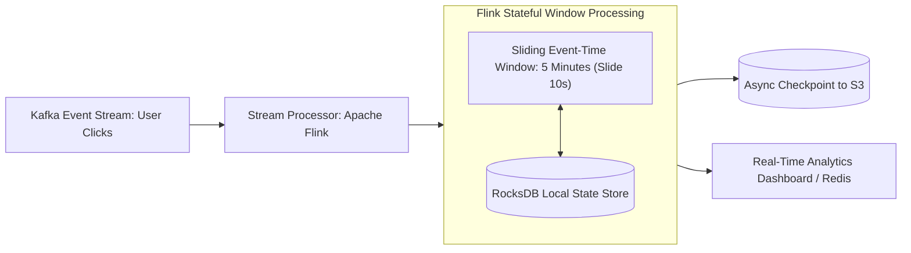

# Building Block 38: Real-Time Stream Processing (Apache Flink)

> **Module**: `06-building-blocks`
> **Reusability Category**: Ingress / Storage / Messaging / Coordination / Reliability / Telemetry / AI Infrastructure

---

## 1. Problem
Traditional batch processing jobs (Hadoop/Spark) run once every few hours or nightly, creating multi-hour delays for critical real-time insights (fraud detection, dynamic surge pricing, live analytics dashboards).

## 2. Requirements
- **Functional Requirements**: Provide robust, highly available, low-latency primitives for client and microservice workloads.
- **Non-Functional Requirements**:
  - **Availability**: $99.999\%$ uptime SLA (Five Nines).
  - **Latency**: $\text{p}99 < 5\text{ms}$ in-memory / $\text{p}99 < 50\text{ms}$ network hop.
  - **Scalability**: Linearly scale to millions of concurrent requests.

## 3. Why It Exists
A Stream Processing Pipeline processes unbounded event streams continuously record-by-record with sub-second latency, stateful stream joins, sliding event-time windows, and exactly-once processing guarantees.

## 4. Mental Model
An automated assembly line quality scanner inspecting every single circuit board as it zooms past on a continuous high-speed conveyor belt.

## 5. Core Concepts
Unbounded Streams, Event Time vs Processing Time, Watermarks, Windowing (Tumbling, Sliding, Session), Stateful Stream Processing, Chandy-Lamport Checkpointing, Exactly-Once Semantics, Apache Flink.

## 6. Architecture

## 7. Request/Data Flow
1. Events ingested from Kafka with event timestamps. 2. Stream processor ingests stream and tracks Watermarks for out-of-order events. 3. Evaluates stateful window operations (e.g. 5-minute sliding window sum). 4. Maintains state in local RocksDB. 5. Asynchronously checkpoints state to S3 via Chandy-Lamport algorithm. 6. Emits aggregated results to sink.

## 8. Data Model
Streaming State: `Key (STRING) -> Aggregated Window State (RocksDB byte-array)`.

## 9. API Design
Flink DataStream API: `stream.keyBy(...).window(SlidingEventTimeWindows.of(5m, 10s)).aggregate(...)`.

## 10. Algorithms
Chandy-Lamport Distributed Checkpointing algorithm, Watermark generation algorithm for out-of-order late data handling.

## 11. Scaling
Scale out processing horizontally by partitioning streams across Flink TaskManagers matching Kafka partition count.

## 12. Partitioning
Keyed Streams partitioned by record key (`keyBy(user_id)`).

## 13. Replication
Stream state checkpoints stored with 11 Nines durability in Amazon S3.

## 14. Consistency
End-to-end Exactly-Once processing semantics via Two-Phase Commit Sink connectors.

## 15. Failure Scenarios
Late arriving out-of-order events (handled via Watermark allowed lateness), TaskManager worker crash (recovers from S3 checkpoint).

## 16. Recovery
Automatic recovery from last committed distributed checkpoint in S3 upon worker crash.

## 17. Observability
Event Processing Throughput (events/sec), Stream Processing Lag, Watermark Latency, Checkpoint Duration, Backpressure Ratio.

## 18. Security
Kerberos authentication with Kafka, encrypted checkpoint storage in S3, TLS inter-node communication.

## 19. Performance
Embedded in-memory RocksDB state storage on local NVMe SSDs avoids remote database network lookups.

## 20. Trade-offs
Stream Processing (Low latency < 100ms, complex event-time state) vs Batch Processing (High throughput, simple, multi-hour latency).

## 21. When to Use
Real-time fraud detection, dynamic surge pricing (Uber), real-time recommendation features, IoT telemetry anomaly detection.

## 22. When NOT to Use
Simple batch reports executed once a week where Spark / Snowflake batch SQL is cheaper and simpler.

## 23. Implementation Strategy
Configure an Apache Flink streaming pipeline in Java consuming from Kafka, computing 1-minute tumbling window aggregations with RocksDB state backend.

## 24. Practical Exercise
Write a Java Flink test processing out-of-order event streams, asserting that Watermarks correctly trigger sliding window calculations and handle 5-second late data.

## 25. Interview Questions
1. Explain the difference between Event Time and Processing Time. 2. How do Watermarks handle late, out-of-order streaming events? 3. How does the Chandy-Lamport checkpointing algorithm guarantee exactly-once state recovery?

## 26. Common Mistakes
Using Processing Time instead of Event Time for financial aggregations, causing distorted calculations during network lag spikes.

## 27. Quick Revision
Stream Processing = Unbounded Kafka stream -> Watermarks handle out-of-order events -> RocksDB state -> Exactly-once via S3 checkpoints.

## 28. Related Building Blocks
`BB-12` (Kafka), `BB-29` (Metrics Pipeline), `BB-34` (Recommendations)

## 29. Related Case Studies
`CS-01` (YouTube Analytics), `CS-05` (Uber Surge Pricing), `CS-15` (Fraud Detection)
