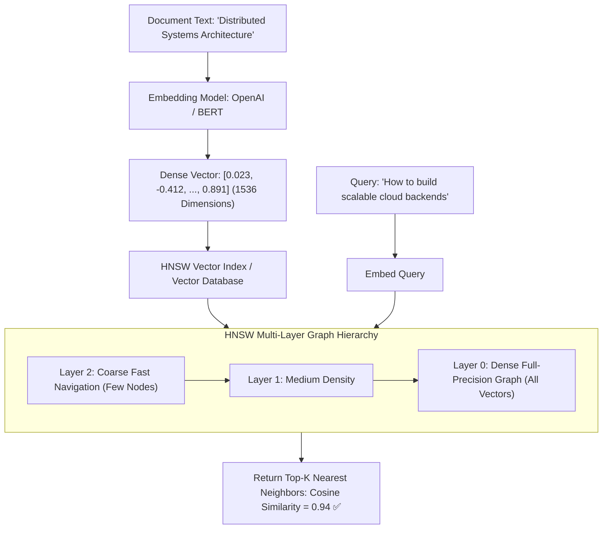

# Building Block 39: Vector Search Index (HNSW & Embeddings)

> **Module**: `06-building-blocks`
> **Reusability Category**: Ingress / Storage / Messaging / Coordination / Reliability / Telemetry / AI Infrastructure

---

## 1. Problem
Traditional keyword search (BM25/Elasticsearch) matches exact text tokens, failing completely on semantic queries, image similarity search, and LLM Retrieval-Augmented Generation (RAG) where conceptual meaning matters.

## 2. Requirements
- **Functional Requirements**: Provide robust, highly available, low-latency primitives for client and microservice workloads.
- **Non-Functional Requirements**:
  - **Availability**: $99.999\%$ uptime SLA (Five Nines).
  - **Latency**: $\text{p}99 < 5\text{ms}$ in-memory / $\text{p}99 < 50\text{ms}$ network hop.
  - **Scalability**: Linearly scale to millions of concurrent requests.

## 3. Why It Exists
Vector Search Indexes store high-dimensional floating-point embeddings (generated by AI models) and execute Approximate Nearest Neighbor (ANN) search in sub-10ms across billions of vectors using graph-based spatial algorithms.

## 4. Mental Model
A multi-dimensional galaxy where conceptually similar stars (ideas/documents) are clustered close to each other in space, and a telescope instantly navigates to the nearest cluster.

## 5. Core Concepts
High-Dimensional Embeddings, Dense Vectors, Cosine Similarity, Euclidean (L2) Distance, Hierarchical Navigable Small World (HNSW), Inverted File Index (IVF), Product Quantization (PQ), Vector DBs (Milvus, Pinecone, Qdrant).

## 6. Architecture

## 7. Request/Data Flow
1. Document ingested and passed to Embedding Model. 2. Model outputs 1536-dimensional vector. 3. Vector inserted into multi-layer HNSW graph. 4. Query text embedded. 5. Search traverses HNSW graph from top sparse layer down to dense base layer. 6. Returns Top-K nearest neighbors in $< 10\text{ms}$.

## 8. Data Model
Vector Record: `vector_id (STRING)`, `embedding (FLOAT32[1536])`, `metadata (JSON)`, `document_chunk (TEXT)`.

## 9. API Design
`POST /v1/vectors/insert { id, vector, metadata }`, `POST /v1/vectors/query { vector, top_k: 10, filter: { 'tenant': 'acme' } }`.

## 10. Algorithms
HNSW (Hierarchical Navigable Small World), Product Quantization (PQ) for vector memory compression, Cosine Distance.

## 11. Scaling
Scale out via horizontal sharding across Vector DB nodes; index caching in RAM for sub-10ms search.

## 12. Partitioning
Vectors partitioned by HNSW sub-graph clusters and tenant metadata namespaces.

## 13. Replication
Replicated vector partitions across 3 nodes for high query QPS.

## 14. Consistency
Eventual consistency; new vector index segments build in near real-time (1–5 seconds).

## 15. Failure Scenarios
High memory consumption (RAM saturation from uncompressed float32 vectors), Slow indexing throughput during massive bulk ingestion.

## 16. Recovery
Product Quantization (PQ) / Scalar Quantization compresses vector memory by $4\times - 8\times$ with $< 2\%$ accuracy loss.

## 17. Observability
Vector Search Latency (p99 < 15ms), Recall@K (Target > 95%), Index Build Throughput, RAM Usage per 1M Vectors.

## 18. Security
Tenant isolation in vector index metadata, encrypted vector storage at rest, API key authorization.

## 19. Performance
HNSW multi-layer skip-list navigation provides $\mathcal{O}(\log N)$ search complexity across 100M vectors.

## 20. Trade-offs
HNSW (Highest recall > 98%, sub-10ms search, high RAM usage) vs IVF-PQ (Lowest RAM, $4\times$ faster index build, slightly lower recall).

## 21. When to Use
LLM RAG pipelines, semantic document search, image/audio similarity search, recommendation candidate retrieval.

## 22. When NOT to Use
Exact keyword string matching (use Elasticsearch BM25 instead) or relational transactional queries.

## 23. Implementation Strategy
Integrate a Vector Database (Milvus / Qdrant / Pgvector) with Spring Boot AI, indexing document embeddings and executing hybrid search.

## 24. Practical Exercise
Implement an in-memory Cosine Similarity search in Java across 10,000 1536-dimensional vectors, verifying nearest neighbor ranking accuracy.

## 25. Interview Questions
1. How does the HNSW graph algorithm achieve $\mathcal{O}(\log N)$ search across millions of high-dimensional vectors? 2. What is the difference between Cosine Distance and Euclidean (L2) Distance? 3. What is Hybrid Search (combining BM25 keyword search with Vector ANN)?

## 26. Common Mistakes
Attempting to store raw 1536-dimensional float vectors in standard relational database columns without dedicated vector indexes (causes full table scans).

## 27. Quick Revision
Vector Index = Text -> Embedding Model -> Multi-Layer HNSW Graph -> $\mathcal{O}(\log N)$ Nearest Neighbor Search -> Sub-10ms semantic retrieval.

## 28. Related Building Blocks
`BB-15` (Distributed Search), `BB-34` (Recommendations), `BB-40` (AI Gateway)

## 29. Related Case Studies
`CS-17` (ChatGPT), `CS-19` (LLM Customer Support), `CS-20` (AI Coding Assistant)
