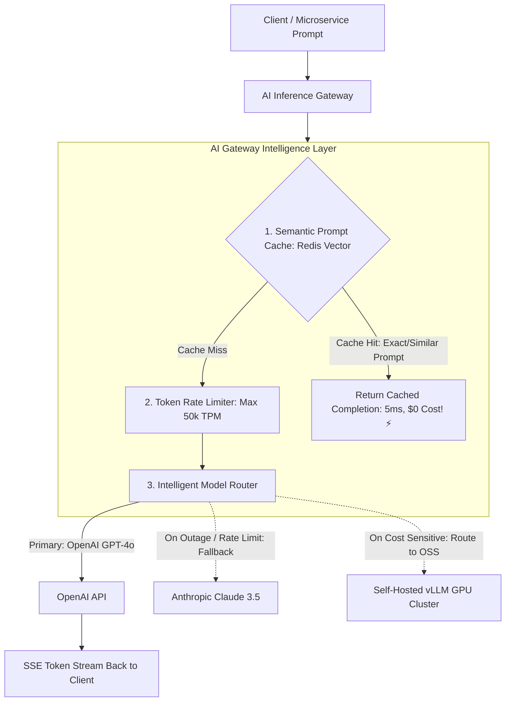

# Building Block 40: AI Inference Gateway & Model Router

> **Module**: `06-building-blocks`
> **Reusability Category**: Ingress / Storage / Messaging / Coordination / Reliability / Telemetry / AI Infrastructure

---

## 1. Problem
Integrating Large Language Models (LLMs) into production microservices creates severe reliability risks: extreme API costs, vendor rate limits, high latency ($1-5\text{s}$ per query), and lack of fallback routing during model outages.

## 2. Requirements
- **Functional Requirements**: Provide robust, highly available, low-latency primitives for client and microservice workloads.
- **Non-Functional Requirements**:
  - **Availability**: $99.999\%$ uptime SLA (Five Nines).
  - **Latency**: $\text{p}99 < 5\text{ms}$ in-memory / $\text{p}99 < 50\text{ms}$ network hop.
  - **Scalability**: Linearly scale to millions of concurrent requests.

## 3. Why It Exists
An AI Inference Gateway acts as an intelligent reverse proxy for AI models, managing semantic prompt caching, token-based rate limiting, multi-provider fallbacks (OpenAI $\to$ Anthropic $\to$ Self-Hosted vLLM), and real-time token streaming.

## 4. Mental Model
An intelligent air traffic controller directing flights to the most cost-effective and available airport runway based on aircraft size and weather conditions.

## 5. Core Concepts
Semantic Prompt Caching, Multi-Provider Model Routing, Token-Based Rate Limiting, Streaming Responses (Server-Sent Events), Fallback Circuit Breakers, Continuous Batching, PagedAttention, vLLM.

## 6. Architecture

## 7. Request/Data Flow
1. Client sends prompt. 2. Gateway checks Semantic Prompt Cache (computes prompt embedding; on $>0.95$ cosine match, returns cached answer instantly). 3. Evaluates Token-Per-Minute (TPM) rate limit. 4. Routes prompt to optimal model provider. 5. If provider fails/times out, circuit breaker reroutes to fallback provider. 6. Streams tokens back via SSE.

## 8. Data Model
AI Request: `prompt (TEXT)`, `model (STRING)`, `temperature (FLOAT)`, `stream (BOOL)`, `max_tokens (INT)`, `cached (BOOL)`.

## 9. API Design
OpenAI-Compatible REST API: `POST /v1/chat/completions` supporting streaming Server-Sent Events (`text/event-stream`).

## 10. Algorithms
Continuous Batching (vLLM), PagedAttention (virtual memory management for KV cache), Semantic Vector Distance Caching.

## 11. Scaling
Gateway scales horizontally as stateless compute; GPU inference nodes scale via Kubernetes KEDA on request queue depth.

## 12. Partitioning
Prompts partitioned by Model ID and Tenant Namespace.

## 13. Replication
Semantic prompt cache replicated in Redis Cluster; model weights replicated across GPU worker instances.

## 14. Consistency
Stateless gateway routing; cache is eventually consistent.

## 15. Failure Scenarios
Primary LLM provider 503 outage (gateway automatically falls back to secondary provider in $< 500\text{ms}$), GPU VRAM Out-of-Memory (OOM).

## 16. Recovery
Automated multi-provider failover matrix; PagedAttention eliminates GPU memory fragmentation crashes.

## 17. Observability
Time to First Token (TTFT < 500ms), Tokens Per Second (TPS), Cache Hit Rate (Target > 20%), Cost Per 1k Tokens, Model Error Rate.

## 18. Security
Prompt injection defense, PII masking before sending prompts to third-party APIs, API token secret rotation.

## 19. Performance
Semantic prompt caching cuts LLM latency from $2000\text{ms}$ to $5\text{ms}$ and reduces API spend by $30\%+$.

## 20. Trade-offs
Cloud Provider APIs (Zero infrastructure, higher token cost, external data) vs Self-Hosted vLLM (Fixed GPU cost, full data privacy, operational complexity).

## 21. When to Use
Production LLM applications, enterprise chatbots, AI coding assistants, automated customer support agents.

## 22. When NOT to Use
Simple non-AI microservice CRUD applications.

## 23. Implementation Strategy
Build an AI Gateway in Java using Spring Boot WebFlux with SSE streaming, Redis semantic caching, and Resilience4j multi-provider fallback.

## 24. Practical Exercise
Configure an AI Gateway in Java that intercepts user prompts, checks Redis for identical cached responses, and routes cache misses to an LLM provider with fallback.

## 25. Interview Questions
1. What is Semantic Prompt Caching and how does it reduce LLM costs? 2. How does Continuous Batching in vLLM increase GPU inference throughput? 3. What is Time to First Token (TTFT) and why is it critical for user experience?

## 26. Common Mistakes
Making direct client calls to a single proprietary LLM API without an intermediary gateway, causing total application downtime during provider outages.

## 27. Quick Revision
AI Gateway = Semantic Cache + Token Rate Limit + Multi-Provider Fallback + SSE Streaming = High reliability & lower AI cost.

## 28. Related Building Blocks
`BB-19` (API Gateway), `BB-39` (Vector Search), `BB-10` (Cache)

## 29. Related Case Studies
`CS-17` (ChatGPT), `CS-19` (LLM Customer Support), `CS-20` (AI Coding Assistant)
