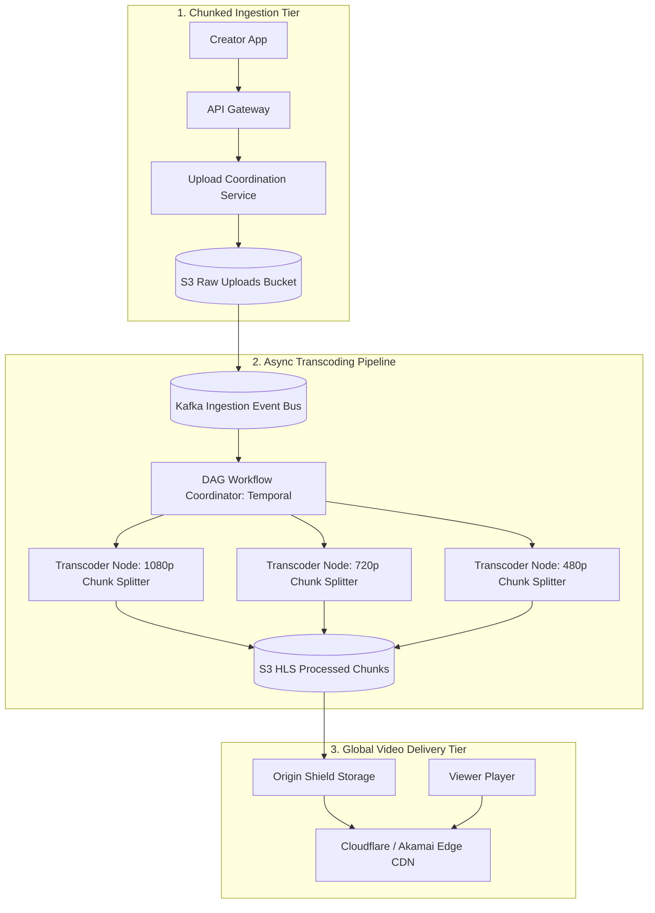
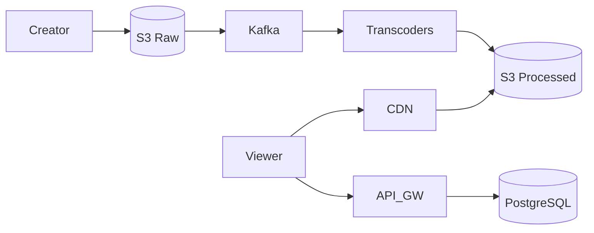

# System Design: YouTube / Netflix Global Video Streaming Platform

> **Domain**: Media Streaming & Distributed Content Delivery
> **Interview Target**: SDE2 / Senior Backend / Staff Engineer
> **Framework**: DESIGN-FLOW (45-Minute Game Plan)

---

## 1. Problem
Design a global video sharing and streaming platform allowing millions of creators to upload high-definition videos and billions of viewers to stream videos seamlessly with sub-second start times across heterogeneous network speeds.

## 2. Requirements Clarification
- Should creators be able to upload 4K/1080p videos of arbitrary duration? (Yes)
- Do we need real-time live streaming or on-demand VoD? (Focus on on-demand VoD; live streaming can be an extension)
- How should we adapt to varying mobile bandwidths? (Adaptive Bitrate Streaming: HLS / DASH)
- Are user comments, likes, and view counts in scope? (Yes, metadata and view counters)

## 3. Functional Requirements
- **FR-1**: Users can upload videos reliably with resumable uploads.
- **FR-2**: Users can stream videos smoothly with minimal buffering at adaptive resolutions (1080p, 720p, 480p, 360p).
- **FR-3**: Users can search for videos by title/tags.
- **FR-4**: Real-time view count tracking and like/dislike interactions.

## 4. Non-Functional Requirements
- **NFR-1 (High Availability)**: $99.99\%$ uptime for video playback.
- **NFR-2 (Low Latency)**: Time to First Frame (TTFF) $< 500\text{ms}$ globally.
- **NFR-3 (High Scalability)**: Support $1\text{B}$ daily active users and $1\text{B}$ video views/day.
- **NFR-4 (Durability)**: 11 Nines durability for uploaded original video source files.

## 5. Assumptions
- $500\text{M}$ Daily Active Users (DAU).
- $1\text{B}$ video views per day; $10\text{M}$ new videos uploaded per day.
- Average video length = $10\text{ minutes}$; average compressed bitrate = $2\text{ Mbps}$.

## 6. Capacity Estimation
- **Write QPS (Uploads)**: $10\text{M} / 86,400 \approx 115\text{ uploads/sec}$ (Peak: $350\text{ uploads/sec}$).
- **Read QPS (Views)**: $1\text{B} / 86,400 \approx 11,570\text{ views/sec}$ (Peak: $35,000\text{ views/sec}$).
- **Storage Growth**: $10\text{M videos/day} \times 300\text{ MB} \approx 3\text{ PB/day} \implies 5.5\text{ Exabytes / 5 years}$.
- **Egress Bandwidth**: $3.47\text{M concurrent streams} \times 2\text{ Mbps} \approx 6.94\text{ Tbps}$.
- **CDN Offload**: $95\%$ of streaming traffic served from Edge CDNs; origin handles only $350\text{ Gbps}$.

## 7. API Design
- `POST /v1/videos/upload_session -> { upload_url, session_id }`
- `PUT /v1/videos/upload_chunk?session_id=...&chunk_index=...`
- `GET /v1/videos/{id}/master.m3u8` (HLS adaptive master playlist)
- `POST /v1/videos/{id}/views` (Asynchronous view count beacon)

## 8. Data Model
- **Video Metadata DB (PostgreSQL / CockroachDB)**: `video_id (UUID PK)`, `creator_id`, `title`, `duration`, `hls_manifest_url`, `status (PROCESSING/READY)`.
- **User DB**: `user_id`, `name`, `email`, `created_at`.
- **View Counts**: Distributed Sharded Counter in Redis -> Flushed to PostgreSQL.

## 9. High-Level Architecture
```mermaid
flowchart TD
    Creator[Content Creator] -->|1. Direct Upload via Presigned URL| S3Raw[(Raw Video S3 Bucket)]
    S3Raw -->|2. S3 ObjectCreated Event| TranscodeQueue[(Kafka Transcoding Topic)]
    TranscodeQueue --> WorkerFleet[Distributed Transcoder Fleet]
    WorkerFleet -->|3. Transcodes to HLS Chunks (1080p, 720p, 480p)| S3HLS[(HLS Video S3 Bucket)]

    Viewer[Global Viewer] -->|4. Request Master.m3u8 Playlist| CDN[Edge CDN POPs]
    CDN -->|Cache Hit: 95%| Viewer
    CDN -->|Cache Miss: 5%| S3HLS
```

## 10. Detailed Architecture


## 11. Request Flow
1. Creator initiates multipart upload session with API Gateway. 2. Obtains S3 presigned URLs and uploads 10MB video chunks directly to S3. 3. S3 triggers Kafka event upon completion. 4. Transcoding worker splits video into 5-second `.ts` segments and encodes at multiple bitrates (HLS). 5. Generates `master.m3u8` playlist. 6. Viewer fetches `master.m3u8` from CDN; video player dynamically requests `.ts` chunks based on current bandwidth.

## 12. Data Flow
Raw Video -> S3 -> Kafka Event -> Transcoder Fleet -> HLS Chunks -> S3 -> CDN Edge -> Viewer Player.

## 13. Database Selection
PostgreSQL for structured video/user metadata (ACID integrity for creator publishing); Amazon S3 for binary video blob chunks; Redis for video views and playback session tokens.

## 14. Caching
Multi-Tier Caching: (1) CDN Edge Caching (95% hit ratio for video `.ts` chunks), (2) Redis Cluster for hot video metadata and recommendations, (3) Player in-memory buffer (pre-fetches next 3 chunks).

## 15. Messaging
Kafka cluster buffers transcoding jobs and analytics beacons; prevents video upload spikes from crashing transcoding clusters.

## 16. Partitioning
Video metadata partitioned by `hash(creator_id)`; video chunks partitioned across S3 by `hash(video_id)`.

## 17. Replication
Video metadata replicated Multi-AZ with Read Replicas; video chunks replicated via S3 Cross-Region Replication (CRR) across US, EU, and APAC.

## 18. Consistency
Eventual consistency for view counters and follower feeds; strong consistency for creator video status transitions (`PROCESSING` -> `READY`).

## 19. Failure Handling
Transcoder node crash (Temporal DAG automatically re-assigns chunk transcoding task to healthy worker); CDN origin stampede (Origin Shield collapses simultaneous cache misses into a single request).

## 20. Bottlenecks
Hot video viral traffic spikes -> Mitigated by aggressive Edge CDN chunk caching and Sharded View Counters.

## 21. Scaling Strategy
Auto-scale transcoder worker fleet on AWS EC2 Spot instances using Kubernetes KEDA based on Kafka queue backlog depth.

## 22. Observability
Video Playback QoE (Buffer Ratio < 0.5%, Rebuffer Rate), Time to First Frame (TTFF), CDN Cache Hit Ratio, Transcoding Pipeline Latency.

## 23. Security
Presigned URLs for direct uploads, DRM encryption (Widevine / FairPlay) for protected content, AES-128 HLS chunk encryption.

## 24. Cost Considerations
Transcoding cold, rarely-watched videos on-demand; lifecycle policies archiving raw original source videos to S3 Glacier Deep Archive after 30 days ($0.00099/GB).

## 25. Trade-offs
Adaptive Bitrate Streaming (HLS: higher storage overhead due to multiple resolutions, but superior user experience across slow mobile networks).

## 26. Alternative Designs
Monolithic Single-Bitrate MP4 Streaming (Rejected: buffers horribly on mobile networks and wastes bandwidth).

## 27. Final Architecture


## 28. Interview Follow-up Questions
1. How does Adaptive Bitrate Streaming (HLS/DASH) adjust quality in real-time? 2. How do you prevent Origin Shield saturation during a viral video launch? 3. How does chunk-level parallel transcoding work?

## 29. Building Blocks Used
`BB-01` (DNS), `BB-05` (CDN), `BB-10` (Cache), `BB-12` (Kafka), `BB-14` (Blob Store), `BB-18` (Sharded Counter)
