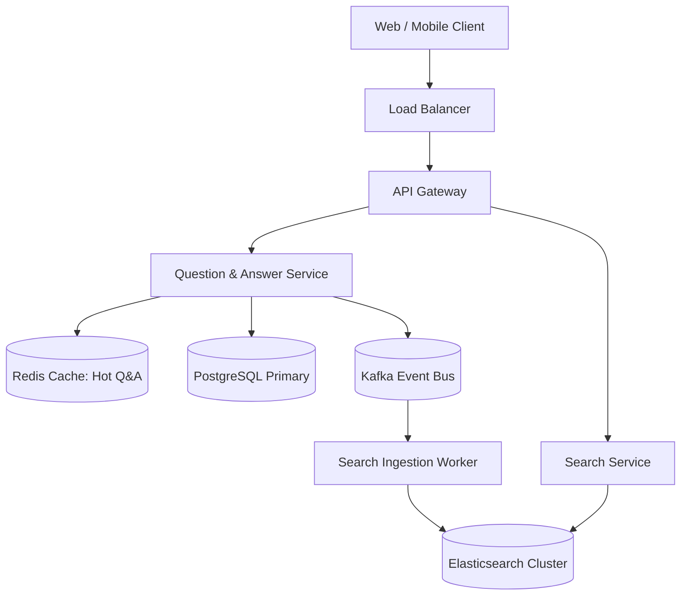
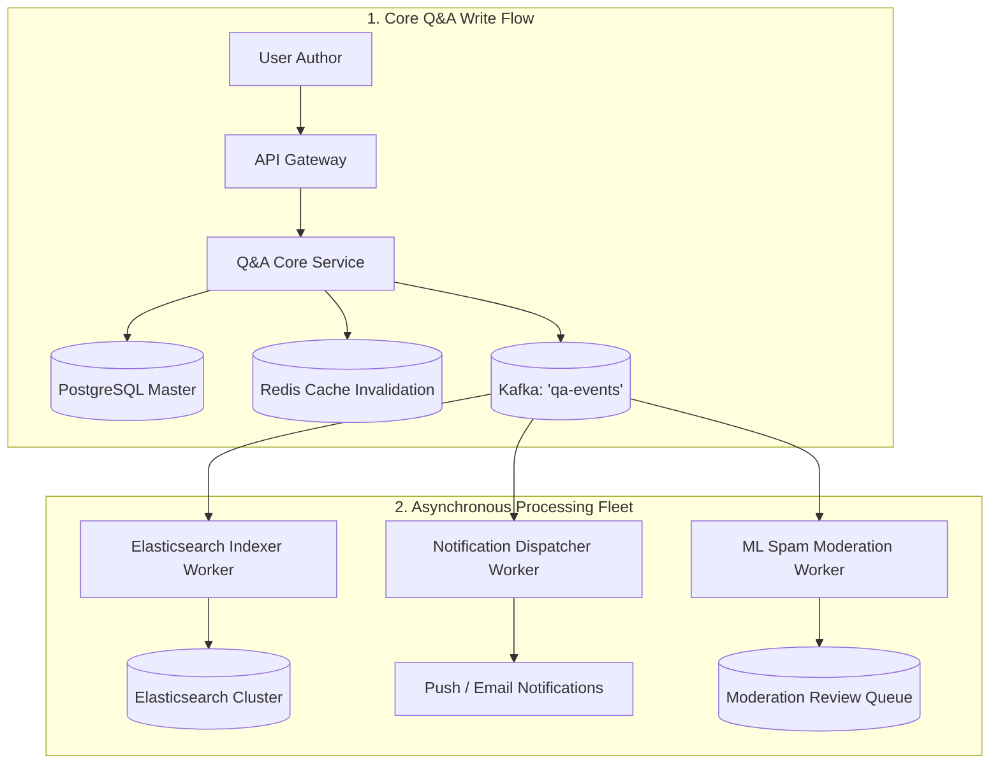
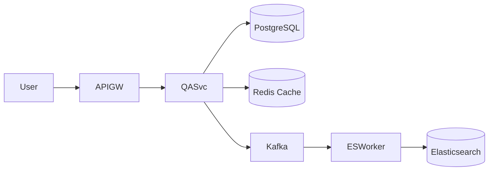

# System Design: Quora / StackOverflow Knowledge Q&A Platform

> **Domain**: Knowledge Sharing & Social Search Platform
> **Interview Target**: SDE2 / Senior Backend / Staff Engineer
> **Framework**: DESIGN-FLOW (45-Minute Game Plan)

---

## 1. Problem
Design a scalable Q&A knowledge platform where millions of users ask questions, post formatted rich-text answers, upvote/downvote content, follow topics, and search a repository of 100M+ historical questions in real time.

## 2. Requirements Clarification
- Is full-text search across answers and questions in scope? (Yes)
- How does the feed ranking work? (Hybrid: personalized followed topics + upvote score)
- Do we need real-time upvote updates? (Eventual consistency within 1-2s is acceptable)
- Is content moderation and spam filtering required? (Yes, automated ML moderation queue)

## 3. Functional Requirements
- **FR-1**: Users can post questions with topic tags and submit rich-text answers.
- **FR-2**: Users can upvote, downvote, and comment on answers.
- **FR-3**: Users can search historical questions via full-text fuzzy search.
- **FR-4**: Personalized home feed showing top-ranked Q&A content based on followed topics.

## 4. Non-Functional Requirements
- **NFR-1 (High Availability)**: $99.99\%$ availability for reading answers.
- **NFR-2 (Low Latency)**: Feed generation $< 50\text{ms}$; Search queries $< 100\text{ms}$.
- **NFR-3 (High Scalability)**: Support $100\text{M}$ MAU and $500\text{M}$ monthly page views.
- **NFR-4 (Consistency)**: Strong consistency for answer authorship; Eventual consistency for upvote counters.

## 5. Assumptions
- $50\text{M}$ Daily Active Users (DAU).
- $100\text{M}$ total questions; $500\text{M}$ total answers in database.
- Average question = $500\text{ bytes}$; average answer = $2\text{ KB}$.

## 6. Capacity Estimation
- **Read QPS**: $500\text{M pageviews/month} / (30 \times 86,400) \approx 200\text{ QPS}$ (Peak: $1,000\text{ QPS}$).
- **Write QPS (Answers/Upvotes)**: $50\text{M writes/day} / 86,400 \approx 580\text{ QPS}$ (Peak: $2,500\text{ QPS}$).
- **Storage Growth**: $500\text{M answers} \times 2\text{ KB} \approx 1\text{ TB}$ (Easily fits in partitioned RDBMS/Elasticsearch).
- **Cache Sizing**: $20\%$ hot questions in Redis $\approx 200\text{ GB RAM}$.

## 7. API Design
- `POST /v1/questions { title, body, topic_ids }`
- `POST /v1/questions/{id}/answers { body }`
- `POST /v1/answers/{id}/vote { value: +1 / -1 }`
- `GET /v1/search?q=distributed+systems&limit=20`

## 8. Data Model
- **Questions Table (PostgreSQL)**: `question_id (UUID PK)`, `user_id`, `title`, `body`, `view_count`, `created_at`.
- **Answers Table (PostgreSQL)**: `answer_id (UUID PK)`, `question_id (FK)`, `user_id`, `body`, `upvote_count`, `is_accepted`.
- **Search Index (Elasticsearch)**: `doc_id`, `title`, `body`, `tags`, `upvotes` (BM25 analyzed).

## 9. High-Level Architecture

## 10. Detailed Architecture

## 11. Request Flow
1. User posts answer. 2. Written to PostgreSQL master. 3. Cache invalidated. 4. Event published to Kafka. 5. Search worker updates Elasticsearch inverted index within 1s. 6. Notification worker notifies question author.

## 12. Data Flow
Client -> Gateway -> PostgreSQL -> Kafka -> Async Indexers (ES) + Notification Engine.

## 13. Database Selection
PostgreSQL for relational integrity (Users, Questions, Answers, Comments, Foreign Key constraints); Elasticsearch for full-text fuzzy search; Redis for feed caching and upvote sharded counters.

## 14. Caching
Redis Cache-Aside for hot Q&A threads (TTL 1 hour); CDN for static UI assets; Singleflight to prevent cache stampedes on viral questions.

## 15. Messaging
Kafka topic `qa-events` decouples core posting latency from heavy search indexing and notification fan-out.

## 16. Partitioning
PostgreSQL partitioned by `hash(question_id)`; Elasticsearch partitioned into 10 primary shards.

## 17. Replication
PostgreSQL Multi-AZ primary with 2 read replicas; Elasticsearch 1 primary + 1 replica per shard.

## 18. Consistency
Strong consistency for question/answer publishing; Eventual consistency for search indexing and upvote aggregations.

## 19. Failure Handling
Search cluster node crash (replica promoted automatically); Spam attack (ML moderation worker flags suspicious content before public indexing).

## 20. Bottlenecks
Hot questions with 100k concurrent upvotes -> Mitigated by Sharded Counters in Redis.

## 21. Scaling Strategy
Read/Write splitting in PostgreSQL; caching top 20% of viewed questions in Redis.

## 22. Observability
Search Query Latency (p99 < 80ms), Answer Publish Latency, Search Indexing Lag, Upvote Counter Drift.

## 23. Security
Input sanitization against XSS in rich-text Markdown; rate limiting on answer submissions (max 5 answers/hour).

## 24. Cost Considerations
Elasticsearch index lifecycle management: moving 2-year-old inactive questions to warm disk nodes.

## 25. Trade-offs
Denormalized Answer Upvote Counts (Fast read sorting, eventual consistency) vs Real-time SQL `COUNT(*)` (Slow table lock).

## 26. Alternative Designs
Pure Document Store MongoDB (Rejected: lacks robust relational join support for complex user follower and comment graphs).

## 27. Final Architecture

## 28. Interview Follow-up Questions
1. How do you rank answers dynamically based on upvotes, recency, and author reputation? 2. How does the Elasticsearch inverted index handle stemming for question searches? 3. How do you prevent vote manipulation bots?

## 29. Building Blocks Used
`BB-03` (RDBMS), `BB-10` (Cache), `BB-12` (Kafka), `BB-15` (Search), `BB-18` (Sharded Counter)
