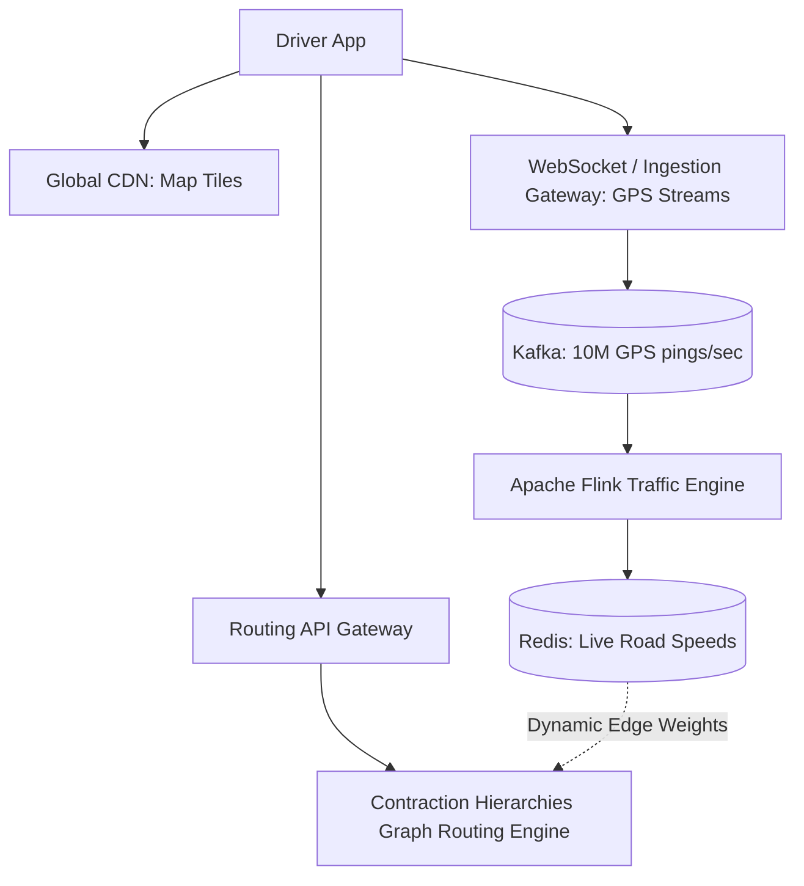
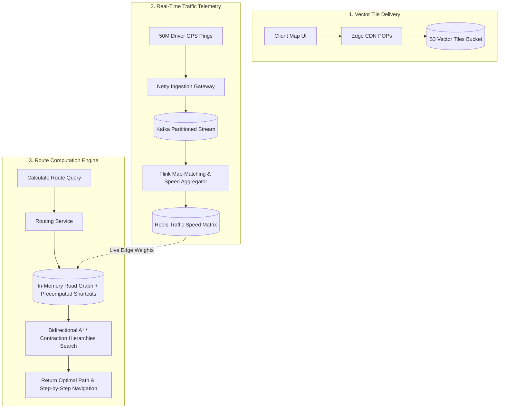
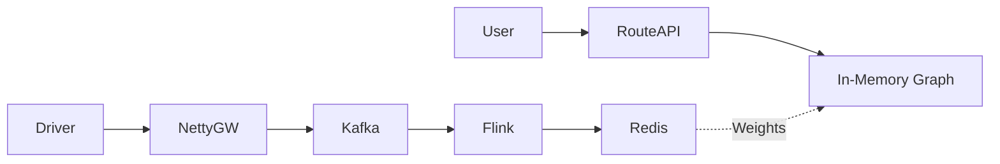

# System Design: Google Maps / Navigation Platform

> **Domain**: Geospatial Navigation & Routing Infrastructure
> **Interview Target**: SDE2 / Senior Backend / Staff Engineer
> **Framework**: DESIGN-FLOW (45-Minute Game Plan)

---

## 1. Problem
Design a real-time mapping, turn-by-turn navigation, and ETA calculation platform that ingests global road networks, processes real-time traffic conditions, and computes shortest path routes across millions of concurrent drivers.

## 2. Requirements Clarification
- Do we need offline map tile rendering? (Focus on online tile streaming and routing)
- How are road networks represented? (Directed weighted graphs: intersections = vertices, roads = edges)
- How does real-time traffic impact ETA? (Dynamic edge weights updated via driver GPS speed streams)
- What routing algorithms should we use? (Contraction Hierarchies / A* search on S2 spatial grids)

## 3. Functional Requirements
- **FR-1**: Render dynamic vector map tiles at varying zoom levels.
- **FR-2**: Compute fastest driving route between origin and destination with accurate ETA.
- **FR-3**: Ingest real-time driver GPS locations to update live traffic congestion.
- **FR-4**: Dynamic re-routing when traffic jams or road accidents occur.

## 4. Non-Functional Requirements
- **NFR-1 (High Availability)**: $99.999\%$ uptime for active navigation sessions.
- **NFR-2 (Low Latency)**: Route calculation $< 200\text{ms}$; Map tile loading $< 50\text{ms}$.
- **NFR-3 (High Scalability)**: Support $1\text{B}$ users, $50\text{M}$ active turn-by-turn navigations simultaneously.
- **NFR-4 (Accuracy)**: ETA accuracy within $\pm 10\%$ of actual travel time.

## 5. Assumptions
- $50\text{M}$ concurrent active drivers streaming GPS every 5 seconds.
- Global road network: $100\text{M}$ road segments, $50\text{M}$ intersections.
- Map tile vector size = $50\text{ KB}$ per tile.

## 6. Capacity Estimation
- **GPS Ingestion QPS**: $50\text{M} / 5\text{s} = \mathbf{10,000,000\text{ GPS pings/sec}}$.
- **Route Calculation QPS**: $100,000\text{ route queries/sec}$ at peak.
- **Road Graph Memory**: $100\text{M edges} \times 64\text{ bytes} \approx 6.4\text{ GB}$ (Easily fits in RAM on graph routing nodes!).
- **Map Tile Storage**: Pre-rendered global vector tiles across 20 zoom levels $\approx 50\text{ TB}$ (Stored in S3 + CDN).

## 7. API Design
- `GET /v1/tiles/{z}/{x}/{y}.pbf` (Fetch vector map tile)
- `POST /v1/routes { origin: [lat, lon], dest: [lat, lon], mode: 'DRIVING' } -> { route_geometry, eta_seconds, steps }`
- `POST /v1/telemetry/location { driver_id, lat, lon, speed, heading, timestamp }`

## 8. Data Model
- **Road Network Graph (In-Memory Graph Engine)**: Node (Intersection ID, Lat, Lon), Edge (StartNode, EndNode, Distance, SpeedLimit, DynamicCongestionFactor).
- **Live Traffic Store (Redis Cluster)**: `SegmentID -> CurrentAverageSpeed (km/h)`.
- **User Trip State (DynamoDB)**: `trip_id`, `user_id`, `route_id`, `current_step`.

## 9. High-Level Architecture

## 10. Detailed Architecture

## 11. Request Flow
1. Driver streams GPS. 2. Ingestion gateway batches pings to Kafka. 3. Flink map-matches GPS points to road segments and calculates average speed. 4. Updates Redis traffic matrix. 5. Routing engine evaluates Bidirectional A* with pre-computed Contraction Hierarchies and live edge weights.

## 12. Data Flow
GPS Ping -> Gateway -> Kafka -> Flink -> Redis Traffic Matrix -> In-Memory Graph Router -> Route & ETA.

## 13. Database Selection
In-memory Graph Engine (Contraction Hierarchies) for sub-50ms routing; Redis for real-time road segment speeds; Amazon S3 for vector tiles; DynamoDB for active trip sessions.

## 14. Caching
CDN caches 99% of static map tiles; Redis caches live road speeds with 30s TTL; Graph routing nodes keep entire road network graph in local RAM.

## 15. Messaging
Kafka cluster handles 10M GPS pings/sec with partition key `hash(s2_region_id)`.

## 16. Partitioning
Road network graph partitioned by Google S2 Level 8 spatial cells (provinces/states); cross-region routes use coarse highway hierarchical graphs.

## 17. Replication
Routing graph engines replicated across all availability zones; S3 tiles replicated globally.

## 18. Consistency
Eventual consistency for traffic updates (acceptable 30-second delay in traffic congestion updates).

## 19. Failure Handling
Road closure / major accident (Flink detects sudden speed drop to 0 km/h and pushes push re-routing notification to affected active drivers).

## 20. Bottlenecks
Massive GPS write volume (10M/s) -> Mitigated by local client-side batching (send 5 pings every 5s instead of 1/s) and Kafka partitioning.

## 21. Scaling Strategy
Partition routing nodes by geographic region (US-West routing cluster only loads US-West graph into memory).

## 22. Observability
Route Computation Latency (p99 < 150ms), ETA Accuracy Drift, GPS Ingestion Throughput (pings/sec), Tile Load Latency.

## 23. Security
TLS 1.3, anonymizing driver GPS trails to prevent user tracking, rate limiting public routing APIs.

## 24. Cost Considerations
Pre-computing static road graph Contraction Hierarchies offline reduces routing CPU search cost by $100\times$.

## 25. Trade-offs
Contraction Hierarchies (Sub-50ms routing, precomputation overhead) vs Raw Dijkstra / A* (Zero precomputation, multi-second query latency).

## 26. Alternative Designs
Classic Dijkstra Search on raw database tables (Rejected: takes 10+ seconds for cross-country routes).

## 27. Final Architecture

## 28. Interview Follow-up Questions
1. How does Contraction Hierarchies algorithm speed up shortest path search by 100x? 2. How does Map-Matching snap noisy GPS points to physical road segments? 3. How do you route across continental boundaries without loading the entire world graph?

## 29. Building Blocks Used
`BB-01` (DNS), `BB-05` (CDN), `BB-10` (Cache), `BB-12` (Kafka), `BB-32` (Geospatial Indexing), `BB-38` (Stream Processing)
