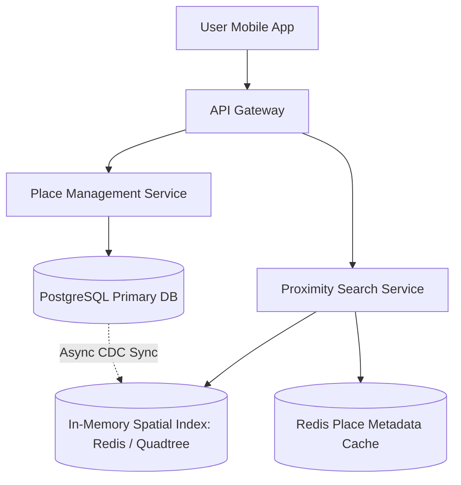
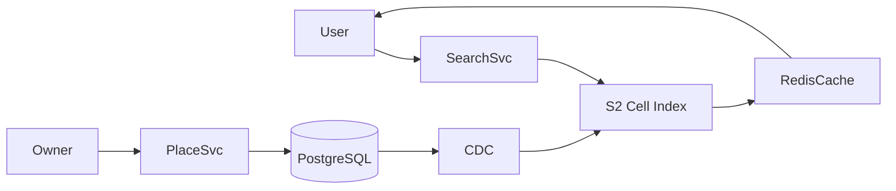

# System Design: Yelp / Proximity Search Service

> **Domain**: Location-Based Business Directory & Spatial Search
> **Interview Target**: SDE2 / Senior Backend / Staff Engineer
> **Framework**: DESIGN-FLOW (45-Minute Game Plan)

---

## 1. Problem
Design a high-scale proximity search service (like Yelp / Google Places) allowing millions of users to find nearby businesses (restaurants, cafes, mechanics) based on geographic radius, category filters, ratings, and open hours in $< 50\text{ms}$.

## 2. Requirements Clarification
- What is the search radius? (Configurable: 1km to 20km)
- Are reviews and photos included? (Yes, attached to business profile)
- How frequently do business locations change? (Rarely; writes are low, reads are extremely high $100:1$)
- Do we need real-time open/closed status? (Yes, calculated dynamically against business operating hours)

## 3. Functional Requirements
- **FR-1**: Users can search for businesses within a specified radius (e.g. 'Coffee shops within 2 miles').
- **FR-2**: Users can filter by rating, price, and open hours.
- **FR-3**: Business owners can create and update business profiles, photos, and operating hours.
- **FR-4**: Users can submit reviews and photos.

## 4. Non-Functional Requirements
- **NFR-1 (High Availability)**: $99.99\%$ uptime for search queries.
- **NFR-2 (Low Latency)**: Proximity search response $< 50\text{ms}$ globally.
- **NFR-3 (High Scalability)**: Support $50\text{M}$ DAU and $100\text{M}$ searches/day.
- **NFR-4 (Data Consistency)**: Eventual consistency for business updates (within 1 minute).

## 5. Assumptions
- $50\text{M}$ Daily Active Users (DAU).
- $200\text{M}$ total registered businesses globally.
- Average business record size = $2\text{ KB}$.

## 6. Capacity Estimation
- **Read QPS (Searches)**: $100\text{M} / 86,400 \approx 1,160\text{ QPS}$ (Peak: $5,000\text{ QPS}$).
- **Write QPS (Updates/Reviews)**: $10\text{M} / 86,400 \approx 115\text{ QPS}$.
- **Total Business Storage**: $200\text{M businesses} \times 2\text{ KB} \approx 400\text{ GB}$ (Can easily fit in memory across a Redis cluster!).
- **Spatial Index RAM**: $200\text{M} \times 32\text{ bytes} \approx 6.4\text{ GB RAM}$.

## 7. API Design
- `GET /v1/places/search?lat=37.77&lon=-122.41&radius_km=5&category=cafe&min_rating=4.0`
- `GET /v1/places/{business_id}`
- `POST /v1/places/{business_id}/reviews { rating, comment, photo_urls }`

## 8. Data Model
- **Business Entity (PostgreSQL / DynamoDB)**: `business_id (UUID PK)`, `name`, `category`, `lat`, `lon`, `geohash`, `rating_avg`, `review_count`, `hours (JSON)`.
- **Spatial Index (Redis Geospatial / Quadtree)**: `geohash / S2 Cell -> List of Business IDs`.
- **Reviews Table (PostgreSQL)**: `review_id`, `business_id (FK)`, `user_id`, `rating`, `text`, `created_at`.

## 9. High-Level Architecture


## 10. Detailed Architecture
```mermaid
flowchart TD
    subgraph ReadFlow["1. Proximity Search Execution Flow"]
        User[User App (lat, lon, radius)] --> SearchEngine[Search Service]
        SearchEngine --> S2Compute[Compute S2 Target Cell + 8 Neighbor Cells]
        S2Compute --> RedisSpatial[(Redis Geospatial Index)]
        RedisSpatial -->|Returns Candidate Business IDs| FilterEngine[Filter Engine]
        FilterEngine --> PlaceCache[(Redis Metadata Cache: Ratings, Hours)]
        FilterEngine --> FinalResults[Return Ranked Top-20 Places ✅]
    end

    subgraph WriteFlow["2. Business Update & Review Flow"]
        Owner[Business Owner] --> EditAPI[Business Management Service]
        EditAPI --> PostgresDB[(PostgreSQL Master)]
        PostgresDB --> Debezium[Debezium CDC]
        Debezium --> KafkaTopic[(Kafka: 'place-updates')]
        KafkaTopic --> IndexUpdater[Spatial Index & Cache Updater]
        IndexUpdater --> RedisSpatial
        IndexUpdater --> PlaceCache
    end
```

## 11. Request Flow
1. Client sends coordinates and radius. 2. Search service converts to Geohash / S2 cell. 3. Fetches business IDs from target cell and 8 adjacent neighbor cells. 4. Filters candidate IDs against category, price, and open hours in Redis cache. 5. Computes Haversine distance and returns top-20 ranked results.

## 12. Data Flow
Search: Client -> S2 Spatial Index (Redis) -> Filter Engine -> Place Cache -> Client.

## 13. Database Selection
PostgreSQL for authoritative business profiles, review histories, and relational joins; Redis Geospatial / In-memory Quadtree for spatial indexing; S3 for business photos.

## 14. Caching
Redis Cache-Aside for hot business profiles; Redis in-memory spatial index for all global business coordinates; CDN for business photos.

## 15. Messaging
Kafka topic `place-updates` asynchronously syncs PostgreSQL mutations to Redis spatial indexes via Change Data Capture (Debezium).

## 16. Partitioning
Businesses partitioned by Geographic Region / City (e.g. `places:san_francisco`, `places:new_york`).

## 17. Replication
PostgreSQL Multi-AZ primary with read replicas; Redis Spatial Index replicated across 3 Availability Zones.

## 18. Consistency
Eventual consistency (updates to a restaurant's operating hours reflect in search results within 5 seconds).

## 19. Failure Handling
Dense downtown areas (10,000 businesses in 1km) -> Dynamic Quadtree decomposition splits dense nodes into sub-cells.

## 20. Bottlenecks
High query volume on popular tourist cities -> Mitigated by localized caching of spatial search queries in Redis.

## 21. Scaling Strategy
Read/Write splitting in PostgreSQL; regional sharding of in-memory spatial indexes.

## 22. Observability
Spatial Query Latency (p99 < 30ms), Cache Hit Ratio (> 98%), Index Sync Lag, Haversine Calculation Rate.

## 23. Security
WAF protection, rate limiting on review submissions to prevent review bombing/spam.

## 24. Cost Considerations
In-memory Redis spatial index uses only 6.4GB RAM ($50/month), eliminating heavy database spatial compute costs.

## 25. Trade-offs
In-Memory Google S2 / Geohash (Sub-30ms, simple, massive read scale) vs PostGIS R-Tree (Heavy SQL compute, slower under 10k QPS).

## 26. Alternative Designs
Pure Relational B-Tree `WHERE lat BETWEEN AND lon BETWEEN` (Rejected: causes full table scans under load).

## 27. Final Architecture


## 28. Interview Follow-up Questions
1. Why is it mandatory to query the target cell plus its 8 neighboring cells in Geohash proximity search? 2. How does a Quadtree dynamically rebalance when thousands of businesses are added to a dense downtown area? 3. How do you handle dynamic open/closed filtering across multiple time zones?

## 29. Building Blocks Used
`BB-03` (RDBMS), `BB-05` (CDN), `BB-10` (Cache), `BB-12` (Kafka), `BB-32` (Geospatial Indexing)
