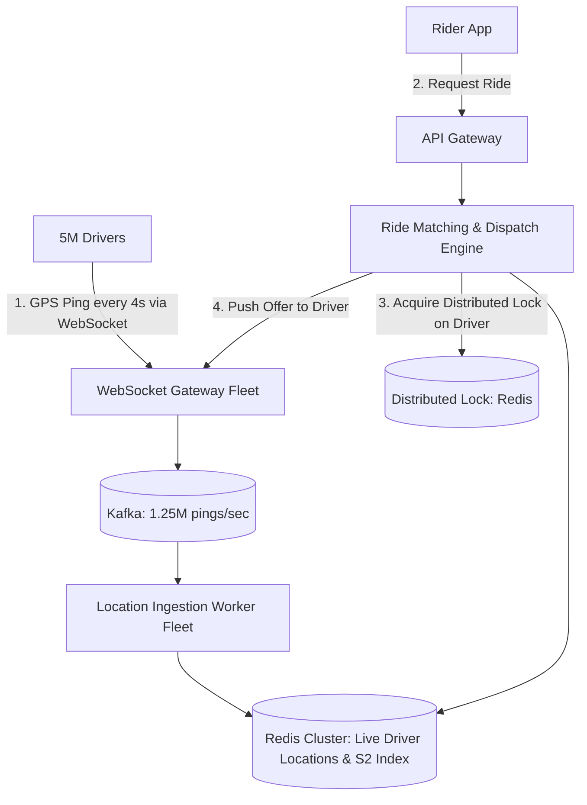
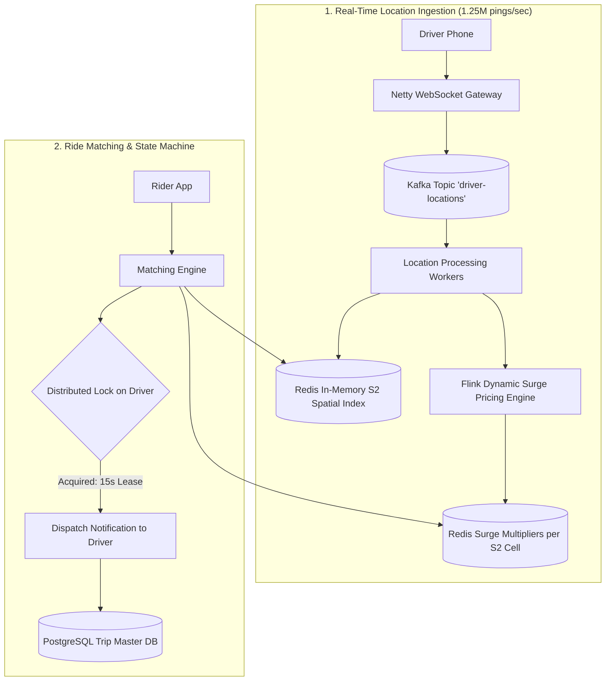
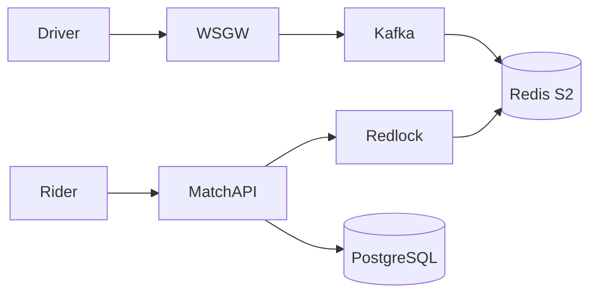

# System Design: Uber / Lyft Real-Time Ride Hailing Platform

> **Domain**: Real-Time Transportation & Geospatial Matching Platform
> **Interview Target**: SDE2 / Senior Backend / Staff Engineer
> **Framework**: DESIGN-FLOW (45-Minute Game Plan)

---

## 1. Problem
Design a real-time ride hailing platform connecting millions of active riders with nearby drivers, processing continuous GPS location streams, dynamic supply-demand surge pricing, and sub-5 second ride matching.

## 2. Requirements Clarification
- What is the driver location update frequency? (Every 4 seconds)
- How does ride matching work? (Rider requests ride -> finds top 5 closest available drivers within 3km -> dispatches offer to driver 1 -> 15s timeout -> cascades to driver 2)
- Is surge pricing required? (Yes, calculated per Google S2 cell based on real-time supply vs demand ratio)
- Are trip tracking and payments in scope? (Yes, real-time WebSocket route tracking and post-trip payment)

## 3. Functional Requirements
- **FR-1**: Drivers can toggle online/offline and continuously stream their GPS coordinates every 4s.
- **FR-2**: Riders can view nearby available drivers on a real-time map.
- **FR-3**: Riders can request a ride and get matched with the closest available driver in $< 5\text{s}$.
- **FR-4**: Real-time live trip tracking via WebSockets and automatic fare deduction upon dropoff.

## 4. Non-Functional Requirements
- **NFR-1 (High Availability)**: $99.999\%$ uptime (transportation safety critical).
- **NFR-2 (Ultra-Low Latency)**: Location ingestion $< 50\text{ms}$; Driver dispatch matching $< 3\text{s}$.
- **NFR-3 (High Scalability)**: Support $5\text{M}$ active concurrent drivers streaming GPS simultaneously.
- **NFR-4 (Consistency)**: Strong consistency for driver dispatch lock (a driver cannot be assigned to two rides simultaneously).

## 5. Assumptions
- $5\text{M}$ active drivers; $25\text{M}$ active riders daily.
- Driver sends GPS ping every $4\text{ seconds}$.
- Average trip duration = $20\text{ minutes}$; $40\text{M}$ trips completed per day.

## 6. Capacity Estimation
- **GPS Ingestion QPS**: $5\text{M drivers} / 4\text{s} = \mathbf{1,250,000\text{ GPS pings/sec}}$ continuous write volume!
- **Ride Request QPS**: $40\text{M} / 86,400 \approx 460\text{ requests/sec}$ (Peak: $2,500\text{ requests/sec}$).
- **GPS Ingestion Bandwidth**: $1.25\text{M pings/sec} \times 100\text{ bytes} = \mathbf{125\text{ MB/sec}} (1\text{ Gbps})$.
- **Live Driver Location Store**: $5\text{M drivers} \times 64\text{ bytes} \approx \mathbf{320\text{ MB RAM}}$ in Redis!

## 7. API Design
- `POST /v1/driver/location { lat, lon, bearing, status: 'AVAILABLE' }`
- `POST /v1/rides/request { pickup: [lat, lon], dropoff: [lat, lon] } -> { trip_id, fare_estimate }`
- `POST /v1/rides/{id}/accept { driver_id }`

## 8. Data Model
- **Live Driver Location (Redis / Ringpop)**: `driver_id -> { lat, lon, s2_cell_id, status (AVAILABLE/DISPATCHED/ON_TRIP), updated_at }`.
- **S2 Cell Spatial Index (Redis Geospatial)**: `s2_cell_id -> Set of AVAILABLE driver_ids`.
- **Trips Table (PostgreSQL / Spanner)**: `trip_id (UUID PK)`, `rider_id`, `driver_id`, `pickup_geom`, `dropoff_geom`, `status`, `fare`.

## 9. High-Level Architecture

## 10. Detailed Architecture

## 11. Request Flow
1. Driver streams GPS. 2. Ingestion workers update Redis S2 cell index. 3. Rider requests ride. 4. Matching engine queries Rider's S2 cell + 8 neighbors for `AVAILABLE` drivers. 5. Calculates ETAs. 6. Acquires Redlock on nearest driver. 7. Sends dispatch offer via WebSocket with 15s countdown timer. 8. If accepted: marks driver `DISPATCHED` and creates trip record.

## 12. Data Flow
Driver GPS -> WebSocket -> Kafka -> Location Worker -> Redis S2 Index -> Matching Engine -> Redlock -> Trip DB.

## 13. Database Selection
Redis Cluster for in-memory live driver locations and S2 spatial index; PostgreSQL / Spanner for transactional trip records and billing; Apache Kafka for real-time location stream ingestion.

## 14. Caching
Redis In-Memory Spatial Grid (320MB total, sub-5ms lookups); Redis Surge Multiplier cache.

## 15. Messaging
Kafka cluster partitioned by `hash(city_id)` handling 1.25M location pings/sec without database lock contention.

## 16. Partitioning
Driver locations partitioned by City / S2 Region Cell (e.g. `drivers:nyc`, `drivers:sf`).

## 17. Replication
Redis Cluster primary-standby in Multi-AZ; PostgreSQL Multi-AZ synchronous replication with zero data loss.

## 18. Consistency
Strict linearizability for driver dispatch locks (Redlock); Eventual consistency for live map rendering of nearby cars.

## 19. Failure Handling
Two riders matched with the same driver simultaneously -> Redlock distributed lock ensures only 1 rider acquires driver lease.

## 20. Bottlenecks
Massive GPS write volume (1.25M QPS) -> Bypasses disk DB completely; streamed purely through Kafka and in-memory Redis.

## 21. Scaling Strategy
City-level cell architecture: compute instances and Redis clusters are isolated per metropolitan region.

## 22. Observability
Location Ingestion Latency (p99 < 30ms), Matching Time (< 3s), Driver Acceptance Rate, Active WebSocket Connections count.

## 23. Security
TLS 1.3, driver location obfuscation before ride match, encrypted payment tokenization via Stripe.

## 24. Cost Considerations
In-memory Redis architecture requires only $500/month in RAM infrastructure to track 5M active cars globally.

## 25. Trade-offs
Strict Distributed Lock (Redlock: prevents double booking, brief latency overhead) vs Optimistic Matching (High throughput, risk of collision).

## 26. Alternative Designs
Writing raw GPS pings directly to a PostgreSQL database table (Rejected: 1.25M writes/sec would instantly crash any SQL cluster).

## 27. Final Architecture

## 28. Interview Follow-up Questions
1. How does Uber prevent two riders from being matched with the same driver simultaneously? 2. How is dynamic Surge Pricing calculated in real-time per S2 cell? 3. What happens if a driver loses network connection mid-trip?

## 29. Building Blocks Used
`BB-02` (Load Balancer), `BB-10` (Cache), `BB-12` (Kafka), `BB-21` (Distributed Lock), `BB-32` (Geospatial), `BB-37` (WebSocket)
