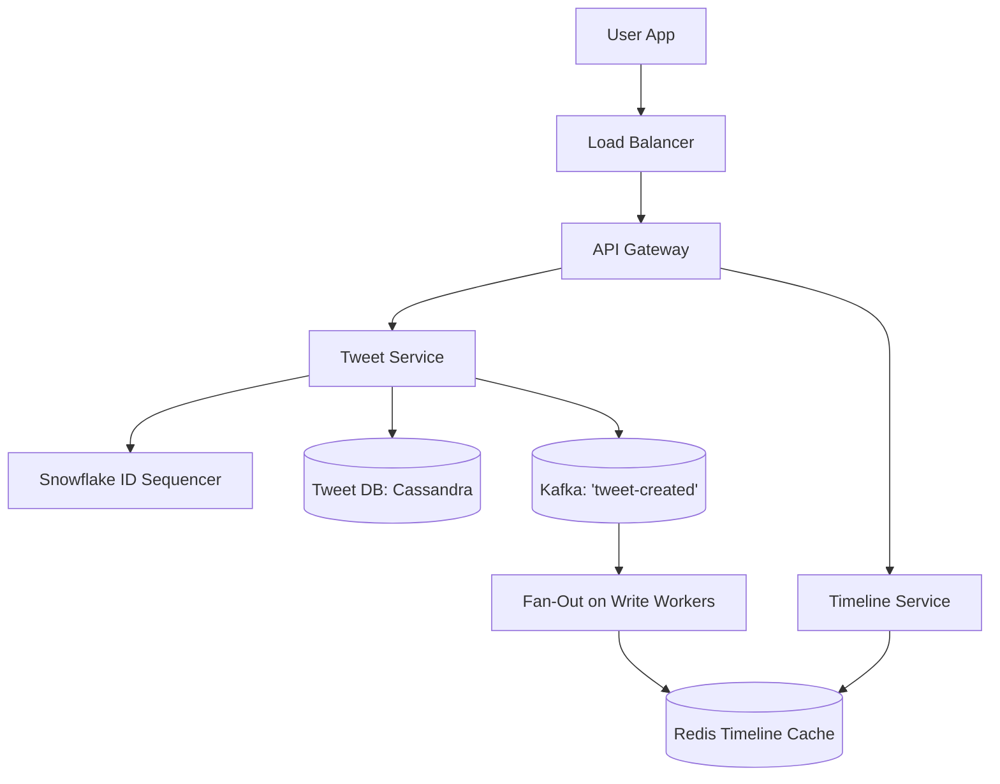
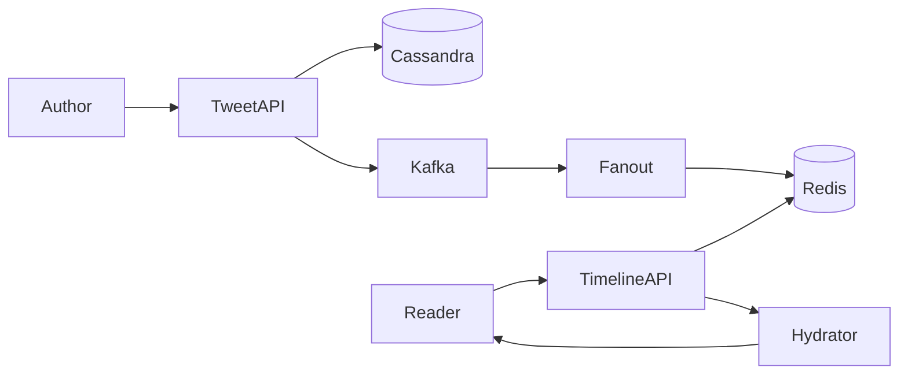

# System Design: Twitter / X Global Social Network

> **Domain**: Social Networking & Real-Time Microblogging
> **Interview Target**: SDE2 / Senior Backend / Staff Engineer
> **Framework**: DESIGN-FLOW (45-Minute Game Plan)

---

## 1. Problem
Design a global microblogging platform allowing 300M+ users to post short tweets (with media), follow other users, like/retweet content, and render personalized reverse-chronological home timelines in $< 50\text{ms}$.

## 2. Requirements Clarification
- What is the character limit and media support? (280 text characters, up to 4 images or 1 video)
- How are celebrity users with 50M+ followers handled? (Hybrid Fan-out: Push for regular users, Pull for celebrities)
- Are direct messages in scope? (No, focus on public tweets, follows, and home timeline)
- Do we need full-text search? (Yes, via search index integration)

## 3. Functional Requirements
- **FR-1**: Users can post tweets (text + media) and delete their own tweets.
- **FR-2**: Users can follow and unfollow other users.
- **FR-3**: Users can view their Home Timeline (tweets from followed users) and User Timeline.
- **FR-4**: Users can like, retweet, and search for tweets.

## 4. Non-Functional Requirements
- **NFR-1 (High Availability)**: $99.99\%$ uptime for timeline reads.
- **NFR-2 (Low Latency)**: Home timeline rendering $< 50\text{ms}$; Tweet posting $< 200\text{ms}$.
- **NFR-3 (High Scalability)**: Support $300\text{M}$ DAU, $500\text{M}$ tweets/day, $1.5\text{B}$ timeline reads/day.
- **NFR-4 (Consistency)**: Eventual consistency for timeline updates (1–2 seconds delay is acceptable).

## 5. Assumptions
- $300\text{M}$ Daily Active Users (DAU).
- $500\text{M}$ tweets created per day; each user views their home timeline $5$ times/day.
- Average tweet text size = $300\text{ bytes}$; $20\%$ of tweets contain images ($1\text{ MB}$).

## 6. Capacity Estimation
- **Write QPS (Tweets)**: $500\text{M} / 86,400 \approx 5,800\text{ tweets/sec}$ (Peak: $25,000\text{ tweets/sec}$ during major events).
- **Read QPS (Timeline)**: $1.5\text{B} / 86,400 \approx 17,360\text{ reads/sec}$ (Peak: $52,000\text{ reads/sec}$).
- **Daily Tweet Storage**: $500\text{M} \times 300\text{ B} = \mathbf{150\text{ GB/day text}}$, plus $100\text{M images} \times 1\text{ MB} = \mathbf{100\text{ TB/day media}}$.
- **5-Year Text Storage**: $150\text{ GB/day} \times 365 \times 5 \approx \mathbf{273\text{ TB}}$ (Sharded PostgreSQL / Manhattan KV).
- **Timeline Cache Sizing**: $300\text{M users} \times 800\text{ tweet IDs} \times 8\text{ bytes} \approx \mathbf{1.92\text{ TB RAM}}$ across Redis Cluster.

## 7. API Design
- `POST /v1/tweets { text, media_ids } -> { tweet_id, created_at }`
- `GET /v1/timeline/home?limit=20&cursor=...`
- `POST /v1/users/{id}/follow`
- `POST /v1/tweets/{id}/like`

## 8. Data Model
- **Tweets Table (Cassandra / PostgreSQL)**: `tweet_id (INT64 PK - Snowflake)`, `author_id (FK)`, `content`, `media_urls`, `like_count`, `retweet_count`, `created_at`.
- **Followers Table (PostgreSQL / Graph DB)**: `user_id`, `follower_id`, `created_at` (Composite PK `(user_id, follower_id)`).
- **Timeline Cache (Redis ZSET)**: `timeline:{user_id} -> ZSET of {score: timestamp, member: tweet_id}`.

## 9. High-Level Architecture


## 10. Detailed Architecture
```mermaid
flowchart TD
    subgraph WritePipeline["1. Hybrid Fan-Out Pipeline"]
        Author[User Posts Tweet] --> TweetAPI[Tweet Ingestion Service]
        TweetAPI --> SnowflakeGen[Snowflake 64-bit ID Gen]
        TweetAPI --> DBWrite[(Cassandra Tweet Master)]
        TweetAPI --> KafkaBus[(Kafka: 'tweet-published')]

        KafkaBus --> FanOutRouter{Author Follower Count?}
        FanOutRouter -->|Followers < 25k (Standard)| WorkerPush[Fan-Out Workers: ZADD to all follower Redis timelines]
        WorkerPush --> RedisCluster[(Redis Timeline Cache)]
        FanOutRouter -->|Followers >= 25k (Celebrity)| CelebrityStore[(Celebrity Tweet List)]
    end

    subgraph ReadPipeline["2. Home Timeline Rendering"]
        Reader[User Opens Feed] --> TimelineAPI[Timeline Service]
        TimelineAPI --> RedisCluster
        TimelineAPI -->|Fetch & Merge Celebrity Tweets| CelebrityStore
        TimelineAPI --> Hydrator[Tweet Hydration Engine: MGET from Tweet Cache]
        Hydrator --> ReturnTimeline[Return 20 Tweets to Client ✅]
    end
```

## 11. Request Flow
1. Author posts tweet. 2. Snowflake generates 64-bit ID. 3. Persisted in Cassandra. 4. Event published to Kafka. 5. If author has $< 25\text{k}$ followers: fan-out worker inserts `tweet_id` into all followers' Redis timeline lists. 6. If author is a celebrity: writes to celebrity's personal list only. 7. Reader requests timeline: reads Redis list, merges celebrity posts on-the-fly, hydrates tweet details via Redis `MGET`, and returns feed.

## 12. Data Flow
Tweet -> Snowflake -> Cassandra -> Kafka -> Fan-Out Worker -> Redis Timeline -> Hydrator -> Client.

## 13. Database Selection
Apache Cassandra / Manhattan (LSM-Tree) for massive write-heavy tweet storage; PostgreSQL for relational user profiles and follow graphs; Redis Cluster for in-memory timeline lists and sharded like counters.

## 14. Caching
Redis Sorted Sets (`ZSET`) caching the most recent 800 tweet IDs for all active users; Memcached / Redis for tweet object hydration; CDN for tweet images.

## 15. Messaging
Kafka topic `tweet-published` partitioned by `hash(author_id)` ensures smooth asynchronous fan-out processing.

## 16. Partitioning
Tweets partitioned by `tweet_id` (Snowflake ID embeds creation timestamp); User timelines partitioned in Redis by `user_id`.

## 17. Replication
Cassandra 3x replication across availability zones; Redis Cluster primary-standby replication.

## 18. Consistency
Eventual consistency for follower timeline propagation (within 1–2 seconds); Strong consistency for tweet creation.

## 19. Failure Handling
The 'Justin Bieber Problem' (Celebrity with 80M followers posts -> Push model would crash Redis with 80M writes -> Hybrid model resolves this).

## 20. Bottlenecks
Hot tweet likes/retweets -> Mitigated by Sharded Counters in Redis (`BB-18`).

## 21. Scaling Strategy
Only cache timelines for active users (DAU logged in within last 7 days); inactive user timelines generated on-demand upon login.

## 22. Observability
Timeline Load Latency (p99 < 50ms), Fan-out Lag (Time for follower to receive tweet), Ingestion QPS, Redis Memory Usage.

## 23. Security
OAuth2.0 / JWT user authorization, rate limiting on tweet creation (max 300 tweets/3 hours), media scanning for CSAM/malware.

## 24. Cost Considerations
Capping timeline caches to 800 tweet IDs per active user saves $85\%$ of Redis cluster RAM costs.

## 25. Trade-offs
Hybrid Fan-Out (Sub-50ms reads, complex architecture) vs Pure Fan-Out on Read (Simple, but 500ms+ read latency).

## 26. Alternative Designs
Pure Fan-Out on Write (Rejected: fails completely for celebrity accounts with millions of followers).

## 27. Final Architecture


## 28. Interview Follow-up Questions
1. How does Twitter's Snowflake algorithm guarantee roughly time-ordered 64-bit IDs without coordination? 2. Explain how the Hybrid Fan-Out model works for a user who follows both normal users and 5 celebrities. 3. How do you implement infinite scroll pagination using cursors?

## 29. Building Blocks Used
`BB-06` (Snowflake Sequencer), `BB-10` (Distributed Cache), `BB-12` (Kafka), `BB-18` (Sharded Counter), `BB-33` (Timeline Generator)
