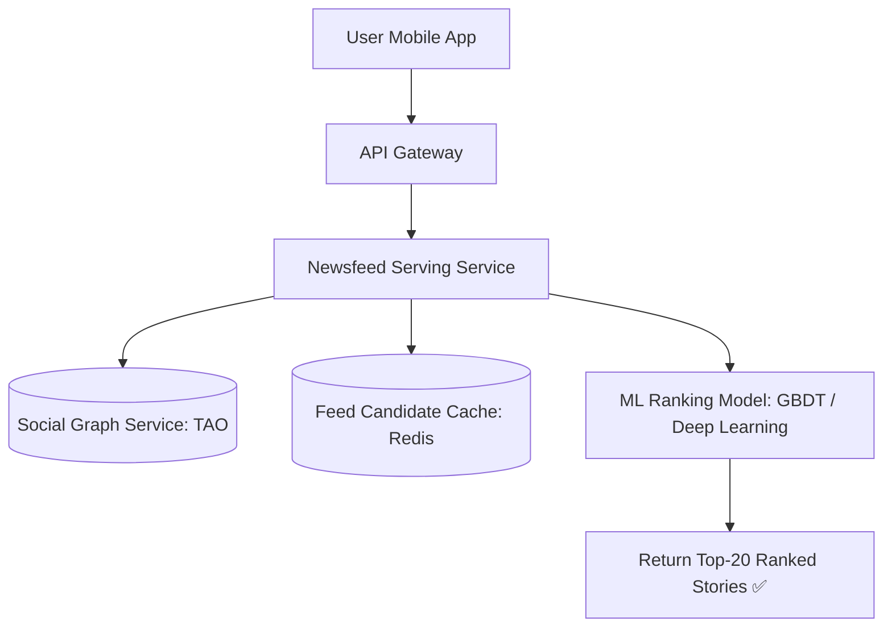
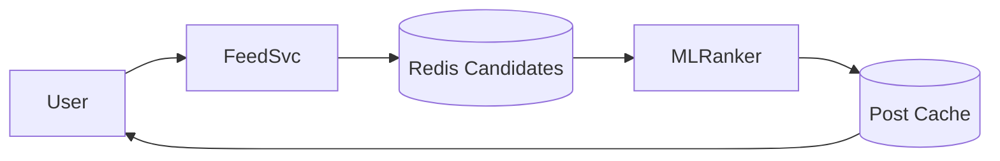

# System Design: Facebook Newsfeed Aggregator & Ranking System

> **Domain**: Social Feed Aggregation & Machine Learning Ranking
> **Interview Target**: SDE2 / Senior Backend / Staff Engineer
> **Framework**: DESIGN-FLOW (45-Minute Game Plan)

---

## 1. Problem
Design a personalized social newsfeed aggregator that aggregates friend updates, group posts, and followed page media into an affinity-ranked, dynamic newsfeed rendered in $< 80\text{ms}$ for billions of users.

## 2. Requirements Clarification
- How does newsfeed differ from Twitter timeline? (Twitter is reverse-chronological; Newsfeed is ML-ranked based on user affinity, content type, recency, and engagement probability)
- How many items are scored per feed refresh? (Retrieve ~500 candidates, score with ML ranker, return top 20)
- Are ads and sponsored posts injected? (Yes, blended into feed pipeline with ad budget constraints)
- How is cache invalidation handled when friends update posts? (Event-driven cache update via Kafka)

## 3. Functional Requirements
- **FR-1**: Users can view a personalized, ranked Newsfeed of posts from friends, groups, and pages.
- **FR-2**: Friends' posts, photos, and video activities are automatically ingested into the feed.
- **FR-3**: Machine learning ranking scores stories based on user affinity, engagement signals, and recency.
- **FR-4**: Feed supports continuous infinite scrolling with cursor pagination.

## 4. Non-Functional Requirements
- **NFR-1 (High Availability)**: $99.99\%$ uptime for feed serving.
- **NFR-2 (Low Latency)**: Feed generation response $< 80\text{ms}$ globally.
- **NFR-3 (High Scalability)**: Support $2\text{B}$ Daily Active Users and $10\text{B}$ feed requests/day.
- **NFR-4 (Freshness)**: New friend posts appear in feed within 5 seconds.

## 5. Assumptions
- $2\text{B}$ Daily Active Users (DAU).
- Average user has $300$ friends and follows $50$ pages.
- Each user requests their feed $5$ times/day ($10\text{B}$ feed views/day).

## 6. Capacity Estimation
- **Feed Read QPS**: $10\text{B} / 86,400 \approx \mathbf{115,700\text{ QPS}}$ (Peak: $\mathbf{350,000\text{ QPS}}$).
- **Post Ingestion QPS**: $500\text{M posts/day} / 86,400 \approx 5,800\text{ writes/sec}$.
- **Feed Cache Sizing**: $500\text{M active users/day} \times 500\text{ story IDs} \times 8\text{ bytes} \approx \mathbf{2\text{ TB RAM}}$ in Redis.

## 7. API Design
- `GET /v1/feed?limit=20&cursor=eyJpZCI6MTIzfQ==`
- `POST /v1/feed/action { post_id, action_type: 'CLICK' / 'LIKE' / 'IMPRESSION' }`

## 8. Data Model
- **Feed Candidate Cache (Redis)**: `user_feed:{user_id} -> Sorted Set of {score: ml_rank_score, member: post_id}`.
- **Social Graph DB (TAO / Neo4j / MySQL)**: `User -> FRIEND_OF -> User`, `User -> MEMBER_OF -> Group`.
- **Post Metadata DB (Cassandra / PostgreSQL)**: `post_id`, `author_id`, `content_type`, `media_url`, `created_at`.

## 9. High-Level Architecture


## 10. Detailed Architecture
```mermaid
flowchart TD
    subgraph CandidateGen["1. Candidate Retrieval (500 Stories)"]
        FriendAction[Friend Posts Story] --> KafkaEvent[(Kafka Event Stream)]
        KafkaEvent --> FanOutWorker[Fan-Out Workers]
        FanOutWorker --> RedisCandidates[(Redis Candidate Pool: Top 500 per User)]
    end

    subgraph MLRankingPipeline["2. Two-Stage Ranking Engine"]
        ReaderReq[User Requests Feed] --> FeedAggregator[Feed Aggregator]
        FeedAggregator --> RedisCandidates
        RedisCandidates -->|500 Candidates| FastScorer[Stage 1: Fast Scoring Filter -> 100 Candidates]
        FastScorer --> DeepRanker[Stage 2: Heavy ML Ranker (User Affinity + Engagement Score)]
        DeepRanker --> DiversityFilter[Diversity & Ad Injection Layer]
        DiversityFilter --> ReturnStories[Return Top 20 Stories to User ✅ (p99 < 70ms)]
    end
```

## 11. Request Flow
1. User requests feed. 2. Aggregator retrieves top 500 candidate post IDs from user's pre-computed Redis candidate pool. 3. Fast linear model filters down to 100 candidates. 4. Heavy ML model computes engagement probability: $P(\text{Click}) + 2 \times P(\text{Like}) + 5 \times P(\text{Comment}) + \text{Recency Decay}$. 5. Diversity filter ensures no more than 2 consecutive posts from the same friend. 6. Returns top 20 hydrated stories.

## 12. Data Flow
User Action -> Kafka -> Fan-Out -> Candidate Pool -> Two-Stage ML Ranker -> Ad Injection -> Final Feed.

## 13. Database Selection
Facebook TAO (Graph caching layer over MySQL) for social graph friend connections; Cassandra for immutable post storage; Redis for candidate story pools; Triton Inference Server for ML model scoring.

## 14. Caching
Multi-Tier Caching: (1) TAO in-memory graph cache, (2) Redis candidate pool cache (500 post IDs per active user), (3) Post object metadata cache.

## 15. Messaging
Kafka topic `social-actions` partitioned by `hash(user_id)` buffers friend post activity for asynchronous fan-out processing.

## 16. Partitioning
Social graph and candidate pools partitioned by `user_id` across database and Redis cluster shards.

## 17. Replication
TAO multi-region leader-follower replication; Redis Cluster with 3x replication.

## 18. Consistency
Eventual consistency (friend post appears in newsfeed within 5 seconds).

## 19. Failure Handling
Heavy ML scoring latency ($> 200\text{ms}$) -> Mitigated by Two-Stage Ranking (Fast coarse filter shrinks 500 candidates to 100 before heavy neural net scoring).

## 20. Bottlenecks
Extreme write load on viral group posts -> Group posts are not pushed to millions of members; instead, group candidate posts are pulled on-demand during feed generation.

## 21. Scaling Strategy
Pre-compute candidate pools asynchronously; serve feed directly from Redis candidate pool with lightweight online re-ranking.

## 22. Observability
Feed Generation Latency (p99 < 80ms), ML Scoring Latency, Candidate Pool Cache Hit Ratio, Feed Engagement CTR.

## 23. Security
Privacy filters (validating post audience settings: Public, Friends Only, Custom List) before rendering stories.

## 24. Cost Considerations
Executing heavy deep learning ranking on only the top 100 candidates saves $80\%$ of GPU inference cluster spend.

## 25. Trade-offs
Two-Stage ML Ranking (Sub-80ms, high precision) vs Single Heavy Neural Net (400ms latency, high cost).

## 26. Alternative Designs
Pure Fan-Out on Read (Rejected: computing graph traversals and ML scoring across 300 friends on every feed refresh would require 500ms+).

## 27. Final Architecture


## 28. Interview Follow-up Questions
1. How does Facebook TAO cache and traverse social graph edges in-memory? 2. Explain the mathematical formula for Newsfeed ranking (EdgeRank / ML Engagement probability). 3. How does the Two-Stage Ranking engine balance low latency with deep ML personalization?

## 29. Building Blocks Used
`BB-03` (RDBMS), `BB-10` (Distributed Cache), `BB-12` (Kafka), `BB-33` (Timeline Generator), `BB-34` (Recommendation Pipeline)
