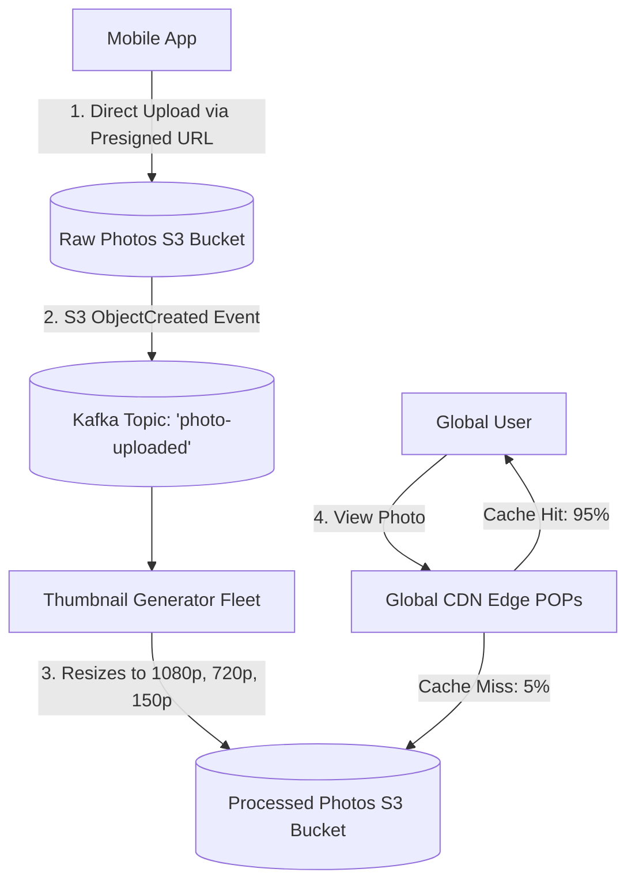
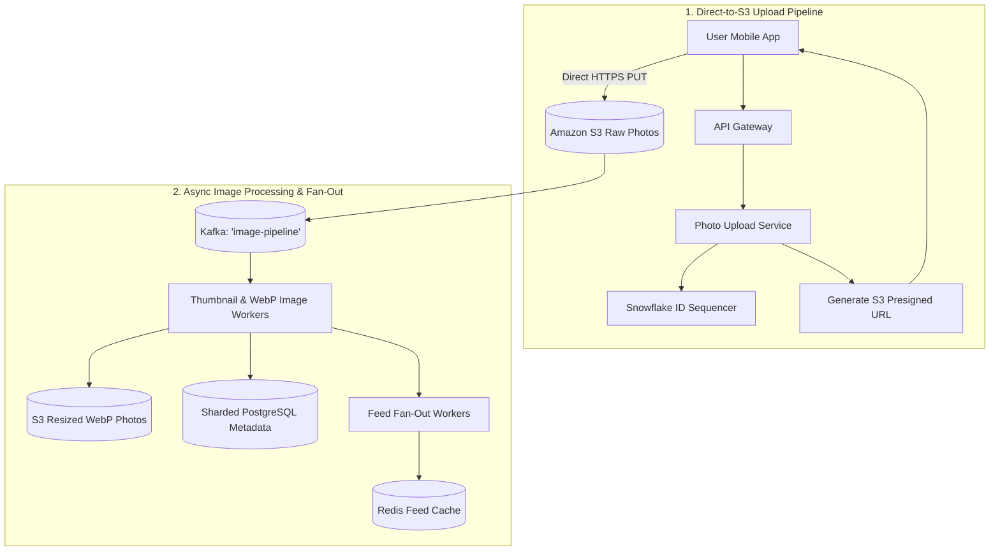
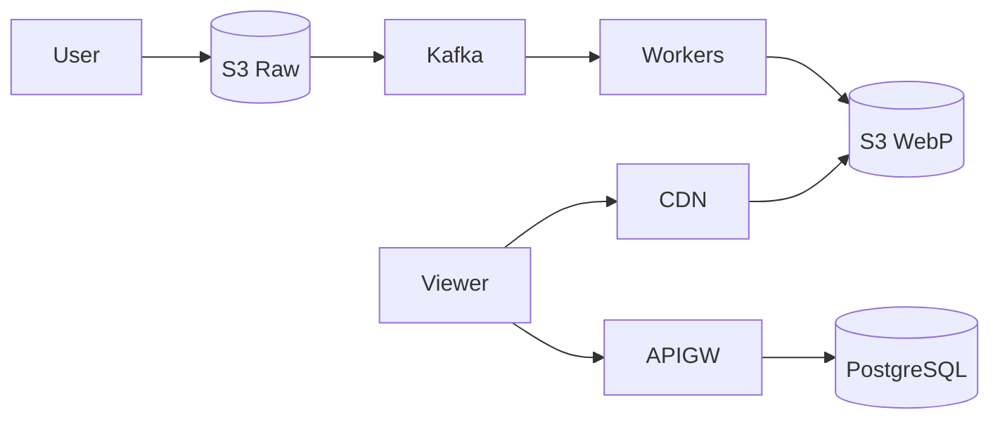

# System Design: Instagram / Flickr Photo Sharing & Feed Platform

> **Domain**: Media Sharing & Content Delivery Platform
> **Interview Target**: SDE2 / Senior Backend / Staff Engineer
> **Framework**: DESIGN-FLOW (45-Minute Game Plan)

---

## 1. Problem
Design a mobile photo sharing platform allowing 500M+ users to upload photos, apply filters, follow accounts, view a photo grid profile, and stream a real-time photo newsfeed with sub-second image loading globally.

## 2. Requirements Clarification
- What image resolutions must be supported? (Original high-res, standard feed 1080x1080, and small thumbnail 150x150)
- Where is image processing performed? (Client applies visual filters; server generates multi-resolution thumbnails asynchronously)
- How is photo metadata stored? (Sharded relational database with custom 64-bit ID sequencer)
- How are images delivered globally? (Amazon S3 Blob Store backed by Cloudflare / CloudFront CDN)

## 3. Functional Requirements
- **FR-1**: Users can upload photos with captions, hashtags, and location tags.
- **FR-2**: Automated thumbnail generation (1080p, 720p, 150p) upon upload.
- **FR-3**: Users can view their User Profile Photo Grid and Home Feed.
- **FR-4**: Users can follow users, like photos, and comment on posts.

## 4. Non-Functional Requirements
- **NFR-1 (High Availability)**: $99.99\%$ availability for photo viewing.
- **NFR-2 (Low Latency)**: Feed image load time $< 200\text{ms}$ globally.
- **NFR-3 (High Scalability)**: Support $500\text{M}$ DAU, $100\text{M}$ photo uploads/day, $2\text{B}$ photo views/day.
- **NFR-4 (Durability)**: 11 Nines durability for uploaded original photos (zero photo loss).

## 5. Assumptions
- $500\text{M}$ Daily Active Users (DAU).
- $100\text{M}$ new photos uploaded per day.
- Average photo size = $2\text{ MB}$; thumbnails total $500\text{ KB}$ per photo.

## 6. Capacity Estimation
- **Upload QPS**: $100\text{M} / 86,400 \approx 1,160\text{ uploads/sec}$ (Peak: $3,500\text{ uploads/sec}$).
- **Read QPS (Photo Views)**: $2\text{B} / 86,400 \approx 23,150\text{ views/sec}$ (Peak: $70,000\text{ views/sec}$).
- **Daily Blob Storage**: $100\text{M photos} \times 2.5\text{ MB} = \mathbf{250\text{ TB/day}} \implies 456\text{ PB / 5 years}$.
- **Daily Metadata Storage**: $100\text{M} \times 500\text{ bytes} = \mathbf{50\text{ GB/day}} \implies 91\text{ TB / 5 years}$.
- **Egress Bandwidth**: $23,150\text{ views/sec} \times 500\text{ KB} \approx \mathbf{11.57\text{ GB/sec}} (92.5\text{ Gbps})$.

## 7. API Design
- `POST /v1/photos/upload_url -> { upload_url, photo_id }` (Presigned S3 upload URL)
- `POST /v1/photos/commit { photo_id, caption, location, tags }`
- `GET /v1/users/{id}/photos?limit=24&cursor=...`
- `GET /v1/feed/photos?limit=20`

## 8. Data Model
- **Photos Table (PostgreSQL Sharded)**: `photo_id (INT64 PK - Snowflake)`, `user_id (FK)`, `s3_url_original`, `s3_url_thumb`, `caption`, `like_count`, `created_at`.
- **Users Table**: `user_id`, `username`, `profile_photo_url`, `bio`, `created_at`.
- **Likes Table**: `photo_id`, `user_id`, `created_at` (Composite PK `(photo_id, user_id)`).

## 9. High-Level Architecture

## 10. Detailed Architecture

## 11. Request Flow
1. Client requests upload URL. 2. Server generates Snowflake `photo_id` and S3 Presigned URL. 3. Client uploads directly to S3. 4. S3 triggers Kafka event. 5. Workers convert image to modern WebP format and generate 1080p/720p/150p thumbnails. 6. Photo metadata committed to PostgreSQL. 7. Feed fan-out worker pushes `photo_id` to followers' Redis feeds. 8. Viewers fetch WebP images from CDN.

## 12. Data Flow
Client -> Presigned S3 -> Kafka -> Image Workers -> S3 WebP -> PostgreSQL -> Feed Fan-out -> CDN -> Viewer.

## 13. Database Selection
PostgreSQL (Sharded by User ID) for relational metadata and ACID user profile integrity; Amazon S3 for binary photo storage; Redis for feed timeline caches and like counters.

## 14. Caching
CDN caches 95%+ of photo image reads; Redis caches user profile metadata and top 800 feed photo IDs; Client mobile app caches recent 50 thumbnails in local disk LRU.

## 15. Messaging
Kafka topic `photo-uploaded` buffers image processing jobs, ensuring burst upload traffic never overwhelms thumbnail workers.

## 16. Partitioning
PostgreSQL partitioned by `user_id` so all photos for a single user reside on the same database shard.

## 17. Replication
PostgreSQL Multi-AZ primary with read replicas; S3 11 Nines durability with Cross-Region Replication (CRR).

## 18. Consistency
Strong consistency for photo upload commits; Eventual consistency for feed fan-out and follower like counters.

## 19. Failure Handling
Thumbnail processing backlog during peak hours -> Auto-scaling worker fleet on Kubernetes KEDA based on Kafka queue depth.

## 20. Bottlenecks
Viral photo traffic -> Offloaded completely by Global CDN Edge caching.

## 21. Scaling Strategy
Converting all uploaded JPEG/PNG photos to compressed WebP/AVIF format reduces image size by $35\%$ with zero visible quality loss.

## 22. Observability
Image Load Latency (TTFB < 100ms), Thumbnail Generation Time (< 2s), CDN Cache Hit Ratio (> 95%), S3 Egress Bandwidth.

## 23. Security
Presigned URLs with 5-minute TTL, stripping EXIF GPS metadata from public photos to protect user location privacy.

## 24. Cost Considerations
Serving modern WebP/AVIF formats saves $35\%$ in CDN egress bandwidth ($500,000+/year savings at scale).

## 25. Trade-offs
WebP/AVIF Format (35% smaller, minor CPU encoding overhead) vs Standard JPEG (Larger bandwidth, zero encode overhead).

## 26. Alternative Designs
Storing binary image data directly as BLOBs in PostgreSQL (Rejected: causes database buffer pool thrashing and massive storage bloat).

## 27. Final Architecture

## 28. Interview Follow-up Questions
1. Why is Direct-to-S3 upload via Presigned URLs superior to streaming through application servers? 2. How does converting images to WebP/AVIF save millions in CDN egress costs? 3. How do you strip sensitive EXIF GPS metadata during image processing?

## 29. Building Blocks Used
`BB-05` (CDN), `BB-06` (Snowflake ID), `BB-10` (Distributed Cache), `BB-12` (Kafka), `BB-14` (Blob Store), `BB-33` (Timeline Generator)
