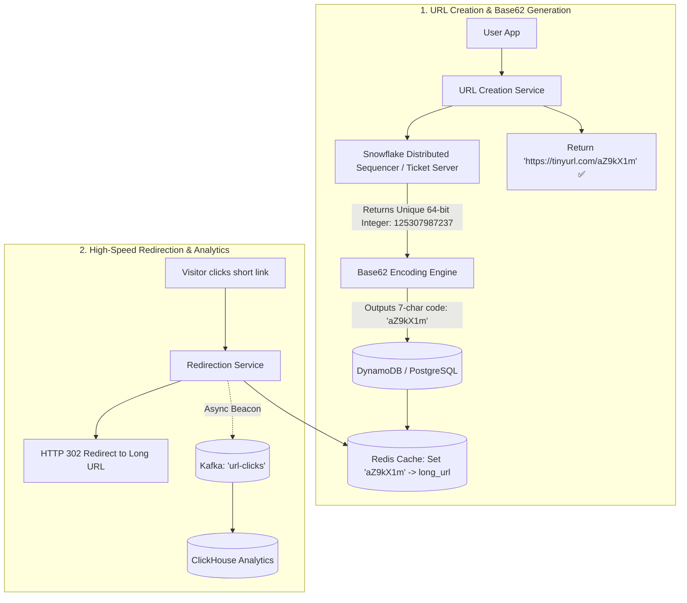
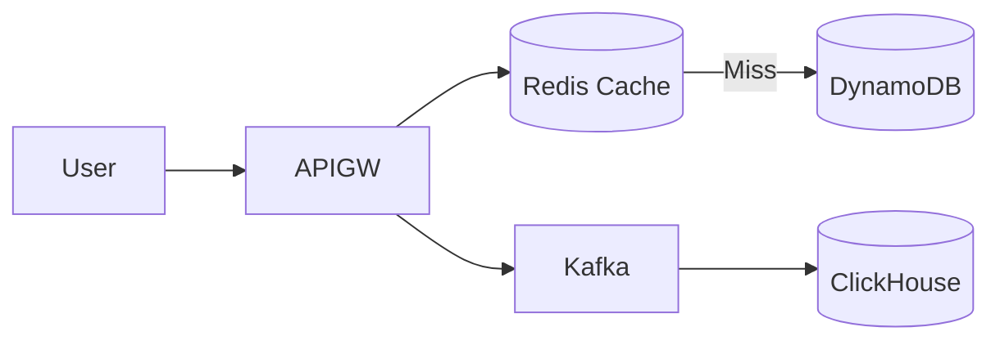

# System Design: TinyURL / Bitly Distributed URL Shortener

> **Domain**: URL Shortening & High-Throughput Redirection Infrastructure
> **Interview Target**: SDE2 / Senior Backend / Staff Engineer
> **Framework**: DESIGN-FLOW (45-Minute Game Plan)

---

## 1. Problem
Design a globally distributed, highly available URL shortening service (like TinyURL / Bitly) that converts long URLs into compact 7-character aliases, redirects users in $< 10\text{ms}$, and tracks real-time click analytics.

## 2. Requirements Clarification
- What is the shortened URL character length? (7 alphanumeric characters: `https://tinyurl.com/aZ9kX1m`)
- What is the expected read-to-write ratio? (Heavy read workload: $100:1$ read-to-write ratio)
- Do URLs expire? (Default expiration after 5 years, with custom custom alias support)
- Are click analytics required? (Yes, track total clicks, referrers, and country of origin asynchronously)

## 3. Functional Requirements
- **FR-1**: Users can enter a long URL and receive a unique 7-character short URL.
- **FR-2**: Users accessing a short URL are redirected via HTTP 301/302 to the original long URL in $< 10\text{ms}$.
- **FR-3**: Users can optionally specify a custom alias (e.g. `tinyurl.com/my-custom-link`).
- **FR-4**: Real-time click analytics tracking (click counts, referrers, geographic locations).

## 4. Non-Functional Requirements
- **NFR-1 (High Availability)**: $99.999\%$ uptime for URL redirections (redirections must never fail).
- **NFR-2 (Ultra-Low Latency)**: URL redirection latency $< 10\text{ms}$ globally.
- **NFR-3 (High Scalability)**: Support $100\text{M}$ new URLs created/month, $10\text{B}$ redirections/month.
- **NFR-4 (Security)**: Short URLs must not be guessable or scrapable sequentially.

## 5. Assumptions
- $100\text{M}$ new URLs shortened per month ($1.2\text{B}$/year).
- $100:1$ Read-to-Write ratio ($10\text{B}$ redirections/month).
- Average URL record size = $500\text{ bytes}$.

## 6. Capacity Estimation
- **Write QPS (Create)**: $100\text{M} / (30 \times 86,400) \approx \mathbf{40\text{ writes/sec}}$ (Peak: $150\text{ writes/sec}$).
- **Read QPS (Redirect)**: $10\text{B} / (30 \times 86,400) \approx \mathbf{4,000\text{ redirects/sec}}$ (Peak: $\mathbf{12,000\text{ redirects/sec}}$).
- **5-Year Storage**: $1.2\text{B/year} \times 5\text{ years} \times 500\text{ bytes} \approx \mathbf{3\text{ TB}}$ (Easily fits on a single NVMe SSD or partitioned NoSQL cluster).
- **Memory / Cache Sizing**: $20\%$ of daily read volume cached in Redis $\approx 4,000\text{ QPS} \times 86,400 \times 500\text{ bytes} \times 0.20 \approx \mathbf{34.5\text{ GB RAM}}$.

## 7. API Design
- `POST /v1/urls { long_url, custom_alias, expires_at } -> { short_url, created_at }`
- `GET /{short_code}` -> Returns HTTP 301/302 Redirect with `Location: {long_url}`
- `GET /v1/urls/{short_code}/analytics -> { total_clicks, referrers, countries }`

## 8. Data Model
- **URL Mapping Table (Distributed NoSQL / DynamoDB / PostgreSQL)**: `short_code (VARCHAR(7) PK)`, `long_url (TEXT)`, `user_id`, `created_at`, `expires_at`.
- **Click Analytics Table (Cassandra / ClickHouse)**: `click_id`, `short_code`, `timestamp`, `ip_address`, `country`, `referrer`.
- **Cache (Redis Cluster)**: `short_code -> long_url` with LRU eviction.

## 9. High-Level Architecture
```mermaid
flowchart TD
    Client[User Browser / Mobile] --> LB[Layer 7 Load Balancer]
    LB --> APIGW[URL Shortener Service Fleet]

    subgraph RedirectFlow["Sub-10ms Redirection Path"]
        APIGW --> CacheCheck{Check Redis Cache}
        CacheCheck -->|Cache Hit: 90%| RedirectHTTP[HTTP 301 / 302 Redirect ✅ (2ms)]
        CacheCheck -->|Cache Miss: 10%| ReadDB[(DynamoDB / PostgreSQL)]
        ReadDB --> PopulateCache[Write to Redis]
        PopulateCache --> RedirectHTTP
    end

    APIGW -. Async Click Event .-> Kafka[(Kafka Analytics Stream)]
    Kafka --> AnalyticsWorker[Click Analytics Worker]
    AnalyticsWorker --> AnalyticsDB[(ClickHouse Analytics DB)]
```

## 10. Detailed Architecture


## 11. Request Flow
1. Creation: User submits long URL. 2. Sequencer generates unique 64-bit ID. 3. Encodes ID to 7-character Base62 string. 4. Writes mapping to DynamoDB. 5. Warms Redis cache. 6. Redirection: Visitor clicks short link. 7. Service checks Redis cache. 8. Returns HTTP 302 Redirect. 9. Emits asynchronous click event to Kafka for analytics processing.

## 12. Data Flow
Create: Client -> Sequencer -> Base62 -> DB -> Cache. Redirect: Client -> Cache Hit -> HTTP 302 -> Kafka Analytics.

## 13. Database Selection
Amazon DynamoDB / PostgreSQL for authoritative key-value URL mappings; Redis Cluster for in-memory redirection caching; ClickHouse for high-throughput append-only click analytics.

## 14. Caching
Redis Cluster holds 35GB of top 20% active URLs (90%+ cache hit ratio); CDN edge caching for extremely viral links.

## 15. Messaging
Kafka topic `url-clicks` buffers millions of click events, shielding analytics databases from write saturation.

## 16. Partitioning
URL mappings partitioned by `hash(short_code)` across DynamoDB / PostgreSQL shards.

## 17. Replication
DynamoDB Global Tables Multi-Region Active-Active replication with sub-10ms global reads.

## 18. Consistency
Strong consistency on URL creation (custom alias uniqueness); Eventual consistency for click analytics counters.

## 19. Failure Handling
Hot short URL (e.g. Super Bowl commercial link with 500k clicks/sec) -> Mitigated by local in-memory Caffeine cache on application nodes.

## 20. Bottlenecks
Sequential ID guessing / Scraping attacks -> Mitigated by bit-shuffling the Snowflake integer before Base62 encoding.

## 21. Scaling Strategy
Stateless redirection compute instances scale horizontally behind an L7 load balancer.

## 22. Observability
Redirection Latency (p99 < 5ms), Cache Hit Ratio (> 90%), Creation QPS, 404 Not Found Rate.

## 23. Security
Malware / Phishing URL scanning via Google Safe Browsing API before generating short links; rate limiting on link creation (max 50 links/minute).

## 24. Cost Considerations
3 TB of total 5-year data easily hosted on cost-effective managed DynamoDB storage ($75/month).

## 25. Trade-offs
HTTP 301 Permanent Redirect (Browser caches redirection, zero server load, but loses click analytics) vs HTTP 302 Temporary Redirect (Server tracks every click, minor server load).

## 26. Alternative Designs
MD5 Hash Truncation with Collision Loops (Rejected: requires multiple database queries on collision, slow and unpredictable).

## 27. Final Architecture


## 28. Interview Follow-up Questions
1. Explain the difference between HTTP 301 and HTTP 302 redirection for URL shorteners. 2. Why is Base62 encoding backed by a distributed sequencer superior to MD5 hash truncation? 3. How do you prevent malicious actors from using your service for phishing and malware distribution?

## 29. Building Blocks Used
`BB-04` (KV Store), `BB-06` (Snowflake Sequencer), `BB-10` (Distributed Cache), `BB-13` (Rate Limiter), `BB-24` (Unique ID Generator)
