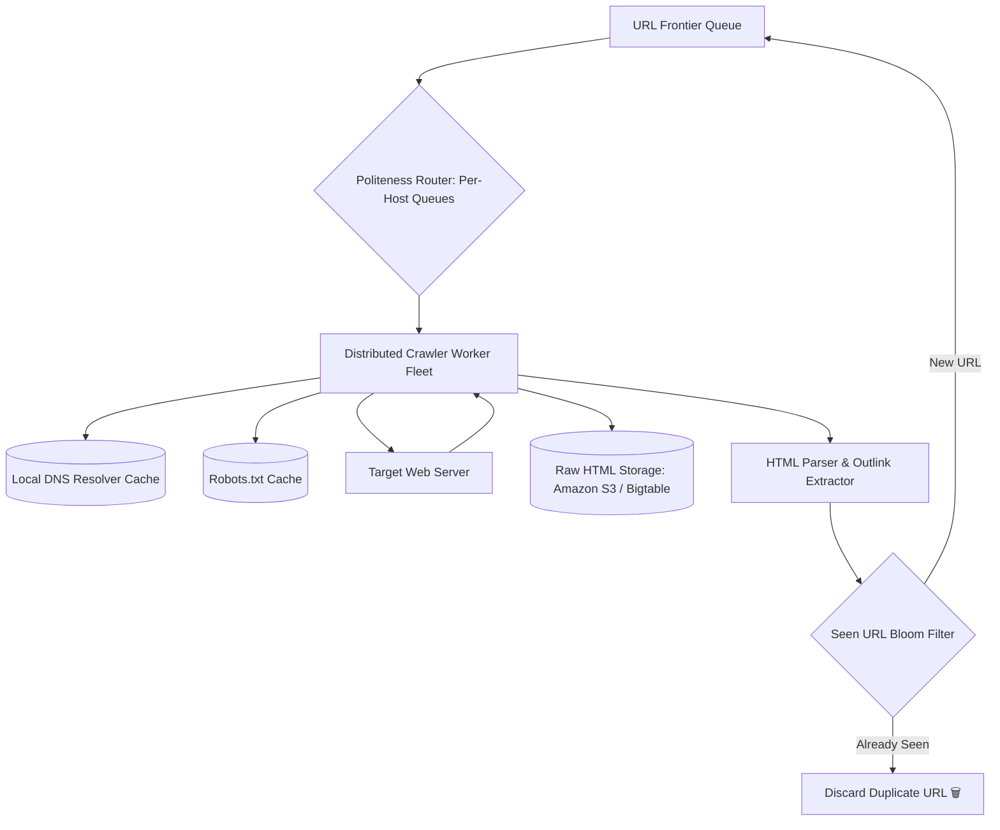
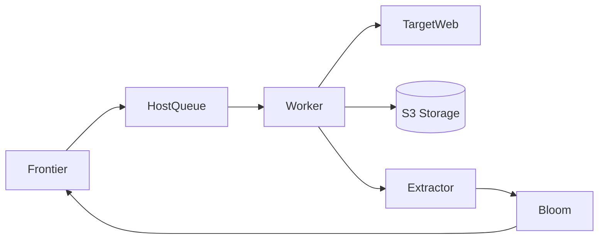

# System Design: Distributed Web Crawler (Google / Bing Search)

> **Domain**: Search Engine Infrastructure & Distributed Crawling
> **Interview Target**: SDE2 / Senior Backend / Staff Engineer
> **Framework**: DESIGN-FLOW (45-Minute Game Plan)

---

## 1. Problem
Design a scalable distributed web crawler (like Googlebot / Bingbot) capable of crawling, deduplicating, parsing, and storing 5 billion web pages per month while strictly respecting webmaster politeness rules and robots.txt protocols.

## 2. Requirements Clarification
- What is the target crawling volume? (5 Billion web pages per month $\approx 2,000\text{ pages/sec}$)
- What file types are crawled? (HTML, PDF, text documents; skip video/audio binaries)
- How is politeness enforced? (Never overload a single host: max 1 request every 2 seconds per domain)
- How do we handle duplicate pages and infinite URL traps? (Bloom Filters for URL deduplication, Content SimHash for duplicate detection)

## 3. Functional Requirements
- **FR-1**: Crawl billions of web pages starting from a seed list of URLs.
- **FR-2**: Extract text, metadata, and outlinks from crawled HTML pages.
- **FR-3**: Enforce Politeness by respecting `robots.txt` rules and rate limiting per domain.
- **FR-4**: Detect and discard duplicate URLs and duplicate page content.

## 4. Non-Functional Requirements
- **NFR-1 (Scalability)**: Crawl 5 Billion pages/month ($2,000\text{ pages/sec}$ continuous throughput).
- **NFR-2 (Fault Tolerance)**: Distributed worker crash must not lose frontier queue progress.
- **NFR-3 (Politeness)**: Strict host delay ($> 1\text{s}$) to avoid triggering DDoS defenses.
- **NFR-4 (Extensibility)**: Modular parser architecture supporting new document formats.

## 5. Assumptions
- $5\text{ Billion}$ pages crawled per month.
- Average web page raw HTML size = $100\text{ KB}$; compressed = $25\text{ KB}$.
- Average outlinks per page = $50\text{ links}$.

## 6. Capacity Estimation
- **Continuous Crawl Throughput**: $5\text{B} / (30 \times 86,400) \approx \mathbf{2,000\text{ pages/sec}}$ (Peak: $5,000\text{ pages/sec}$).
- **Network Ingress Bandwidth**: $2,000\text{ pages/sec} \times 100\text{ KB} = \mathbf{200\text{ MB/sec}} (1.6\text{ Gbps})$.
- **Monthly Raw Page Storage**: $5\text{B} \times 25\text{ KB compressed} \approx \mathbf{125\text{ TB/month}} \implies 1.5\text{ PB/year}$ in S3.
- **URL Seen Bloom Filter**: $5\text{B URLs} \times 10\text{ bits} \approx \mathbf{6.25\text{ GB RAM}}$ (Easily fits in memory with $1\%$ false positive rate).

## 7. API Design
- Internal Worker gRPC API: `CrawlTask(url, priority) -> CrawlResult { html_content, outlinks, status }`
- `POST /v1/crawler/seed { urls: [...] }`

## 8. Data Model
- **URL Frontier Queue (Redis / Kafka)**: Priority Queue (Importance) + Politeness Queue (Per-host delay).
- **Robots.txt Cache (Redis)**: `domain -> { disallowed_paths, crawl_delay }`.
- **Document Store (Amazon S3 / Bigtable)**: `doc_id (URL Hash)`, `raw_html`, `extracted_text`, `crawled_at`, `simhash`.

## 9. High-Level Architecture


## 10. Detailed Architecture
```mermaid
flowchart TD
    subgraph FrontierPipeline["1. Two-Tier URL Frontier (Priority + Politeness)"]
        RawURLs[Discovered Outlinks] --> Bloom[Seen URL Bloom Filter: 6.25GB RAM]
        Bloom -->|New URL| PriorityQueues[Priority Queues: PageRank Top-K]
        PriorityQueues --> HostDistributor[Host Distributor]
        HostDistributor --> HostQueue1[Host Queue: wikipedia.org (Delay 2s)]
        HostDistributor --> HostQueue2[Host Queue: github.com (Delay 2s)]
        HostDistributor --> HostQueue3[Host Queue: cnn.com (Delay 2s)]
    end

    subgraph FetcherFleet["2. Crawler Worker Fleet"]
        HostQueue1 --> FetchWorker1[Fetch Worker 1]
        HostQueue2 --> FetchWorker2[Fetch Worker 2]
        FetchWorker1 --> LocalDNS[Async c-ares DNS Cache]
        FetchWorker1 --> FetchHTTP[Async HTTP Client]
        FetchHTTP --> WebTarget[Target Web Server]
        WebTarget --> S3Store[(S3 Document Store)]
    end
```

## 11. Request Flow
1. URL popped from priority queue. 2. Host Distributor places URL into domain-specific queue. 3. Worker waits for host crawl delay (2s). 4. Checks cached `robots.txt`. 5. Resolves IP via local DNS cache. 6. Fetches HTML via HTTP GET. 7. Stores compressed HTML in S3. 8. Extracts outlinks. 9. Checks Bloom filter; new URLs enqueued to Frontier.

## 12. Data Flow
Frontier -> Politeness Queue -> Worker -> S3 Storage -> Link Extractor -> Bloom Filter -> Frontier.

## 13. Database Selection
Amazon S3 / Google Cloud Storage for compressed raw HTML documents; Redis for in-memory Seen URL Bloom Filter and Robots.txt cache; Apache Kafka / RocksDB for persistent URL Frontier queue.

## 14. Caching
Local in-memory DNS resolver cache (c-ares) avoids repetitive DNS lookups; Redis cache for `robots.txt` rules (TTL 24h).

## 15. Messaging
Kafka partitions URLs by domain name `hash(domain)` to guarantee per-host rate limiting within a single worker thread.

## 16. Partitioning
URL Frontier partitioned by domain name hash; HTML documents partitioned by `hash(url)` across S3 buckets.

## 17. Replication
Frontier state checkpointed periodically to durable storage (RocksDB / S3).

## 18. Consistency
At-least-once crawling; idempotency ensured by content-hash deduplication (SimHash).

## 19. Failure Handling
Crawler traps / Spider traps (infinite calendar loops `page?year=2026&month=13...`) -> Mitigated by maximum URL path depth limits and URL length limits.

## 20. Bottlenecks
DNS resolution bottleneck (resolving thousands of domains/sec blocks threads) -> Mitigated by asynchronous non-blocking DNS resolution (c-ares library).

## 21. Scaling Strategy
Stateless crawler workers scale horizontally across hundreds of container nodes.

## 22. Observability
Crawl Rate (Pages/sec), Frontier Queue Backlog Depth, HTTP 429 / 503 Error Rate from target hosts, Bandwidth Utilization (Gbps).

## 23. Security
Strict identification header `User-Agent: Googlebot/2.1 (+http://www.google.com/bot.html)`, respecting `robots.txt` and `noindex/nofollow` directives.

## 24. Cost Considerations
Compressing raw HTML with Zstandard (Zstd) reduces storage costs by $75\%$.

## 25. Trade-offs
Content-Defined SimHash (Detects near-duplicate scraped articles) vs Exact MD5 (Only detects 100% identical files).

## 26. Alternative Designs
BFS Crawling with Single Global Queue (Rejected: violates host politeness and crashes individual web servers).

## 27. Final Architecture


## 28. Interview Follow-up Questions
1. How does the Two-Tier URL Frontier balance PageRank priority with host politeness? 2. How does a Bloom Filter deduplicate 5 billion URLs in only 6GB of RAM? 3. How do you detect and escape infinite crawler spider traps?

## 29. Building Blocks Used
`BB-01` (DNS), `BB-04` (KV Store), `BB-11` (Queue), `BB-14` (Blob Store), `BB-17` (Task Scheduler)
