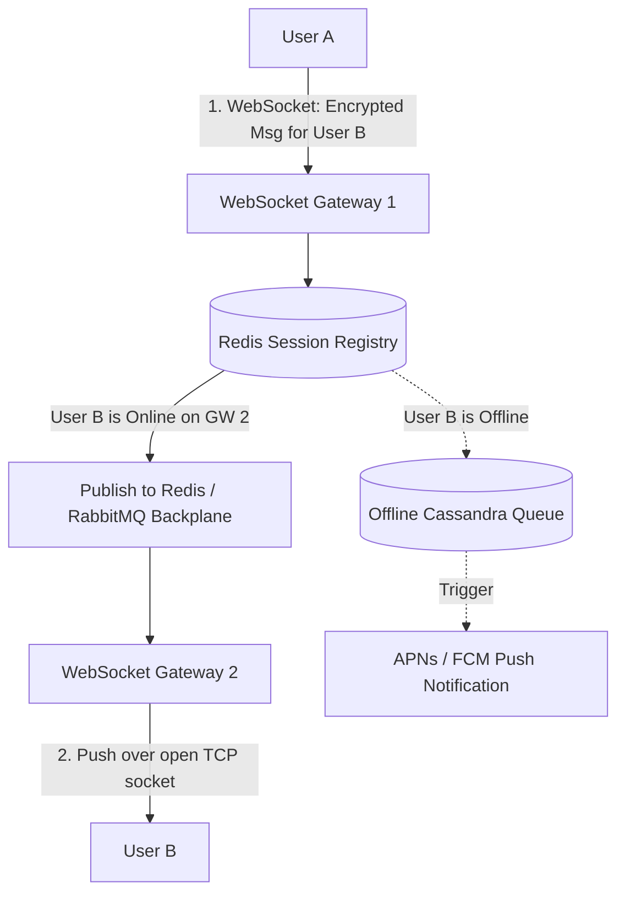
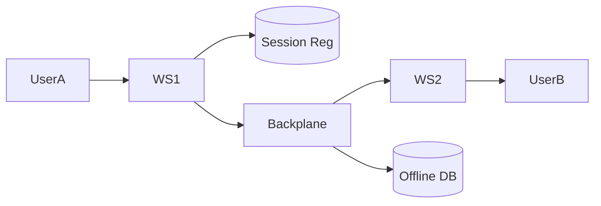

# System Design: WhatsApp / Discord Real-Time Messaging Platform

> **Domain**: Instant Messaging & Real-Time Stateful Infrastructure
> **Interview Target**: SDE2 / Senior Backend / Staff Engineer
> **Framework**: DESIGN-FLOW (45-Minute Game Plan)

---

## 1. Problem
Design a global, secure real-time messaging platform supporting 2 billion users sending 100 billion 1-on-1 and group messages per day with sub-100ms delivery, delivery/read receipts, offline message queues, and end-to-end encryption (E2EE).

## 2. Requirements Clarification
- Are group chats supported? (Yes, groups up to 1,024 members)
- What happens when a recipient is offline? (Messages buffered in durable offline queue; delivered upon reconnect)
- Is message history stored on the server? (Ephemeral server model: once delivered, message is permanently deleted from server)
- Is End-to-End Encryption (E2EE) required? (Yes, Signal Protocol with pre-shared keys and double ratchet)

## 3. Functional Requirements
- **FR-1**: Real-time 1-on-1 instant text and media messaging.
- **FR-2**: Group chats supporting up to 1,024 participants.
- **FR-3**: Message status receipts (Sent ✓, Delivered ✓✓, Read Blue ✓✓).
- **FR-4**: Offline message queuing and push notifications via APNs/FCM.

## 4. Non-Functional Requirements
- **NFR-1 (High Availability)**: $99.999\%$ uptime for message routing.
- **NFR-2 (Ultra-Low Latency)**: End-to-end message delivery $< 100\text{ms}$ globally.
- **NFR-3 (High Scalability)**: Support $2\text{B}$ users, $50\text{M}$ concurrent active WebSocket connections.
- **NFR-4 (Privacy & Security)**: End-to-End Encryption (Server cannot inspect plaintext message contents).

## 5. Assumptions
- $2\text{B}$ total users; $500\text{M}$ Daily Active Users (DAU).
- $100\text{ Billion}$ messages sent per day.
- $50\text{M}$ peak concurrent open TCP/WebSocket connections.

## 6. Capacity Estimation
- **Message QPS**: $100\text{B} / 86,400 \approx \mathbf{1,157,000\text{ msgs/sec}}$ continuous throughput (Peak: $\mathbf{3,000,000\text{ msgs/sec}}$).
- **Network Bandwidth**: $1.15\text{M msgs/sec} \times 500\text{ bytes} = \mathbf{575\text{ MB/sec}} (4.6\text{ Gbps})$.
- **Gateway Server Sizing**: Single Netty/Erlang gateway node handles $100,000\text{ idle sockets} \implies \mathbf{500\text{ Gateway Nodes}}$ for 50M concurrent connections.
- **Offline Message Buffer**: $10\%$ offline messages $\approx 10\text{B msgs} \times 500\text{ bytes} \approx \mathbf{5\text{ TB}}$ ephemeral storage in Cassandra/Redis.

## 7. API Design
- WebSocket Binary Protocol (RFC 6455) / Protobuf frames: `SendMessagePayload { msg_id, recipient_id, encrypted_ciphertext, timestamp }`
- `POST /v1/auth/keys/prekey_bundle` (Signal Protocol cryptographic keys)
- `POST /v1/media/upload_url` (Encrypted image/video blob upload)

## 8. Data Model
- **Session Registry (Redis Cluster)**: `user_id -> { gateway_node_ip, connection_id, status }`.
- **Offline Message Queue (Apache Cassandra)**: `recipient_id (Partition Key)`, `message_id (Clustering Key)`, `sender_id`, `encrypted_payload`, `created_at` (TTL 30 days).
- **Group Metadata (PostgreSQL)**: `group_id`, `name`, `admin_id`, `members (ARRAY)`.

## 9. High-Level Architecture


## 10. Detailed Architecture
```mermaid
flowchart TD
    subgraph ConnectionTier["1. Stateful Connection Tier (50M Sockets)"]
        ClientA[User A Phone] --> WS1[Netty Gateway 1 (100k Sockets)]
        ClientB[User B Phone] --> WS2[Netty Gateway 2 (100k Sockets)]
        WS1 <--> SessionCluster[(Redis Session Registry: 'user_id -> node_ip')]
        WS2 <--> SessionCluster
    end

    subgraph MessageRouting["2. Distributed Routing Backplane"]
        WS1 --> Router[Message Router Service]
        Router --> Backplane[(Redis Pub/Sub / Kafka Exchange)]
        Backplane --> WS2
        Router -->|If Offline| Cassandra[(Cassandra Offline Store: TTL 30d)]
        Router -->|If Group Chat| GroupWorker[Group Fan-Out Worker Fleet]
        GroupWorker --> Backplane
    end
```

## 11. Request Flow
1. User A encrypts message locally using User B's public key (Signal Protocol). 2. Sends binary frame over WebSocket to Gateway 1. 3. Gateway queries Redis Session Registry for User B. 4. If online: routes message via Redis Pub/Sub backplane to Gateway 2 hosting User B. 5. Gateway 2 pushes to User B's open socket. 6. User B decrypts locally and sends Delivery Receipt back. 7. If offline: saved to Cassandra offline queue and triggers Apple APNs push alert.

## 12. Data Flow
User A -> Gateway 1 -> Redis Session -> Gateway 2 -> User B -> Delivery Receipt back to User A.

## 13. Database Selection
Apache Cassandra for ephemeral offline message queuing (LSM-Tree high write speed, built-in TTL auto-deletion); Redis Cluster for active session mapping and pub/sub routing; PostgreSQL for group membership and user account profiles.

## 14. Caching
Redis in-memory session registry (`user_id -> gateway_ip`); local gateway memory caches user socket handles; S3 + CDN for encrypted media blobs.

## 15. Messaging
Redis Pub/Sub / RabbitMQ cluster acts as the message distribution backplane between 500 WebSocket gateway nodes.

## 16. Partitioning
Offline messages partitioned in Cassandra by `recipient_id`; Sessions partitioned in Redis by `user_id`.

## 17. Replication
Cassandra 3x replication across availability zones; Redis Cluster primary-standby replication.

## 18. Consistency
Strict FIFO message ordering per 1-on-1 chat using client-side monotonic sequence IDs.

## 19. Failure Handling
Gateway node crash (100k connections disconnect -> client reconnects with exponential backoff to any healthy gateway and updates session registry in Redis).

## 20. Bottlenecks
Large Group Chat Fan-Out (User sends message to group of 1,024 members -> 1 write creates 1,024 deliveries) -> Mitigated by asynchronous worker fleets fanning out messages in batches.

## 21. Scaling Strategy
Horizontal scaling of stateless Netty WebSocket gateways handling 100k connections each.

## 22. Observability
Message Delivery Latency (p99 < 80ms), Active Socket Count, Offline Queue Backlog, Reconnection Storm Rate.

## 23. Security
End-to-End Encryption (Signal Protocol Double Ratchet Algorithm); server stores zero plaintext keys.

## 24. Cost Considerations
Ephemeral server architecture (deleting messages immediately upon delivery) eliminates 90% of long-term server disk storage costs.

## 25. Trade-offs
Ephemeral Storage (Zero server disk cost, high privacy, client backup required) vs Server-Side Cloud Sync (Telegram style: heavy server disk cost, no true E2EE by default).

## 26. Alternative Designs
Client Polling over HTTP (Rejected: 50M polling requests/sec would overwhelm infrastructure and drain phone batteries).

## 27. Final Architecture


## 28. Interview Follow-up Questions
1. How does the Signal Protocol Double Ratchet algorithm achieve End-to-End Encryption and Forward Secrecy? 2. How do you scale 50 million concurrent WebSocket connections across 500 server nodes without socket connection leaks? 3. How does group message fan-out work efficiently without blocking the sender?

## 29. Building Blocks Used
`BB-10` (Distributed Cache), `BB-11` (Queue), `BB-12` (Kafka), `BB-23` (Notification Service), `BB-37` (WebSocket Gateway)
