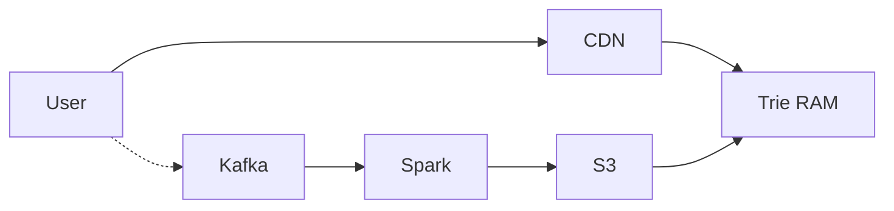

# System Design: Google / Amazon Typeahead Search Autocomplete

> **Domain**: Real-Time Search Suggestions & Prefix Trie Infrastructure
> **Interview Target**: SDE2 / Senior Backend / Staff Engineer
> **Framework**: DESIGN-FLOW (45-Minute Game Plan)

---

## 1. Problem
Design a real-time search autocomplete / typeahead system (like Google / Amazon search) that returns top 5 trending search suggestions as the user types each character with sub-20ms latency across 5 billion daily search queries.

## 2. Requirements Clarification
- What is the query latency requirement? (Extremely strict: $< 20\text{ms}$ globally as user types each keystroke)
- How are suggestions ranked? (Top 5 based on historical query frequency and recency)
- How frequently are suggestion frequencies updated? (Offline MapReduce batch update every hour/night)
- Are personalized suggestions included? (Yes, personal recent search history blended with global trending suggestions)

## 3. Functional Requirements
- **FR-1**: As user types a prefix (e.g. 'sys'), return top 5 autocomplete suggestions (e.g. 'system design', 'system design interview').
- **FR-2**: Real-time suggestion ranking based on global search frequency.
- **FR-3**: Filter inappropriate, offensive, and hateful search terms automatically.
- **FR-4**: Support personalized recent search suggestions for logged-in users.

## 4. Non-Functional Requirements
- **NFR-1 (High Availability)**: $99.999\%$ availability for autocomplete lookups.
- **NFR-2 (Ultra-Low Latency)**: Response latency $< 20\text{ms}$ globally (p99).
- **NFR-3 (High Scalability)**: Support $5\text{B}$ search queries/day ($50,000\text{ QPS}$ average, $150,000\text{ QPS}$ peak).
- **NFR-4 (Freshness)**: Trending search terms reflected within 1 hour.

## 5. Assumptions
- $5\text{B}$ search queries per day.
- Average query length = $15\text{ characters}$; each character sends a typeahead request $\implies 25\text{B}$ typeahead requests/day.
- Unique search queries dictionary = $100\text{M}$ terms.

## 6. Capacity Estimation
- **Read QPS**: $25\text{B} / 86,400 \approx \mathbf{290,000\text{ typeahead queries/sec}}$ (Peak: $\mathbf{750,000\text{ QPS}}$).
- **Trie Memory Footprint**: $100\text{M terms} \times (15\text{ bytes string} + 5 \times 8\text{ bytes top-5 cache}) \approx \mathbf{5.5\text{ GB RAM}}$!
- Entire global Trie dictionary easily fits into memory on a single machine; replicated across 100 cache nodes for query scale.

## 7. API Design
- `GET /v1/autocomplete?prefix=sys&limit=5&user_id=...` -> Returns `['system design', 'system design interview', 'system 76', 'systematic', 'system software']`
- `POST /v1/telemetry/query { query_text, timestamp }`

## 8. Data Model
- **Prefix Trie Node Structure**: `children: Map<char, TrieNode>`, `is_end_of_word: boolean`, `top_k_suggestions: List<SuggestionItem { text, frequency }>`.
- **Query Frequency DB (Cassandra / ClickHouse)**: `query_text (PK)`, `frequency (INT64)`, `last_updated`.
- **User Recent Searches (Redis)**: `user_history:{user_id} -> List of 10 recent queries`.

## 9. High-Level Architecture
```mermaid
flowchart TD
    Client[User Browser Keystroke: 'sys'] --> Edge[CDN Edge POP]
    Edge -->|Cache Hit: 80%| ReturnFast[Return Top 5 Suggestions: 5ms ✅]
    Edge -->|Cache Miss: 20%| APIGW[API Gateway]

    APIGW --> TrieCluster[In-Memory Prefix Trie Server Fleet]
    TrieCluster -->|O(L) Prefix Walk -> Top-5 Array| Suggestions[Return Top 5 Suggestions: 10ms]

    Client -. Async Search Log .-> Kafka[(Kafka Search Ingestion Stream)]
    Kafka --> FlinkAggregator[Flink / Spark Aggregation Pipeline]
    FlinkAggregator --> TrieBuilder[Trie Builder Worker]
    TrieBuilder --> TrieCluster
```

## 10. Detailed Architecture
```mermaid
flowchart TD
    subgraph ServingPath["1. Ultra-Fast Serving Path (< 20ms)"]
        UserKeystroke[User Types 'dist'] --> BrowserDebounce[Browser Debounce: 50ms Delay]
        BrowserDebounce --> EdgeCache[Edge CDN Cache]
        EdgeCache -->|Miss| TrieNode1[Trie Server 1 (Local RAM)]
        TrieNode1 --> LocalTrie[(Serialized Prefix Trie with Pre-computed Top-5)]
        LocalTrie --> ReturnTop5[Return ['distributed systems', 'distributed caching', ...]]
    end

    subgraph DataPipeline["2. Offline Aggregation & Trie Building"]
        UserSearch[User Executes Search] --> KafkaTopic[(Kafka: 'search-logs')]
        KafkaTopic --> SamplingFilter[10% Sampling Filter]
        SamplingFilter --> SparkJob[Hourly Spark Aggregation Job]
        SparkJob --> FreqDB[(ClickHouse Frequency DB)]
        SparkJob --> BuildTrie[Build Optimized Binary Trie Snapshot]
        BuildTrie --> S3Snapshots[(S3 Trie Snapshots)]
        S3Snapshots -->|Hot Reload every 1 Hour| TrieNode1
    end
```

## 11. Request Flow
1. User types character. 2. Browser debounces input (50ms). 3. Checks browser and CDN cache. 4. On miss: calls Trie server. 5. Trie server traverses root down prefix nodes $\mathcal{O}(L)$ where $L = \text{length(prefix)}$. 6. Immediately reads pre-computed `top_k_suggestions` list stored directly on the prefix node (zero traversal of child subtrees!). 7. Blends with user recent searches and returns top 5 suggestions.

## 12. Data Flow
Keystroke -> Debounce -> CDN -> Trie Node (O(L) read) -> Top 5. Search Executed -> Kafka -> Spark -> S3 Snapshot -> Trie Hot Reload.

## 13. Database Selection
In-Memory Prefix Trie with pre-computed Top-K lists for sub-10ms serving; ClickHouse for query frequency aggregation logs; Amazon S3 for serialized Trie binary snapshots; Redis for user recent search history.

## 14. Caching
Multi-Tier Caching: (1) Browser local cache (TTL 10m), (2) CDN Edge Caching (80% hit ratio for popular 1-3 letter prefixes), (3) In-Memory Trie RAM.

## 15. Messaging
Kafka topic `search-logs` buffers billions of search telemetry events with 10% sampling to reduce aggregation compute costs.

## 16. Partitioning
Trie partitioned by prefix letters (`A-G`, `H-N`, `O-T`, `U-Z`) or replicated fully across all stateless query nodes.

## 17. Replication
Entire Trie replicated to all query server nodes; multiple nodes behind load balancer handle 750k peak QPS.

## 18. Consistency
Eventual consistency; Trie frequencies updated every hour via background snapshot deployment.

## 19. Failure Handling
Massive keystroke traffic (25B/day) -> Mitigated by Client Debouncing (50ms delay) and CDN Edge caching.

## 20. Bottlenecks
Child subtree traversal bottleneck -> Mitigated by pre-computing and storing the Top-5 suggestions directly on every intermediate Trie node.

## 21. Scaling Strategy
Stateless Trie serving nodes scale horizontally behind an L7 load balancer.

## 22. Observability
Typeahead Latency (p99 < 15ms), CDN Cache Hit Ratio (> 80%), Trie Memory Usage, Hourly Snapshot Build Duration.

## 23. Security
Blacklist filtering against offensive words, PII redaction (never autocomplete credit card numbers or passwords).

## 24. Cost Considerations
Sampling search log telemetry at 10% reduces Kafka and Spark data pipeline compute costs by $90\%$ with zero impact on top suggestions.

## 25. Trade-offs
Pre-computed Top-K on Node ($\mathcal{O}(L)$ lookup, slightly higher memory) vs Dynamic Subtree Traversal ($\mathcal{O}(N)$ lookup, low memory, fails latency SLA).

## 26. Alternative Designs
Elasticsearch Prefix Query (Rejected: takes 50-100ms per keystroke under high concurrency, violating the 20ms SLA).

## 27. Final Architecture


## 28. Interview Follow-up Questions
1. Why is pre-computing Top-5 suggestions at each Trie node mandatory for sub-20ms latency? 2. How does client-side debouncing reduce typeahead server traffic by 70%? 3. How do you hot-reload a 5GB Trie in memory on production servers with zero downtime?

## 29. Building Blocks Used
`BB-05` (CDN), `BB-10` (Cache), `BB-12` (Kafka), `BB-15` (Search), `BB-17` (Task Scheduler)
