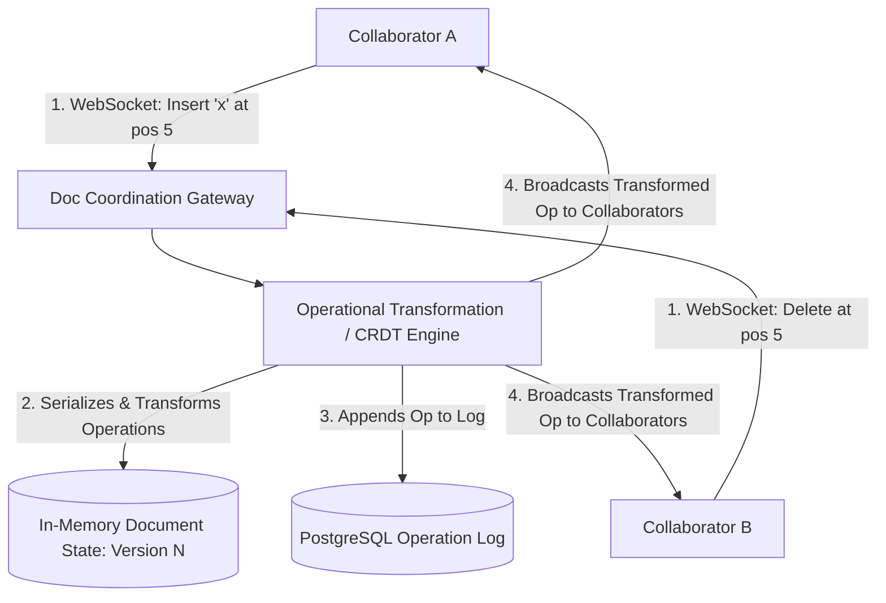
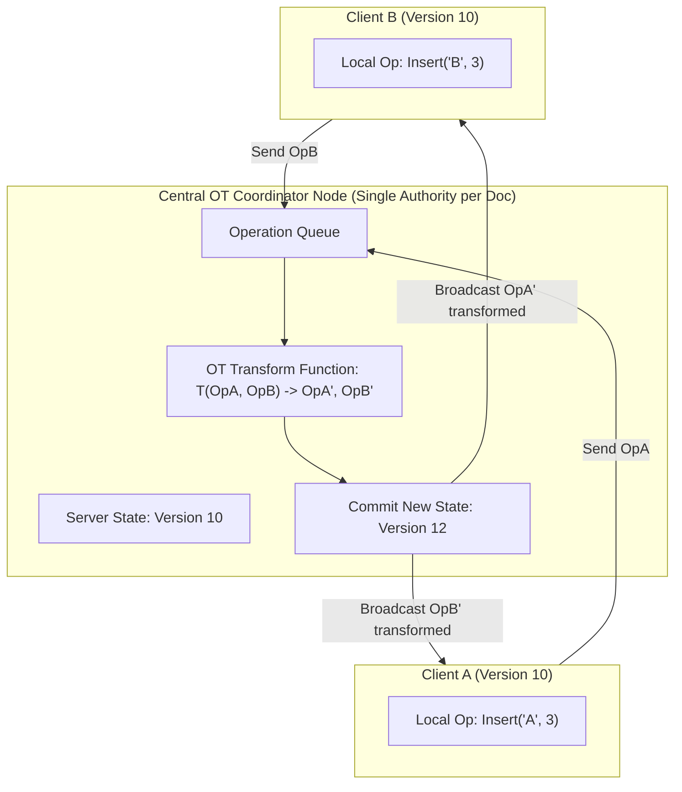
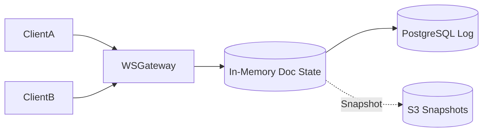

# System Design: Google Docs / Collaborative Rich-Text Editor

> **Domain**: Collaborative Document Editing & Distributed Concurrency
> **Interview Target**: SDE2 / Senior Backend / Staff Engineer
> **Framework**: DESIGN-FLOW (45-Minute Game Plan)

---

## 1. Problem
Design a real-time collaborative rich-text document editing platform (like Google Docs / Figma) allowing multiple users to edit the same document concurrently with sub-50ms synchronization, multi-cursor presence, and conflict-free divergence resolution.

## 2. Requirements Clarification
- What concurrency algorithm should be used? (Operational Transformation OT / Conflict-Free Replicated Data Types CRDT)
- How many concurrent editors per document? (Up to 100 concurrent active editors per document)
- How is document state persisted? (Periodic snapshot chunks to S3 + continuous operation commit log in PostgreSQL)
- Are offline edits supported? (Yes, client buffers local operations and reconciles via OT upon reconnect)

## 3. Functional Requirements
- **FR-1**: Multiple users can edit a shared document simultaneously with real-time character synchronization.
- **FR-2**: Real-time multi-cursor presence showing collaborators' cursor positions and text selections.
- **FR-3**: Conflict-free text merging preserving user editing intent.
- **FR-4**: Revision history tracking and point-in-time document rollbacks.

## 4. Non-Functional Requirements
- **NFR-1 (High Availability)**: $99.99\%$ availability for document editing.
- **NFR-2 (Ultra-Low Latency)**: Edit propagation $< 50\text{ms}$ between collaborators.
- **NFR-3 (Consistency)**: Strong Convergence (All collaborators viewing the same document eventually see the exact identical text state).
- **NFR-4 (Scalability)**: Support $100\text{M}$ Daily Active Users and $10\text{M}$ concurrent active editing sessions.

## 5. Assumptions
- $100\text{M}$ DAU; $10\text{M}$ concurrent active editing sessions.
- Average document size = $100\text{ KB}$; average active editing rate = $2\text{ edits/sec per user}$.
- Concurrency per document = $5$ average, $100$ peak.

## 6. Capacity Estimation
- **Edit Ingestion QPS**: $10\text{M users} \times 2\text{ edits/sec} = \mathbf{20,000,000\text{ operations/sec}}$ worldwide!
- **Bandwidth**: $20\text{M ops/sec} \times 100\text{ bytes} = \mathbf{2\text{ GB/sec}} (16\text{ Gbps})$.
- **Document Storage**: $100\text{M documents} \times 100\text{ KB} \approx \mathbf{10\text{ TB}}$ (Fits easily in PostgreSQL + S3).

## 7. API Design
- WebSocket Frame: `ClientOperation { doc_id, client_version, operation_type (INSERT/DELETE), position, text }`
- `POST /v1/documents { title, folder_id } -> { doc_id }`
- `GET /v1/documents/{id}/export?format=PDF`

## 8. Data Model
- **Document Master (PostgreSQL)**: `doc_id (UUID PK)`, `title`, `owner_id`, `latest_version (INT64)`, `created_at`.
- **Operation Log (PostgreSQL / DynamoDB)**: `doc_id`, `version (INT64)`, `author_id`, `op_type`, `position`, `text` (Sequential append-only log).
- **Document Snapshots (Amazon S3)**: Periodic complete document JSON snapshots taken every 100 operations.

## 9. High-Level Architecture

## 10. Detailed Architecture

## 11. Request Flow
1. Client A generates local operation $Op_A$ at version 10. 2. Sends $Op_A$ to Central OT Coordinator via WebSocket. 3. Simultaneously Client B generates $Op_B$ at version 10. 4. Coordinator receives $Op_A$ first, applies it, increments document version to 11. 5. Coordinator transforms $Op_B$ against $Op_A$: $T(Op_B, Op_A) \to Op_B'$. 6. Applies $Op_B'$ and increments version to 12. 7. Broadcasts transformed operations back to all clients. 8. Clients apply transformed ops locally, achieving 100% convergence.

## 12. Data Flow
Local Edit -> WebSocket -> OT Engine -> Transform -> Version Increment -> OpLog -> Broadcast to All Clients.

## 13. Database Selection
PostgreSQL for authoritative document metadata and immutable sequential Operation Log; Redis for active WebSocket presence and cursor positions; Amazon S3 for periodic document snapshot storage.

## 14. Caching
In-memory document state loaded on the specific coordination node hosting the active document; Redis for collaborator multi-cursor presence (`doc_id -> Map<user_id, cursor_position>`).

## 15. Messaging
Redis Pub/Sub / WebSocket Gateway routes real-time edit frames between clients connected to different gateway nodes.

## 16. Partitioning
Documents partitioned by `hash(doc_id)` across coordination worker nodes; each active document is managed by a single designated coordinator node to serialize OT transformations.

## 17. Replication
PostgreSQL Multi-AZ synchronous replication; S3 11 Nines durability for document snapshots.

## 18. Consistency
Strong Convergence consistency (all clients converge to the exact same text state once all operations are applied).

## 19. Failure Handling
Offline reconnection with 1,000 buffered edits -> Client sends buffered ops; server transforms them against all missed document versions since disconnect.

## 20. Bottlenecks
High operation ingestion rate (20M ops/sec) -> Mitigated by in-memory single-thread serialization per document on designated coordinator nodes.

## 21. Scaling Strategy
Route all WebSocket connections for `doc_id` to the same coordinator node using Consistent Hashing on `doc_id`.

## 22. Observability
Edit Propagation Latency (p99 < 30ms), OT Transformation Time (< 1ms), Active WebSocket Sessions, Snapshot Generation Backlog.

## 23. Security
Document-level permission checks (Viewer, Commenter, Editor), TLS 1.3 encryption for WebSocket transport.

## 24. Cost Considerations
Taking document snapshots every 100 operations avoids replaying thousands of historical operations when loading a document.

## 25. Trade-offs
Operational Transformation OT (Central coordinator, smaller operation payloads) vs CRDTs (Decentralized P2P friendly, larger memory overhead per character).

## 26. Alternative Designs
Pessimistic Locking / Section Locking (Rejected: locks paragraphs, preventing true fluid character-level collaboration).

## 27. Final Architecture

## 28. Interview Follow-up Questions
1. Explain how Operational Transformation (OT) resolves concurrent insert operations at the same text position. 2. What is the difference between Operational Transformation (OT) and Conflict-Free Replicated Data Types (CRDT)? 3. How do you handle a user reconnecting after 2 hours of offline editing?

## 29. Building Blocks Used
`BB-03` (RDBMS), `BB-10` (Cache), `BB-14` (Blob Store), `BB-21` (Distributed Lock), `BB-35` (File Sync), `BB-37` (WebSocket Gateway)
