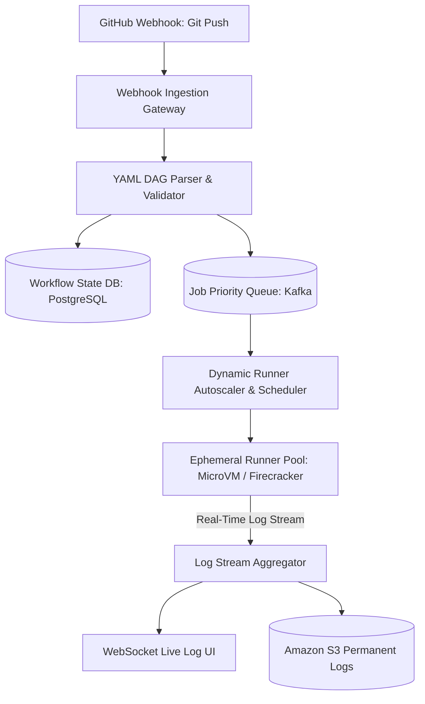
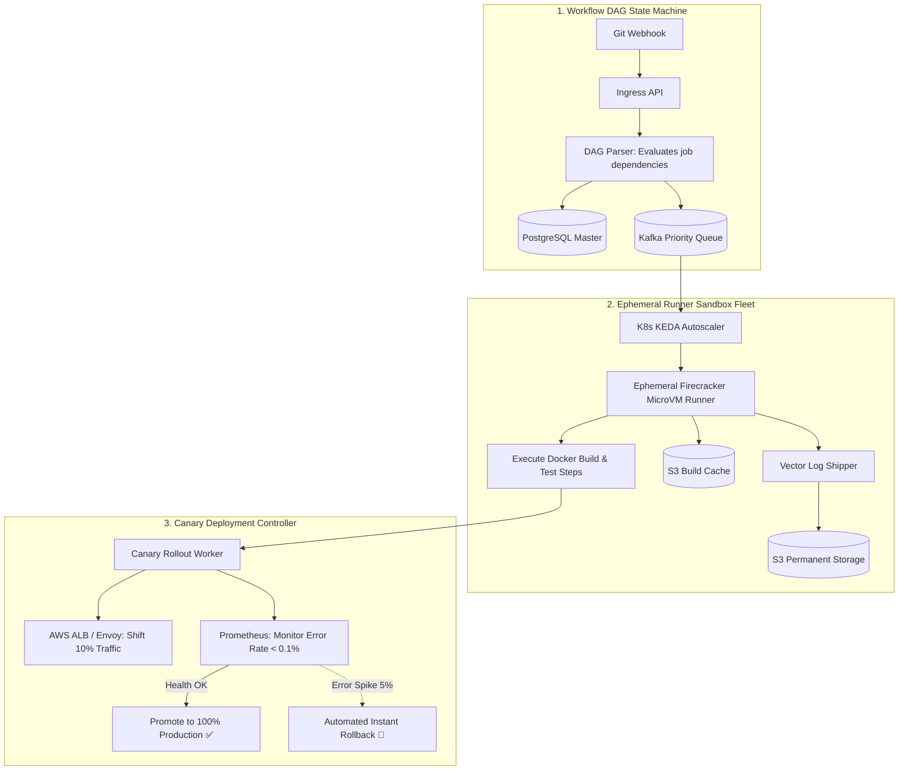
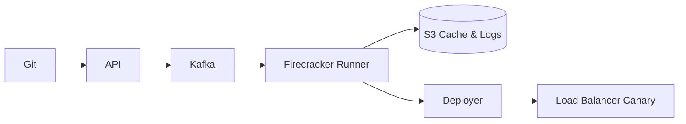

# System Design: Distributed CI/CD Deployment Pipeline (GitHub Actions)

> **Domain**: Developer Tools & Distributed Workflow Orchestration
> **Interview Target**: SDE2 / Senior Backend / Staff Engineer
> **Framework**: DESIGN-FLOW (45-Minute Game Plan)

---

## 1. Problem
Design a scalable, distributed continuous integration and deployment (CI/CD) execution platform (like GitHub Actions / Spinnaker) that schedules, isolates, and executes 10 million automated build, test, and deployment workflows per day across ephemeral container runners.

## 2. Requirements Clarification
- What workflow formats are supported? (YAML workflow DAG definitions with steps and dependencies)
- How are runners isolated? (Ephemeral isolated containers / MicroVMs e.g. AWS Firecracker)
- How is build artifact caching handled? (Distributed S3 blob caching with content-hash keys)
- How are zero-downtime deployments executed? (Blue-Green and Canary traffic shifting via Load Balancers)

## 3. Functional Requirements
- **FR-1**: Ingest Git webhook events (`push`, `pull_request`) and trigger corresponding YAML workflow DAGs.
- **FR-2**: Execute multi-step build/test jobs across heterogeneous OS runners (Linux, macOS, Windows).
- **FR-3**: Stream real-time console build logs over WebSockets to the user UI.
- **FR-4**: Orchestrate zero-downtime Canary deployments with automated rollback on health check failure.

## 4. Non-Functional Requirements
- **NFR-1 (High Availability)**: $99.99\%$ availability for pipeline triggering.
- **NFR-2 (Security & Isolation)**: Strict multi-tenant sandbox isolation (malicious PR code cannot escape runner VM).
- **NFR-3 (High Scalability)**: Support $10\text{M}$ workflow jobs/day, $500,000$ concurrent active runner instances.
- **NFR-4 (Durability)**: Complete workflow execution history and logs retained for 90 days.

## 5. Assumptions
- $10\text{M}$ workflow jobs executed per day.
- $500,000$ peak concurrent running jobs.
- Average build log size = $5\text{ MB}$; average build duration = $10\text{ minutes}$.

## 6. Capacity Estimation
- **Job Trigger QPS**: $10\text{M} / 86,400 \approx \mathbf{115\text{ jobs/sec}}$ (Peak: $\mathbf{1,000\text{ jobs/sec}}$).
- **Daily Build Log Ingestion**: $10\text{M} \times 5\text{ MB} = \mathbf{50\text{ TB/day}} \implies 4.5\text{ PB / 90 days}$ in S3.
- **Log Streaming Bandwidth**: $500,000\text{ concurrent jobs} \times 10\text{ KB/sec} = \mathbf{5\text{ GB/sec}} (40\text{ Gbps})$.
- **Runner Fleet**: $500,000$ ephemeral microVM runners managed dynamically across cloud Kubernetes clusters.

## 7. API Design
- `POST /v1/webhooks/github` (Webhook ingestion)
- `GET /v1/runs/{id}/logs/stream` (WebSocket live log tailing)
- `POST /v1/deployments/canary { service, version, traffic_percent: 10 }`

## 8. Data Model
- **Workflow DAG DB (PostgreSQL)**: `workflow_run_id (UUID PK)`, `repo_id`, `commit_sha`, `status (QUEUED/RUNNING/SUCCESS/FAILED)`, `dag_definition (JSON)`.
- **Job Queue (Kafka / RabbitMQ)**: `job_id`, `os_type`, `cpu_memory_spec`, `secrets_token`, `command_steps`.
- **Build Artifacts & Logs (Amazon S3)**: `s3://artifacts/{repo_id}/{commit_sha}/bundle.tar.gz`.

## 9. High-Level Architecture

## 10. Detailed Architecture

## 11. Request Flow
1. Git webhook arrives. 2. YAML workflow parsed into DAG of executable jobs. 3. Saved to PostgreSQL in state `QUEUED`. 4. Enqueued to Kafka priority queue based on runner OS type (Linux/Windows). 5. KEDA spins up ephemeral Firecracker MicroVM runner. 6. Runner downloads code, restores cached dependencies from S3, and executes build commands. 7. Vector streams console logs over WebSocket. 8. Upon test pass: triggers Canary deployment shifting 10% traffic on ALB. 9. Monitors Prometheus for 5 minutes; on zero error spike, promotes to 100%.

## 12. Data Flow
Webhook -> DAG Parser -> Kafka -> Ephemeral Runner -> S3 Cache -> Log Stream -> Canary Rollout -> Production.

## 13. Database Selection
PostgreSQL for ACID workflow state machine and job execution logs; Apache Kafka for high-throughput runner dispatch queues; Amazon S3 for build artifact caches and 90-day compressed logs; Redis for live runner heartbeats.

## 14. Caching
Distributed S3 content-hash cache for build dependencies (npm/Maven caches); Redis for live job heartbeat tracking.

## 15. Messaging
Kafka topic `runner-jobs` partitioned by `os_type` and repository priority tier.

## 16. Partitioning
Workflows partitioned by `repo_id` across PostgreSQL database shards.

## 17. Replication
PostgreSQL Multi-AZ synchronous replication; S3 11 Nines durability for logs and deployment artifacts.

## 18. Consistency
At-least-once job execution; runners use idempotent build tasks and unique build execution IDs.

## 19. Failure Handling
Runner VM crash mid-build (missing heartbeat after 60s triggers automated scheduler to re-queue job on a new runner VM).

## 20. Bottlenecks
Dependency download bottlenecks -> Mitigated by localized high-speed S3 build artifact caching inside the same datacenter region.

## 21. Scaling Strategy
Elastic autoscaling of runner MicroVMs using Kubernetes KEDA based on pending queue backlog depth.

## 22. Observability
Runner Queue Wait Time, Job Execution Duration, Runner CPU/Memory Saturation, Canary Error Rate, Build Failure Rate.

## 23. Security
Strict MicroVM hardware-level virtualization isolation (Firecracker) preventing container breakout attacks; dynamic masked secret injection; short-lived OIDC tokens.

## 24. Cost Considerations
Executing ephemeral runners on AWS EC2 Spot instances reduces runner compute spend by $70\%$.

## 25. Trade-offs
Ephemeral MicroVM Sandbox (Strict security, 1s boot time) vs Shared Host Containers (Fast, security risk of cross-tenant privilege escalation).

## 26. Alternative Designs
Running CI builds directly on persistent shared virtual machines (Rejected: dirty state between runs causes non-reproducible builds).

## 27. Final Architecture

## 28. Interview Follow-up Questions
1. How do AWS Firecracker MicroVMs provide hardware-level virtualization security with sub-second boot times? 2. How does an automated Canary deployment detect performance regressions and execute instant rollbacks? 3. How does content-addressable build caching speed up CI build times by 10x?

## 29. Building Blocks Used
`BB-11` (Queue), `BB-12` (Kafka), `BB-14` (Blob Store), `BB-17` (Task Scheduler), `BB-21` (Distributed Lock)
