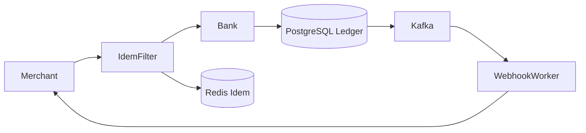

# System Design: Stripe / PayPal Global Payment Gateway & Ledger

> **Domain**: Financial Infrastructure & High-Reliability Ledgers
> **Interview Target**: SDE2 / Senior Backend / Staff Engineer
> **Framework**: DESIGN-FLOW (45-Minute Game Plan)

---

## 1. Problem
Design a mission-critical global payment gateway (like Stripe / PayPal) capable of processing millions of credit card transactions per day with absolute idempotency, zero double-charging, double-entry ledger bookkeeping, and PCI-DSS compliance.

## 2. Requirements Clarification
- What is the primary invariant? (Zero double-charging: every customer charge must execute exactly once regardless of network retries)
- How is financial state tracked? (Double-Entry Bookkeeping: every transaction consists of balanced debits and credits $\sum \text{Debits} \equiv \sum \text{Credits}$)
- What happens on bank timeout? (Asynchronous reconciliation worker polls bank API or waits for bank webhook confirmation)
- Is PCI-DSS compliance required? (Strict compliance: raw credit card numbers are tokenized at the edge and never touch core application servers)

## 3. Functional Requirements
- **FR-1**: Process credit card charge requests via external payment networks (Visa/Mastercard/Stripe).
- **FR-2**: Enforce strict idempotency on all charge requests using client-provided `Idempotency-Key`s.
- **FR-3**: Maintain a double-entry immutable financial ledger recording every cent transferred.
- **FR-4**: Asynchronous webhook dispatch to merchant servers with exponential retry jitter.

## 4. Non-Functional Requirements
- **NFR-1 (High Availability)**: $99.999\%$ uptime for payment acceptance.
- **NFR-2 (Low Latency)**: Synchronous payment authorization $< 1\text{s}$.
- **NFR-3 (Data Consistency & Durability)**: Strict Serializability / Linearizability; Zero data loss ($RPO = 0$).
- **NFR-4 (Security & Compliance)**: Strict PCI-DSS Level 1 compliance, end-to-end payload encryption.

## 5. Assumptions
- $50\text{M}$ payment transactions processed per day.
- Average transaction payload = $2\text{ KB}$.
- $10\%$ of requests are network retry duplicates.

## 6. Capacity Estimation
- **Payment QPS**: $50\text{M} / 86,400 \approx \mathbf{580\text{ TPS}}$ (Peak: $\mathbf{2,500\text{ TPS}}$).
- **Daily Financial Storage**: $50\text{M} \times 2\text{ KB} = \mathbf{100\text{ GB/day}} \implies 182\text{ TB / 5 years}$ in PostgreSQL.
- **Idempotency Cache Sizing**: $50\text{M keys} \times 200\text{ bytes} \approx \mathbf{10\text{ GB RAM}}$ in Redis (24-hour TTL).

## 7. API Design
- `POST /v1/charges` with HTTP Header `Idempotency-Key: 9b1deb4d-3b7d-4bad-9bdd-2b0d7b3dcb6d` and body `{ amount: 5000, currency: 'USD', card_token: 'tok_visa123' }`
- `GET /v1/charges/{id}`
- `POST /v1/refunds { charge_id, amount }`

## 8. Data Model
- **Idempotency Store (Redis / PostgreSQL)**: `idempotency_key (PK)`, `user_id`, `request_hash`, `response_body (JSON)`, `status (PROCESSING/SUCCESS/FAILED)`, `created_at`.
- **Ledger Accounts Table (PostgreSQL)**: `account_id (PK)`, `merchant_id`, `currency`, `balance_cents`.
- **Ledger Entries Table (PostgreSQL)**: `entry_id (PK)`, `transaction_id`, `debit_account_id`, `credit_account_id`, `amount_cents`, `created_at`.
- **Charges Table**: `charge_id`, `amount_cents`, `currency`, `status`, `bank_tx_id`.

## 9. High-Level Architecture
```mermaid
flowchart TD
    Merchant[Merchant Client] -->|1. POST /v1/charges (Idempotency-Key: 'abc-123')| APIGW[API Gateway: Tokenizer]
    APIGW --> IdemFilter{Idempotency Filter}
    IdemFilter -->|Atomic Lock Acquired| RedisLock[(Redis Idempotency Lock)]

    IdemFilter --> PaymentCore[Payment Processing Service]
    PaymentCore --> BankGateway[Acquiring Bank / Visa Network]
    BankGateway -->|Authorized ✅| PaymentCore

    PaymentCore --> LedgerDB[(PostgreSQL Double-Entry Ledger DB)]
    PaymentCore -->|Store Response (TTL 24h)| RedisLock
    PaymentCore --> MerchantResponse[201 Created: {charge_id, status: 'PAID'}]

    RedisLock -.->|Duplicate Key Detected| CachedResponse[Return Cached 200 OK (0 Bank Calls! 🛡️)]
```

## 10. Detailed Architecture
```mermaid
flowchart TD
    subgraph Perimeter["1. PCI-DSS Perimeter & Tokenization"]
        Customer[Customer Browser] --> Tokenizer[PCI Vault / Tokenizer Server]
        Tokenizer -->|Exchanges raw PAN for Card Token| CardToken[Card Token: 'tok_visa_987']
        CardToken --> MerchantBackend[Merchant Backend Server]
    end

    subgraph CoreEngine["2. Idempotent Payment Core"]
        MerchantBackend -->|POST /v1/charges (Idempotency-Key)| IdemEngine[Idempotency Engine]
        IdemEngine --> RedisMutex[(Redis Mutex: SET NX EX 120s)]
        IdemEngine --> TxCoordinator[Payment Transaction Coordinator]
        TxCoordinator --> Bank[External Acquiring Bank]
        Bank -->|200 OK Authorize| TxCoordinator
    end

    subgraph LedgerTier["3. ACID Double-Entry Financial Ledger"]
        TxCoordinator --> PostgresMaster[(PostgreSQL Master: Multi-AZ Synchronous)]
        PostgresMaster --> LedgerEntries["Ledger Entry: Debit Customer $50 / Credit Merchant $50"]
        TxCoordinator --> WebhookQueue[(Kafka Webhook Topic)]
        WebhookQueue --> WebhookWorker[Webhook Dispatcher with Exponential Jitter]
        WebhookWorker --> MerchantWebhook[Merchant Webhook URL]
    end
```

## 11. Request Flow
1. Client generates UUID `Idempotency-Key`. 2. Tokenizer exchanges raw credit card for secure token. 3. Idempotency filter acquires Redis lock `SET idem:key PROCESSING NX EX 120`. 4. If key exists: returns cached response immediately. 5. If new: calls acquiring bank over secure ISO 8583 protocol. 6. In a single ACID PostgreSQL transaction: records Charge record + creates balanced Double-Entry Ledger rows (Debit Customer Account / Credit Merchant Account). 7. Caches final response in Redis for 24h. 8. Pushes webhook event to Kafka. 9. Returns 201 Created.

## 12. Data Flow
Client -> Tokenizer -> Idempotency Filter -> Bank Authorization -> PostgreSQL ACID Ledger -> Kafka -> Merchant Webhook.

## 13. Database Selection
PostgreSQL (Multi-AZ synchronous replication) for ACID double-entry financial ledger and charge records; Redis Cluster for 24-hour idempotency key locks and response caching; Apache Kafka for merchant webhook event retries.

## 14. Caching
Redis Cache holds 24 hours of Idempotency Keys and cached response payloads (10GB RAM); zero caching on raw ledger account balances (always read authoritative SQL).

## 15. Messaging
Kafka topic `merchant-webhooks` handles asynchronous webhook deliveries with exponential backoff and randomized jitter across 72 hours.

## 16. Partitioning
Ledger accounts and transactions partitioned by `hash(merchant_id)` ensuring all transactions for a single merchant execute on the same database shard.

## 17. Replication
PostgreSQL Multi-AZ synchronous replication with zero RPO (zero financial data loss under primary datacenter failure).

## 18. Consistency
Strict Serializability / Linearizability for financial ledger updates (CP in CAP theorem).

## 19. Failure Handling
Bank network timeout mid-flight -> Background reconciliation worker polls bank settlement API every 5 minutes to resolve pending transaction state.

## 20. Bottlenecks
Retry storms during network outages -> Mitigated by Idempotency Key filter returning cached success responses without re-hitting the bank.

## 21. Scaling Strategy
Stateless payment application servers scale horizontally; PostgreSQL scales via merchant-level database sharding.

## 22. Observability
Payment Authorization Success Rate (Target > 99.5%), Bank Authorization Latency (p99 < 800ms), Double-Entry Imbalance Anomaly Count ($= 0$), Webhook Dispatch Lag.

## 23. Security
Strict PCI-DSS Level 1 compliance; raw credit card numbers never touch core application servers (isolated in specialized Tokenizer Vault); TLS 1.3.

## 24. Cost Considerations
Strict idempotency checks prevent thousands of accidental double-charges and dispute chargeback fees ($15-$25 fee per dispute).

## 25. Trade-offs
Strict Double-Entry Bookkeeping (Guaranteed financial audit integrity, slightly higher SQL insert overhead) vs Single Balance Counter (Prone to silent corruption).

## 26. Alternative Designs
Asynchronous Event-Driven Settlement for all charges (Rejected: merchants require immediate synchronous authorization confirmation during online checkout).

## 27. Final Architecture


## 28. Interview Follow-up Questions
1. Explain the step-by-step lifecycle of an Idempotency Key during a payment charge. 2. What is Double-Entry Bookkeeping and why is it mandatory for financial systems? 3. How does Stripe achieve PCI-DSS compliance using iframe tokenization?

## 29. Building Blocks Used
`BB-03` (RDBMS), `BB-10` (Distributed Cache), `BB-12` (Kafka), `BB-21` (Distributed Lock), `BB-30` (Audit Log), `BB-36` (Payment Idempotency)
