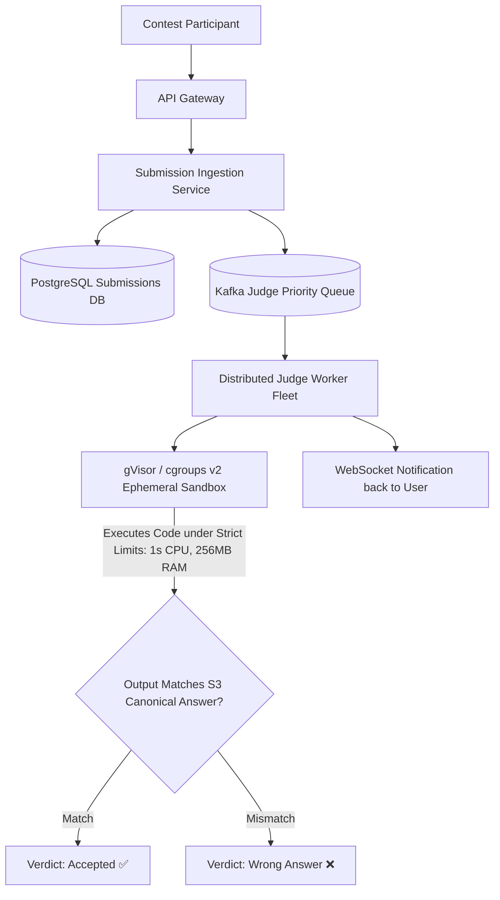
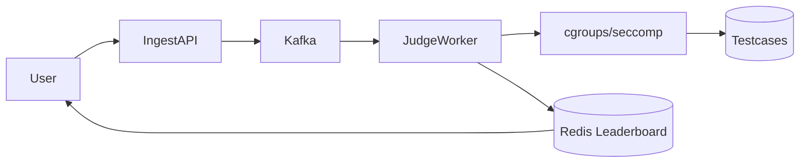

# System Design: LeetCode / HackerRank Distributed Online Judge

> **Domain**: Developer Assessment & Sandboxed Code Execution
> **Interview Target**: SDE2 / Senior Backend / Staff Engineer
> **Framework**: DESIGN-FLOW (45-Minute Game Plan)

---

## 1. Problem
Design a scalable, secure online judge platform (like LeetCode / Codeforces) capable of compiling, executing, and evaluating 10 million user-submitted code snippets per day across multiple programming languages under strict time (1s) and memory (256MB) limits without compromising host security.

## 2. Requirements Clarification
- What languages are supported? (Java, C++, Python, Rust, Go, JS)
- How is untrusted code isolated? (Linux Namespaces, cgroups v2, seccomp-bpf, ephemeral Docker/gVisor sandboxes)
- How are testcases evaluated? (Hidden testcases stored in S3; executed against user binary; output compared with canonical answer)
- What verdicts are supported? (Accepted, Wrong Answer, Time Limit Exceeded TLE, Memory Limit Exceeded MLE, Runtime Error, Compile Error)

## 3. Functional Requirements
- **FR-1**: Users can submit code solutions for algorithmic coding problems in multiple languages.
- **FR-2**: Securely compile, execute, and judge submissions against hidden testcase suites.
- **FR-3**: Stream real-time execution status (Compiling -> Running -> Accepted / TLE / WA) over WebSockets.
- **FR-4**: Global leaderboard ranking and contest contest rating calculations.

## 4. Non-Functional Requirements
- **NFR-1 (Security & Sandboxing)**: Absolute isolation (Zero host kernel compromise, no unauthorized disk or network access from user code).
- **NFR-2 (Low Latency)**: Judge execution verdict returned in $< 3\text{s}$.
- **NFR-3 (High Scalability)**: Support $10\text{M}$ submissions/day ($100,000$ concurrent submissions during live contests).
- **NFR-4 (Fairness & Determinism)**: Identical code on identical testcases must produce 100% deterministic CPU time and memory results.

## 5. Assumptions
- $10\text{M}$ code submissions per day; $100,000$ peak concurrent submissions during weekly live contests.
- Average testcase suite per problem = $100\text{ testcases}$ ($10\text{ MB}$ total data).
- Average execution time limit = $1.0\text{ second}$.

## 6. Capacity Estimation
- **Submission QPS**: $10\text{M} / 86,400 \approx \mathbf{115\text{ subs/sec}}$ (Contest Peak: $\mathbf{2,500\text{ subs/sec}}$).
- **Sandbox Worker Fleet**: $2,500\text{ concurrent jobs} \times 2\text{ sec execution} = \mathbf{5,000\text{ Worker Cores}}$ required at peak.
- **Testcase Storage**: $5,000\text{ problems} \times 10\text{ MB} \approx \mathbf{50\text{ GB}}$ (Cached in worker RAM / NVMe SSDs).

## 7. API Design
- `POST /v1/submissions { problem_id, language: 'JAVA', source_code: '...' } -> { submission_id }`
- `GET /v1/submissions/{id}/status` (or WebSocket stream: `Compiling` -> `Running on Testcase 42/100` -> `Accepted 12ms 42.1MB`)

## 8. Data Model
- **Submissions Table (PostgreSQL)**: `submission_id (UUID PK)`, `user_id`, `problem_id`, `language`, `source_code`, `status (PENDING/JUDGING/ACCEPTED/WA/TLE/MLE)`, `runtime_ms`, `memory_kb`, `created_at`.
- **Problems Table**: `problem_id`, `title`, `time_limit_ms`, `memory_limit_mb`, `testcase_s3_url`.
- **Contest Leaderboard (Redis ZSET)**: `contest_id -> Sorted Set of {score: total_score_and_penalty_time, member: user_id}`.

## 9. High-Level Architecture


## 10. Detailed Architecture
```mermaid
flowchart TD
    subgraph IngestionTier["1. Submission Ingestion Tier"]
        Client[User Browser] --> GW[API Gateway]
        GW --> IngestAPI[Submission Ingestion Service]
        IngestAPI --> DB[(PostgreSQL Master)]
        IngestAPI --> KafkaTopics[(Kafka: Priority 'contest-subs' & 'practice-subs')]
    end

    subgraph SandboxFleet["2. Secure Sandboxed Execution Fleet"]
        KafkaTopics --> Dispatcher[Judge Worker Dispatcher]
        Dispatcher --> JudgeWorker[Judge Node (Pre-warmed Sandbox Pool)]
        JudgeWorker --> TestCache[(Local RAM Disk: Testcases for Problem X)]

        subgraph IsolationEngine["gVisor / Linux seccomp Sandbox"]
            Compile[1. Compiler: javac / g++]
            Execute[2. Execute: Fork-exec in cgroups v2 container]
            Seccomp[3. seccomp-bpf: Block all network/file socket syscalls]
            Compile --> Execute --- Seccomp
        end
        JudgeWorker --> IsolationEngine
        IsolationEngine --> DiffChecker[Diff Output with Expected Output]
    end

    subgraph VerdictNotification["3. Real-Time Verdict & Leaderboard"]
        DiffChecker --> UpdateDB[(Update PostgreSQL Submission Verdict)]
        DiffChecker --> RedisLeaderboard[(Redis ZSET: Contest Leaderboard)]
        DiffChecker --> NettyWS[Netty WebSocket Gateway]
        NettyWS --> Client
    end
```

## 11. Request Flow
1. User submits code. 2. Saved to PostgreSQL in state `PENDING`. 3. Enqueued to Kafka priority topic (`contest-subs` has higher priority than `practice-subs`). 4. Judge worker pulls submission. 5. Pulls cached testcases from local RAM disk. 6. Compiles code in isolated container. 7. Spawns sandboxed runner process under `cgroups v2` (memory limit 256MB) and `seccomp-bpf` (blocks all network calls and unauthorized disk writes). 8. Feeds testcase input; captures stdout. 9. Diffs output against expected answer. 10. Emits verdict (Accepted, TLE, MLE, WA). 11. Updates PostgreSQL, updates Redis contest leaderboard, and pushes result to user via WebSocket.

## 12. Data Flow
Submission -> PostgreSQL -> Kafka -> Sandbox Worker -> gVisor / cgroups -> Test Diff -> Redis Leaderboard -> WebSocket -> User.

## 13. Database Selection
PostgreSQL for authoritative submission records and problem definitions; Apache Kafka for prioritized judge queues; Redis for live contest leaderboards (Sorted Sets) and rate limiters; Amazon S3 for hidden testcase storage.

## 14. Caching
Local NVMe RAM-disk on judge nodes caching testcases for active contest problems; Redis Sorted Sets for $O(\log N)$ live contest rank calculations.

## 15. Messaging
Kafka topic `judge-submissions` split into `contest-priority` and `standard-practice` partitions.

## 16. Partitioning
Submissions partitioned by `hash(submission_id)`; Contest leaderboards partitioned in Redis by `contest_id`.

## 17. Replication
PostgreSQL Multi-AZ synchronous replication; Redis Cluster primary-standby replication.

## 18. Consistency
Strong consistency for submission verdicts and contest leaderboard rankings.

## 19. Failure Handling
Malicious fork-bomb or infinite loop (`while(1) fork();`) -> Mitigated by strict `cgroups v2 pids.max = 32` and hard OS process execution timeouts (1.0s CPU time via `setrlimit`).

## 20. Bottlenecks
File system exfiltration or network socket connection -> Blocked completely by `seccomp-bpf` system call filtering (only `read`, `write`, `exit` allowed).

## 21. Scaling Strategy
Pre-warm a pool of idle sandboxes in memory to eliminate container startup latency ($< 10\text{ms}$ startup).

## 22. Observability
Judge Execution Latency (p99 < 2s), Queue Wait Time in Kafka, Worker CPU Saturation, Sandbox Violation / Security Alert Count.

## 23. Security
gVisor user-space kernel virtualization, cgroups v2 hardware limits, seccomp-bpf syscall blacklisting, zero network access.

## 24. Cost Considerations
Running judge workers on AWS EC2 Spot Instances with automated KEDA autoscaling reduces compute costs by $70\%$.

## 25. Trade-offs
Pre-warmed Sandbox Pool (Sub-10ms startup, RAM memory overhead) vs Cold Container Spawn (Slow 1-2s startup, lower RAM).

## 26. Alternative Designs
Executing user code directly on host OS without sandboxing (Rejected: a single `rm -rf /` or fork bomb would destroy the entire host).

## 27. Final Architecture


## 28. Interview Follow-up Questions
1. How do Linux cgroups v2 and seccomp-bpf isolate untrusted user code execution? 2. How do you prevent a malicious submission from executing a Fork-Bomb attack? 3. How does Redis Sorted Set (`ZSET`) compute real-time contest rankings across 50,000 participants in sub-millisecond time?

## 29. Building Blocks Used
`BB-11` (Queue), `BB-12` (Kafka), `BB-14` (Blob Store), `BB-21` (Distributed Lock), `BB-37` (WebSocket Gateway)
