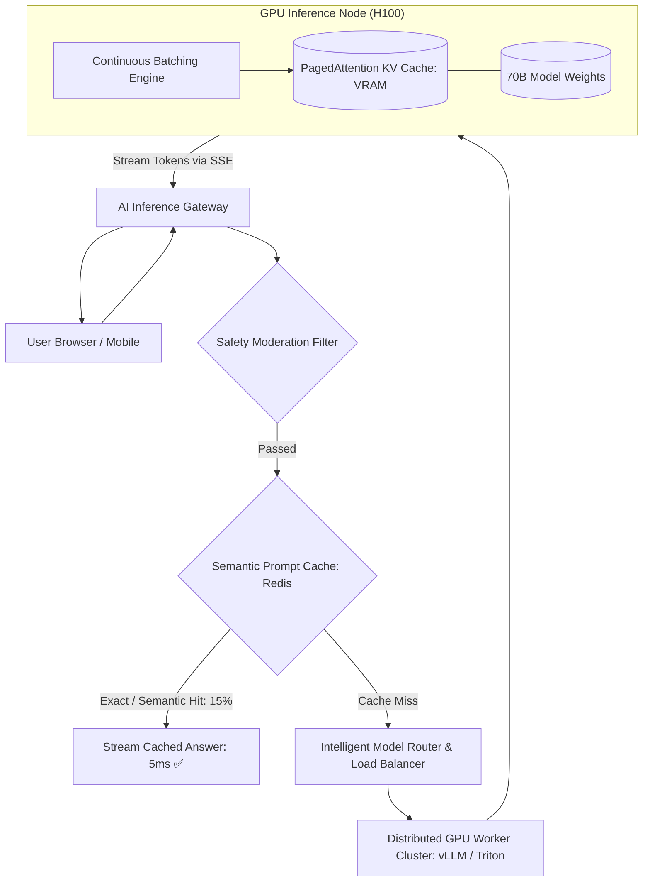
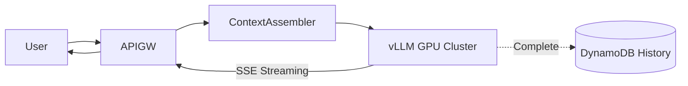

# System Design: ChatGPT / Conversational AI Inference Platform

> **Domain**: Generative AI & Distributed Model Inference Infrastructure
> **Interview Target**: SDE2 / Senior Backend / Staff Engineer
> **Framework**: DESIGN-FLOW (45-Minute Game Plan)

---

## 1. Problem
Design a scalable, low-latency conversational AI serving platform (like ChatGPT / Claude) capable of orchestrating billions of daily conversation turns, streaming real-time token responses via Server-Sent Events (SSE), managing multi-turn context windows, and optimizing GPU cluster utilization via Continuous Batching and KV Caching.

## 2. Requirements Clarification
- What is the primary user experience metric? (Time to First Token TTFT $< 500\text{ms}$ and streaming rate $> 30\text{ tokens/sec}$)
- How is multi-turn conversation context managed? (Conversation history stored in DynamoDB/Redis; loaded and pruned to fit model context window 128k tokens)
- How do we optimize expensive GPU memory during inference? (PagedAttention / vLLM for KV Cache memory management, Continuous Batching)
- Are safety guardrails and moderation included? (Yes, synchronous input/output moderation classification filters)

## 3. Functional Requirements
- **FR-1**: Real-time conversational multi-turn chat with Large Language Models.
- **FR-2**: Stream output tokens back to client in real time via Server-Sent Events (SSE).
- **FR-3**: Maintain conversation history and persistent user chat threads.
- **FR-4**: Automatic input/output moderation checking for unsafe content.

## 4. Non-Functional Requirements
- **NFR-1 (Ultra-Low Latency)**: Time to First Token (TTFT) $< 500\text{ms}$; Inter-Token Latency (ITL) $< 30\text{ms}$.
- **NFR-2 (High Availability)**: $99.99\%$ availability for chat inference.
- **NFR-3 (High Scalability)**: Support $100\text{M}$ Daily Active Users and $1\text{B}$ chat messages/day.
- **NFR-4 (Cost Efficiency)**: Maximize GPU compute utilization ($> 85\%$ VRAM and compute saturation).

## 5. Assumptions
- $100\text{M}$ Daily Active Users (DAU); $1\text{B}$ chat turns per day.
- Average prompt length = $200\text{ tokens}$; average response = $500\text{ tokens}$.
- Peak inference throughput = $50,000\text{ concurrent streaming requests}$.

## 6. Capacity Estimation
- **Inference QPS**: $1\text{B} / 86,400 \approx \mathbf{11,570\text{ requests/sec}}$ (Peak: $\mathbf{35,000\text{ req/sec}}$).
- **Token Throughput**: $11,570\text{ req/sec} \times 500\text{ tokens} = \mathbf{5,785,000\text{ tokens/sec}}$ generated globally!
- **GPU Cluster Sizing**: Single NVIDIA H100 GPU generates $\approx 1,500\text{ tokens/sec}$ on 70B model $\implies \mathbf{3,850\text{ H100 GPUs}}$ in cluster.
- **Conversation State Storage**: $1\text{B messages/day} \times 1\text{ KB} \approx \mathbf{1\text{ TB/day}} \implies 1.8\text{ PB / 5 years}$.

## 7. API Design
- `POST /v1/chat/completions { model: 'gpt-4o', messages: [...], stream: true }` -> Streams `text/event-stream` chunks: `data: {'token': 'Hello'}`
- `GET /v1/conversations/{id}/history`

## 8. Data Model
- **Conversation Threads Table (DynamoDB / Cassandra)**: `conversation_id (PK)`, `user_id`, `title`, `created_at`.
- **Messages Table (DynamoDB)**: `conversation_id (PK)`, `message_id (SK)`, `role (USER/ASSISTANT)`, `content (TEXT)`, `token_count`, `created_at`.
- **Semantic Prompt Cache (Redis Vector)**: `prompt_embedding (1536-dim)` -> `cached_response_text`.

## 9. High-Level Architecture


## 10. Detailed Architecture
```mermaid
flowchart TD
    subgraph GatewayTier["1. AI Gateway & Context Assembler"]
        UserReq[User Sends Prompt] --> Gateway[AI API Gateway]
        Gateway --> HistoryStore[(DynamoDB Conversation History)]
        HistoryStore -->|Fetch Last 10 Messages| ContextAssembler[Context Window Pruner: 8k Tokens]
        ContextAssembler --> Moderation[Toxicity / Injection Scanner]
    end

    subgraph InferenceCluster["2. vLLM Distributed GPU Inference Tier"]
        Moderation --> LoadBalancer[vLLM Inference Router (Least Outstanding Tokens)]
        LoadBalancer --> GPUNode1[GPU Worker 1 (8x H100 NVLink)]

        subgraph EngineCore["vLLM Engine Internals"]
            Scheduler[Continuous Batching Iteration-Level Scheduler]
            PagedAttn[PagedAttention: Virtual Memory KV Cache Pages]
            Weights[Tensor Parallel Model Weights: TP=8]
            Scheduler --> PagedAttn --> Weights
        end
        GPUNode1 --> EngineCore
    end

    subgraph StreamingEgress["3. SSE Real-Time Streaming Egress"]
        EngineCore -->|Yield Token Chunk| NettySSE[Netty Server-Sent Events Emitter]
        NettySSE -->|HTTP chunked 'data: {token: ...}'| UserReq
        EngineCore -. Full Response Complete .-> HistoryStore
    end
```

## 11. Request Flow
1. User sends message. 2. AI Gateway fetches recent conversation history from DynamoDB. 3. Assembles prompt within token budget. 4. Evaluates safety moderation filter. 5. Checks Semantic Cache in Redis (if $> 0.96$ cosine similarity, returns cached response). 6. Routes to least-loaded GPU inference node. 7. vLLM engine batches prompt into Continuous Batching iteration queue. 8. Generates tokens autoregressively using PagedAttention KV Cache. 9. Streams token chunks immediately back to client over HTTP Server-Sent Events (SSE). 10. Persists final assistant response in DynamoDB.

## 12. Data Flow
Prompt -> Gateway -> Context Assembly -> Moderation -> vLLM GPU Node -> PagedAttention KV Cache -> SSE Stream -> Client.

## 13. Database Selection
Amazon DynamoDB / Cassandra for fast key-value conversation history; Redis Vector for semantic prompt caching; Redis for token-per-minute rate limiting; S3 for model weights checkpoints.

## 14. Caching
Semantic Prompt Cache (Redis Vector) resolves 15% of frequent queries with 0 GPU cost; PagedAttention KV Cache in GPU VRAM.

## 15. Messaging
Asynchronous message persistence to DynamoDB so database writes never block live token streaming.

## 16. Partitioning
Conversations partitioned by `conversation_id` in DynamoDB; GPU model weights partitioned across 8 GPUs using Tensor Parallelism (TP=8).

## 17. Replication
Model weights replicated across 500 independent GPU worker instances.

## 18. Consistency
Stateless inference; conversation history updates with strong read-after-write consistency.

## 19. Failure Handling
GPU VRAM Out-of-Memory (OOM) during long generation -> Mitigated by PagedAttention (allocates KV cache in fixed 16-token non-contiguous memory blocks, eliminating memory fragmentation).

## 20. Bottlenecks
Prompt Length Heterogeneity (10-token prompt batched with 2,000-token prompt) -> Mitigated by Continuous Batching (iteration-level scheduling rather than request-level batching).

## 21. Scaling Strategy
Autoscale GPU worker pods on Kubernetes using KEDA based on pending token queue backlog.

## 22. Observability
Time to First Token (TTFT < 500ms), Tokens Per Second (TPS > 30/s), GPU VRAM Utilization (> 85%), PagedAttention Cache Eviction Rate.

## 23. Security
Prompt injection defense (LLM Guard / NeMo Guardrails), PII masking, encrypted TLS 1.3 token streaming.

## 24. Cost Considerations
PagedAttention and Continuous Batching increase GPU throughput by $4\times$, saving tens of millions of dollars in GPU hardware.

## 25. Trade-offs
Server-Sent Events SSE (Lightweight, HTTP/2 native, unidirectional text streaming) vs WebSockets (Bi-directional overhead, stateful socket connection).

## 26. Alternative Designs
Synchronous Non-Streaming HTTP POST (Rejected: user waits 15 seconds in silence before full response renders, destroying UX).

## 27. Final Architecture


## 28. Interview Follow-up Questions
1. Explain how PagedAttention solves GPU memory fragmentation in KV Caching. 2. What is Continuous Batching (Iteration-level scheduling) and why is it superior to static batching? 3. Why is Server-Sent Events (SSE) preferred over WebSockets for AI token streaming?

## 29. Building Blocks Used
`BB-10` (Cache), `BB-13` (Rate Limiter), `BB-19` (API Gateway), `BB-39` (Vector Search), `BB-40` (AI Inference Gateway)
