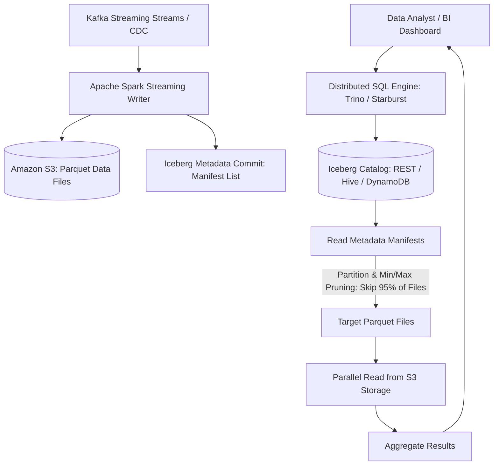
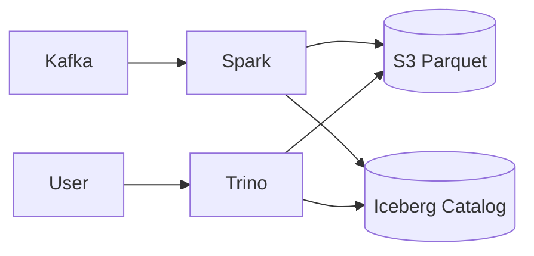

# System Design: Enterprise Distributed Data Lakehouse (Apache Iceberg & Snowflake)

> **Domain**: Big Data Analytics & Cloud Lakehouse Infrastructure
> **Interview Target**: SDE2 / Senior Backend / Staff Engineer
> **Framework**: DESIGN-FLOW (45-Minute Game Plan)

---

## 1. Problem
Design a petabyte-scale distributed data lakehouse (like Snowflake / Databricks / Apache Iceberg) capable of ingesting 100 terabytes of streaming and batch data per day, executing sub-second ACID transactions on object storage (S3), and executing interactive SQL queries across billions of records.

## 2. Requirements Clarification
- What is the storage format? (Columnar Apache Parquet with Snappy/Zstd compression)
- How are ACID transactions supported on S3? (Table metadata manifest snapshots with Optimistic Concurrency Control OCC)
- How are query engines decoupled from storage? (Decoupled compute-storage: stateless Trino/Spark query nodes query immutable Parquet files in S3)
- How is partition pruning achieved? (Column min/max statistics stored in metadata manifests to skip 95% of data files)

## 3. Functional Requirements
- **FR-1**: High-throughput streaming ingestion (Kafka) and batch ingestion (Parquet files).
- **FR-2**: Full ACID transactions (`INSERT`, `UPDATE`, `DELETE`, `MERGE`) on Amazon S3.
- **FR-3**: Interactive distributed SQL query engine (Trino / Presto) executing fast analytical queries.
- **FR-4**: Time Travel (querying historical table snapshots at a specific timestamp).

## 4. Non-Functional Requirements
- **NFR-1 (Scalability)**: Scale to $100\text{ Petabytes}$ of data storage and $100\text{ TB/day}$ continuous ingestion.
- **NFR-2 (Query Performance)**: Analytical SQL query latency $< 2\text{s}$ for aggregated queries.
- **NFR-3 (Durability)**: 11 Nines durability on Amazon S3 (Zero data loss).
- **NFR-4 (Cost Optimization)**: Decoupled compute and storage (Zero compute cost when queries are idle).

## 5. Assumptions
- $100\text{ TB}$ new raw analytical data ingested per day ($36.5\text{ PB/year}$).
- $10,000$ concurrent analytical SQL queries per day.
- Raw JSON data compressed to Parquet = $4\times$ storage reduction ($25\text{ TB/day}$ Parquet).

## 6. Capacity Estimation
- **Ingestion Throughput**: $100\text{ TB/day} / 86,400 \approx \mathbf{1.15\text{ GB/sec}}$ continuous ingestion stream.
- **5-Year Lakehouse Storage**: $25\text{ TB/day} \times 365 \times 5 \approx \mathbf{45.6\text{ Petabytes}}$ in Amazon S3.
- **Query Engine Sizing**: Stateless auto-scaling Trino worker clusters on EC2 Spot instances.

## 7. API Design
- SQL Interface (ANSI SQL): `SELECT country, SUM(revenue) FROM iceberg_db.orders WHERE order_date >= '2026-01-01' GROUP BY country;`
- Time Travel SQL: `SELECT * FROM iceberg_db.orders FOR SYSTEM_TIME AS OF '2026-08-01 00:00:00';`

## 8. Data Model
- **Iceberg Metadata Hierarchy (S3)**:
  1. `Iceberg Catalog` -> Points to `v3.metadata.json`
  2. `v3.metadata.json` -> Contains Snapshot ID, Schema, Partition Spec, points to `Manifest List`
  3. `Manifest List` -> Contains array of `Manifest Files` with min/max partition bounds
  4. `Manifest File` -> Contains list of physical `.parquet` data files with column statistics
  5. Physical Data Files -> `.parquet` files on S3.

## 9. High-Level Architecture


## 10. Detailed Architecture
```mermaid
flowchart TD
    subgraph IngestionTier["1. ACID Ingestion Pipeline"]
        EventBus[Kafka Ingestion Topic] --> FlinkWriter[Flink / Spark Streaming Ingest]
        FlinkWriter --> Buffer[Buffer in Memory (100MB)]
        Buffer --> WriteParquet[Write Columnar Parquet File to S3]
        WriteParquet --> AtomicCommit[Atomic Snapshot Commit via Catalog OCC]
    end

    subgraph MetadataHierarchy["2. Apache Iceberg Metadata Architecture"]
        CatalogPointer[Catalog: Points to Latest Snapshot] --> SnapV3[Snapshot 3: Manifest List]
        SnapV3 --> Manifest1["Manifest 1 (2026-08: min_date=Aug 1, max_date=Aug 15)"]
        SnapV3 --> Manifest2["Manifest 2 (2026-08: min_date=Aug 16, max_date=Aug 31)"]
        Manifest1 --> Data1[(Parquet File 1)]
        Manifest1 --> Data2[(Parquet File 2)]
    end

    subgraph QueryExecution["3. Decoupled SQL Query Engine"]
        Query[User SQL Query: WHERE date = '2026-08-05'] --> TrinoCoordinator[Trino Coordinator]
        TrinoCoordinator --> Pruner[Partition Pruner: Discards Manifest 2 completely!]
        Pruner --> TrinoWorkers[Trino Worker Cluster: Parallel Scan File 1]
        TrinoWorkers --> Result[Return Query Results in 800ms ✅]
    end
```

## 11. Request Flow
1. Spark/Flink ingests streaming events from Kafka. 2. Formats into Parquet files with dictionary encoding and Snappy compression. 3. Writes files to S3. 4. Commits new metadata snapshot to Iceberg Catalog using Optimistic Concurrency Control (OCC). 5. Analyst executes SQL query in Trino. 6. Trino reads Iceberg metadata manifests. 7. Applies Partition Pruning and Column Min/Max stats, skipping 95% of unneeded files. 8. Trino workers fetch only target columnar chunks in parallel. 9. Returns query result in $< 1\text{s}$.

## 12. Data Flow
Kafka -> Spark Ingestion -> Parquet on S3 -> Iceberg Snapshot Commit -> Trino Query Engine -> Pruning -> S3 Read -> Client.

## 13. Database Selection
Amazon S3 / Google Cloud Storage for infinite petabyte data lakehouse storage; Apache Iceberg format for ACID table metadata; Trino / Presto for interactive distributed SQL compute; PostgreSQL / DynamoDB for the Iceberg Catalog pointer.

## 14. Caching
Local NVMe SSD caching on Trino query nodes (Alluxio / Trino local cache) avoids repeated S3 read latencies for hot partitions.

## 15. Messaging
Kafka cluster buffers streaming CDC events before micro-batch Parquet writing.

## 16. Partitioning
Data partitioned by time bucket (`order_date / month`) and hash of `tenant_id`.

## 17. Replication
S3 11 Nines durability with Multi-Region Replication.

## 18. Consistency
Serializability / Snapshot Isolation via Optimistic Concurrency Control (OCC) in Iceberg Catalog.

## 19. Failure Handling
Small File Problem (thousands of tiny 1MB files slow down S3 reads) -> Mitigated by background compaction worker merging small files into optimal 128MB–512MB Parquet files.

## 20. Bottlenecks
S3 prefix rate limiting (5,500 GETs/sec per prefix) -> Mitigated by hashing S3 object keys across partitioned folder prefixes.

## 21. Scaling Strategy
Decoupled Compute and Storage: scale Trino query worker nodes independently on Kubernetes based on active SQL query queue depth.

## 22. Observability
Query Latency (p90, p99), Data Ingestion Throughput (MB/s), Small File Compaction Backlog, S3 Egress Bandwidth.

## 23. Security
Column-level and row-level data masking (Apache Ranger), IAM role-based access to S3, encrypted Parquet files at rest.

## 24. Cost Considerations
Decoupling compute from storage and executing queries on auto-scaling spot nodes saves $80\%$ compared to legacy data warehouses.

## 25. Trade-offs
Apache Iceberg on S3 (Open source, multi-engine support, $10x cheaper) vs Proprietary Snowflake Warehouse (Managed simplicity, vendor lock-in).

## 26. Alternative Designs
Traditional Hadoop HDFS on dedicated physical servers (Rejected: massive hardware maintenance overhead, expensive storage scaling).

## 27. Final Architecture


## 28. Interview Follow-up Questions
1. How does Apache Iceberg achieve ACID transactions and Time Travel on top of append-only S3 storage? 2. How does Metadata Partition and Min/Max Pruning skip 95% of data files during a SQL query? 3. How do you solve the 'Small File Problem' in streaming data ingestion?

## 29. Building Blocks Used
`BB-03` (RDBMS), `BB-12` (Kafka), `BB-14` (Blob Store), `BB-30` (Audit Log), `BB-38` (Stream Processing)
