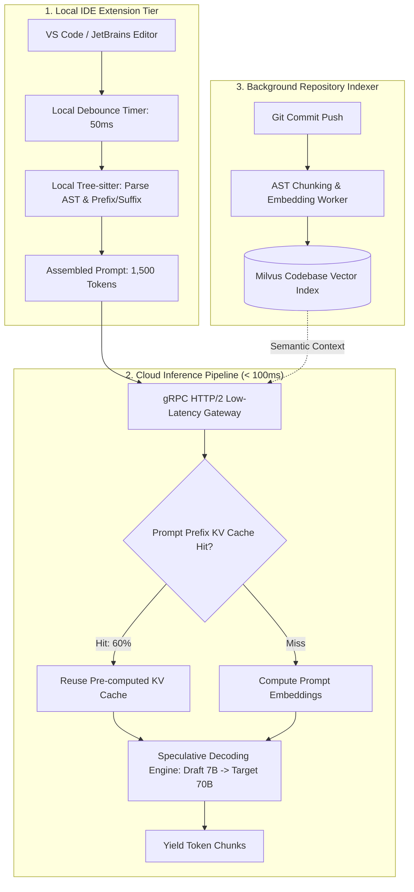
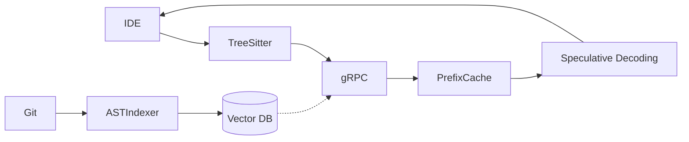

# System Design: AI Coding Assistant & Repo Indexer (GitHub Copilot / Cursor)

> **Domain**: Developer Tools & Real-Time Code Intelligence
> **Interview Target**: SDE2 / Senior Backend / Staff Engineer
> **Framework**: DESIGN-FLOW (45-Minute Game Plan)

---

## 1. Problem
Design a real-time, context-aware AI coding assistant (like GitHub Copilot / Cursor) capable of providing single-line and multi-line code completions in $< 150\text{ms}$ as developers type, indexing entire git repositories for semantic code search, and generating multi-file codebase edits.

## 2. Requirements Clarification
- What is the target latency for inline code suggestions? (Extremely strict: $< 150\text{ms}$ Time to First Token TTFT to avoid interrupting typing flow)
- How is codebase context assembled? (AST parsing of current file + imports + recent file tabs + semantic vector search across repo index)
- How do we optimize latency for fast typing? (Client-side typing debounce 50ms + Speculative Decoding / Speculative Caching)
- How are private codebases secured? (Zero training on user code, ephemeral in-memory processing, tenant-isolated vector indexes)

## 3. Functional Requirements
- **FR-1**: Real-time inline code auto-completions as developers type in IDE.
- **FR-2**: Full codebase semantic search and multi-file context indexing.
- **FR-3**: Conversational chat interface for code generation, bug fixing, and refactoring.
- **FR-4**: Multi-file repository edits with syntax-valid diff generation.

## 4. Non-Functional Requirements
- **NFR-1 (Ultra-Low Latency)**: Inline completion latency $< 150\text{ms}$ globally (p95).
- **NFR-2 (High Scalability)**: Support $10\text{M}$ active developers generating $1\text{B}$ completion queries/day.
- **NFR-3 (Code Quality & Relevance)**: High acceptance rate ($> 30\%$ of suggested completions accepted by developers).
- **NFR-4 (Security & Privacy)**: Enterprise-grade code privacy (Zero persistence of customer code on inference servers).

## 5. Assumptions
- $10\text{M}$ Daily Active Developers; $1\text{B}$ completion requests per day.
- Average prompt = $1,500\text{ tokens}$ (Prefix code + Suffix code + Imported types).
- Average completion = $30\text{ tokens}$.

## 6. Capacity Estimation
- **Completion QPS**: $1\text{B} / 86,400 \approx \mathbf{11,570\text{ completions/sec}}$ (Peak: $\mathbf{30,000\text{ QPS}}$).
- **Latency Budget**: $150\text{ms}$ total: Network Round Trip ($40\text{ms}$) + Context Assembly ($20\text{ms}$) + Fast Model TTFT ($80\text{ms}$) + Stream First Token ($10\text{ms}$).
- **Repo Vector Storage**: $100\text{M repos} \times 500\text{ code chunks} \times 1536\text{ dims} \times 4\text{ bytes} \approx \mathbf{300\text{ TB}}$ distributed vector index in Milvus/Qdrant.

## 7. API Design
- IDE Plugin gRPC Stream: `StreamCompletion(CodeContext) returns (stream CompletionChunk)`
- `POST /v1/repo/index { repo_id, git_commit_sha }`
- `POST /v1/chat/codebase_query { query: 'Where is the auth middleware configured?' }`

## 8. Data Model
- **Code Chunk Vector Store (Milvus / Qdrant)**: `chunk_id`, `repo_id`, `file_path`, `start_line`, `end_line`, `ast_node_type (FUNCTION/CLASS)`, `embedding (FLOAT[1536])`.
- **Repo Index Catalog (PostgreSQL)**: `repo_id (PK)`, `commit_sha`, `index_status`, `indexed_at`.
- **Telemetry Store (ClickHouse)**: `completion_id`, `user_id`, `latency_ms`, `accepted (BOOL)`, `language`.

## 9. High-Level Architecture
```mermaid
flowchart TD
    IDE[Developer IDE Plugin] -->|1. Debounced Keystroke (50ms)| Gateway[AI Gateway]

    subgraph ContextEngine["IDE Local + Cloud Context Assembly (20ms)"]
        AST[Tree-sitter AST Parser: Extracts cursor prefix/suffix]
        RecentTabs[Recent Open File Tabs]
        RepoSearch[Semantic Repo Vector Search]
        AST --- RecentTabs --- RepoSearch
    end
    Gateway --> ContextEngine

    ContextEngine --> SpeculativeRouter[Speculative Decoding / Fast Model Router]
    SpeculativeRouter --> FastModel[Fast Small Model: 7B Speculator (TTFT 30ms)]
    FastModel --> LargeModel[Large Model: 70B Verifier]

    LargeModel -->|2. Stream Completion Tokens in 100ms| Gateway
    Gateway --> IDE
    IDE -->|User hits TAB: Accepted ✅| AcceptTelemetry[ClickHouse Telemetry]
```

## 10. Detailed Architecture


## 11. Request Flow
1. Developer types in IDE. 2. IDE plugin debounces keystroke (50ms). 3. Tree-sitter extracts enclosing function prefix, suffix, and imported interfaces. 4. Sends gRPC request to Cloud Gateway. 5. Gateway checks Prompt Prefix KV Cache (60% hit ratio on file prefix). 6. Speculative Decoding generates 5 draft tokens using a small 7B model in 20ms and verifies with a 70B model in parallel. 7. Streams completion tokens back over gRPC stream. 8. Developer hits `Tab` to accept suggestion. 9. Emits acceptance telemetry.

## 12. Data Flow
Keystroke -> Debounce -> Tree-sitter AST -> gRPC -> Prefix KV Cache -> Speculative Decoding -> IDE -> Tab Accept.

## 13. Database Selection
Milvus / Qdrant for semantic codebase vector indexing; Redis for ephemeral prompt prefix KV caches; PostgreSQL for repository indexing state; ClickHouse for developer suggestion acceptance telemetry.

## 14. Caching
Prompt Prefix KV Cache in GPU VRAM (re-uses pre-computed attention keys/values for unchanged file lines, cutting prompt computation time by 70%); Local IDE memory cache of recently accepted completions.

## 15. Messaging
gRPC multiplexed HTTP/2 streams provide sub-millisecond framing overhead compared to heavy HTTP/1.1 REST calls.

## 16. Partitioning
Vector embeddings partitioned strictly by `tenant_id` and `repo_id` (zero cross-tenant data leakage).

## 17. Replication
Model weights replicated across 1,000 GPU worker instances behind a global Anycast network.

## 18. Consistency
Stateless inference; telemetry logged asynchronously with eventual consistency.

## 19. Failure Handling
Typing Speed Latency Collapse (Developer types 80 words/minute -> 5 keystrokes/sec would trigger 5 overlapping requests) -> Mitigated by Client Debouncing (50ms) and Request Cancellation (cancelling in-flight gRPC streams when a new keystroke arrives).

## 20. Bottlenecks
Multi-turn context window bloat -> Mitigated by Smart Slicing (enclosing function + imported types + cursor context up to 2,048 tokens).

## 21. Scaling Strategy
Global Anycast edge deployment routes IDE requests to the geographically closest GPU datacenter (US, EU, APAC) to minimize speed-of-light network round trips.

## 22. Observability
Time to First Token (TTFT < 150ms), Completion Acceptance Rate (> 30%), Keystroke Cancellation Rate, GPU KV Cache Hit Rate.

## 23. Security
Strict tenant isolation in vector database, zero retention of enterprise customer code, SOC2 / ISO 27001 compliance.

## 24. Cost Considerations
Speculative Decoding and Prefix KV Caching increase GPU token generation throughput by $3\times$, reducing cloud GPU inference costs.

## 25. Trade-offs
Speculative Decoding (Fast 7B draft + 70B verify: sub-100ms latency, high quality) vs Single Large 70B Model (Slow 300ms latency, misses 150ms SLA).

## 26. Alternative Designs
Full-Repository Brute Force Context Injection (Rejected: exceeds LLM context windows, slow, and full of irrelevant code noise).

## 27. Final Architecture


## 28. Interview Follow-up Questions
1. How does Speculative Decoding achieve 2x–3x faster LLM token generation? 2. How does Prompt Prefix KV Caching eliminate redundant attention computation in code editors? 3. How does Tree-sitter AST parsing extract high-signal context from large multi-file codebases?

## 29. Building Blocks Used
`BB-10` (Cache), `BB-19` (API Gateway), `BB-39` (Vector Search), `BB-40` (AI Inference Gateway)
