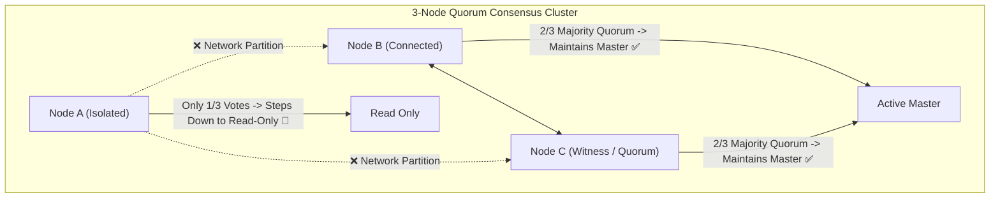

# Production Outage Post-Mortem 03: Split-Brain in Two-Node Distributed Cluster

> **Severity**: SEV-1 Outage
> **Impacted Domain**: Distributed Reliability & Fault Tolerance
> **Post-Mortem Framework**: Cause $\to$ Symptoms $\to$ Detection $\to$ Mitigation $\to$ Recovery $\to$ Prevention

---

## 1. Incident Summary
A transient network partition isolated two primary database nodes in a 2-node cluster. Both nodes assumed the other had failed, promoted themselves to Master, and accepted conflicting writes for 45 minutes, causing severe data divergence.

---

## 2. Root Cause Analysis
Configuring a 2-node cluster without a third tie-breaker witness node. In a 2-node cluster, a 1-1 network split leaves neither node with a true majority ($N/2 + 1$), allowing both sides to falsely claim leadership.

---

## 3. Symptoms & Blast Radius
- **Divergent Ledgers**: 12,400 user account transactions written to Node A; 9,800 conflicting transactions written to Node B.
- **Data Corruption**: Negative account balances and duplicate order fulfillments.

---

## 4. Detection & Time to Detect (TTD)
- **Time to Detect (TTD)**: $45\text{ minutes}$ (Customer complaints regarding balance discrepancies).

---

## 5. Immediate Mitigation (Stop the Bleeding)
1. Immediately severed write access to Node B.
2. Locked impacted user accounts.
3. Executed manual offline reconciliation scripts to merge split WAL transaction logs.

---

## 6. Full Recovery & Time to Recovery (TTR)
- **Time to Recovery (TTR)**: $6\text{ hours}$ of manual data reconciliation.

---

## 7. Architectural Prevention

- Always deploy an **odd number of consensus nodes** ($N = 3, 5, 7$) across independent Availability Zones.
- Enforce strict **Majority Quorum ($N/2 + 1$)**: a partition with $\le N/2$ nodes must immediately demote itself to Read-Only.
- Implement **STONITH** (Shoot The Other Node In The Head) fencing mechanisms.

---

## 8. Code & Configuration Fix
```java
// Raft Leader Heartbeat Quorum Check
public void checkHeartbeatQuorum() {
    int activeAcks = countFollowerHeartbeatAcks();
    int requiredQuorum = (totalNodes / 2) + 1; // 2 out of 3

    if (activeAcks < requiredQuorum) {
        logger.error("Lost majority quorum! Stepping down from Leader to FOLLOWER.");
        this.currentRole = Role.FOLLOWER;
        this.readOnlyMode = true;
    }
}
```

---

## 9. Key Lessons Learned
1. Never deploy a 2-node cluster for authoritative master-election architectures.
2. Majority Quorum ($N/2 + 1$) is a non-negotiable mathematical requirement in distributed systems.
3. Epoch generation fencing tokens prevent zombie leaders from committing stale writes.
