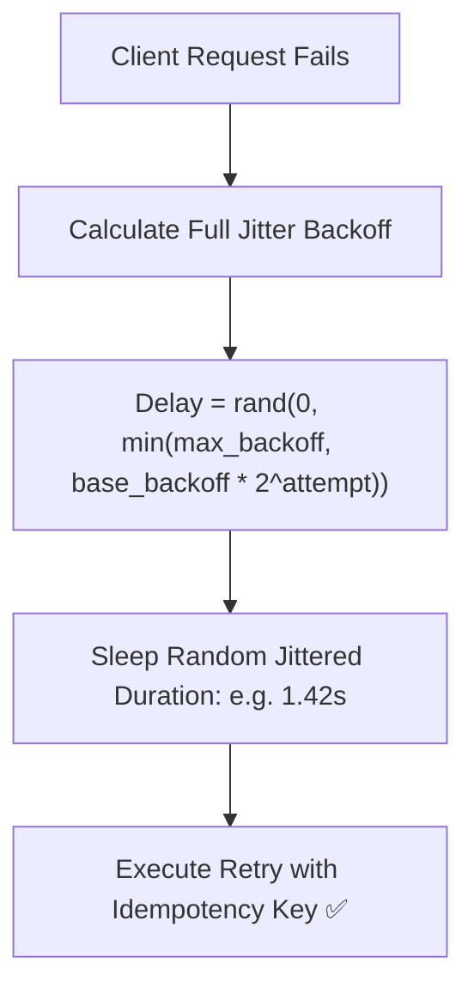

# Production Outage Post-Mortem 04: Retry Storm & Self-Inflicted DDoS

> **Severity**: SEV-1 Outage
> **Impacted Domain**: Distributed Reliability & Fault Tolerance
> **Post-Mortem Framework**: Cause $\to$ Symptoms $\to$ Detection $\to$ Mitigation $\to$ Recovery $\to$ Prevention

---

## 1. Incident Summary
A payment service experienced a brief 2-second database network blip. 10,000 client apps received connection errors and immediately retried every 100ms simultaneously without exponential backoff or jitter, amplifying traffic from 2,000 QPS to 60,000 QPS and keeping the database offline for 40 minutes.

---

## 2. Root Cause Analysis
Immediate, aggressive retry loops in client mobile apps and upstream microservices with static zero-jitter retry intervals.

---

## 3. Symptoms & Blast Radius
- **Self-Inflicted DDoS**: Ingress traffic spiked by $3,000\%$ on a recovering service.
- **Total Platform Freeze**: Upstream connection pools exhausted by retry storms.

---

## 4. Detection & Time to Detect (TTD)
- **Time to Detect (TTD)**: $3\text{ minutes}$ (Ingress gateway connection saturation alarm).

---

## 5. Immediate Mitigation (Stop the Bleeding)
1. Enabled aggressive rate limiting at the API Gateway to drop $80\%$ of retry traffic.
2. Flushed edge gateway connection queues.

---

## 6. Full Recovery & Time to Recovery (TTR)
- **Time to Recovery (TTR)**: $35\text{ minutes}$.

---

## 7. Architectural Prevention

- Mandate **Exponential Backoff with Full Jitter** across all client SDKs and internal RPC clients.
- Enforce **Retry Budgets** (clients only retry up to $10\%$ of total request volume; reject retries when failure rate is high).
- Return **HTTP 429 Too Many Requests** with `Retry-After: {seconds}` headers.

---

## 8. Code & Configuration Fix
```java
public class ResilientRetryClient {
    public static long calculateFullJitter(int attempt, long baseMs, long maxMs) {
        long exponential = Math.min(maxMs, baseMs * (1L << attempt));
        return ThreadLocalRandom.current().nextLong(0, exponential);
    }

    public Response executeWithRetry(Request req, int maxRetries) {
        for (int attempt = 0; attempt < maxRetries; attempt++) {
            try {
                return httpClient.send(req);
            } catch (IOException e) {
                if (attempt == maxRetries - 1) throw e;
                long sleepMs = calculateFullJitter(attempt, 100, 5000);
                Thread.sleep(sleepMs);
            }
        }
        throw new RuntimeException("Retries exhausted");
    }
}
```

---

## 9. Key Lessons Learned
1. Never retry immediately without exponential backoff and randomized jitter.
2. Implement global Retry Budgets to stop retrying when an outage is already in progress.
3. Always include Idempotency-Keys on retried write operations.
