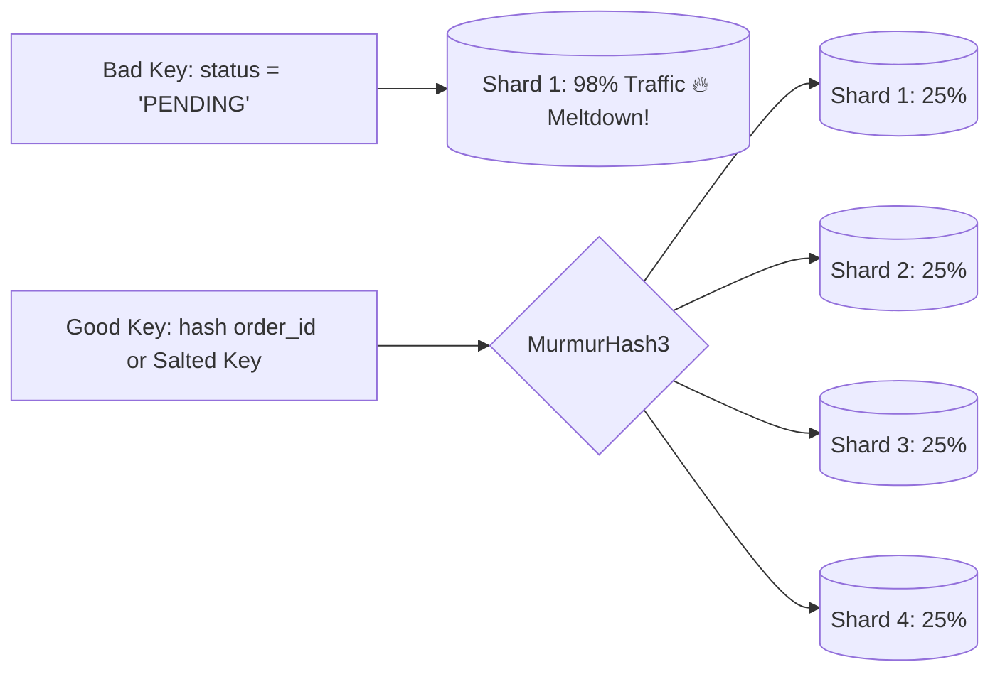

# Production Outage Post-Mortem 05: Database Hotspotting from Low-Cardinality Partition Keys

> **Severity**: SEV-1 Outage
> **Impacted Domain**: Distributed Reliability & Fault Tolerance
> **Post-Mortem Framework**: Cause $\to$ Symptoms $\to$ Detection $\to$ Mitigation $\to$ Recovery $\to$ Prevention

---

## 1. Incident Summary
An e-commerce platform sharded its order database by `status` (`'PENDING'`, `'SHIPPED'`, `'DELIVERED'`). During Black Friday, $98\%$ of all 200,000 new orders/min were written to the single `'PENDING'` shard node, melting that single server while other shards sat at $1\%$ CPU.

---

## 2. Root Cause Analysis
Selecting a low-cardinality partition key (`status` has only 3 distinct values), creating massive skew and destroying horizontal partitioning benefits.

---

## 3. Symptoms & Blast Radius
- **Single Node Meltdown**: Shard Node 1 CPU hit $100\%$, disk I/O saturated at $50,000\text{ IOPS}$.
- **Order Failures**: $75\%$ of Black Friday checkout requests timed out.

---

## 4. Detection & Time to Detect (TTD)
- **Time to Detect (TTD)**: $5\text{ minutes}$ (Single database host CPU alert).

---

## 5. Immediate Mitigation (Stop the Bleeding)
1. Temporarily diverted pending order writes to an in-memory Redis queue buffer.
2. Vertically scaled Shard Node 1 instance size.

---

## 6. Full Recovery & Time to Recovery (TTR)
- **Time to Recovery (TTR)**: $45\text{ minutes}$.

---

## 7. Architectural Prevention

- Choose **High-Cardinality Partition Keys** (e.g. `order_id` or `user_id`) using uniform hashing (MurmurHash3).
- If querying by low-cardinality status is required, use **Key Salting** (append random integer `status_0`, `status_1` ... `status_9`).
- Use secondary global index tables for status-based queries.

---

## 8. Code & Configuration Fix
```java
// High-Cardinality Partition Key Routing
public int calculateShard(String orderId, int totalShards) {
    // Uniform hash distribution across all available shards
    int hash = Hashing.murmur3_32_fixed().hashString(orderId, StandardCharsets.UTF_8).asInt();
    return Math.abs(hash) % totalShards;
}

// Key Salting for Low-Cardinality Status Queries
public String getSaltedKey(String status, int saltBuckets) {
    int salt = ThreadLocalRandom.current().nextInt(saltBuckets);
    return status + "_" + salt;
}
```

---

## 9. Key Lessons Learned
1. Never shard a database by low-cardinality enum columns (`status`, `gender`, `country`).
2. Use uniform hashing (MurmurHash3 / CRC32) on unique entity IDs.
3. Monitor shard data and throughput uniformity continuously.
