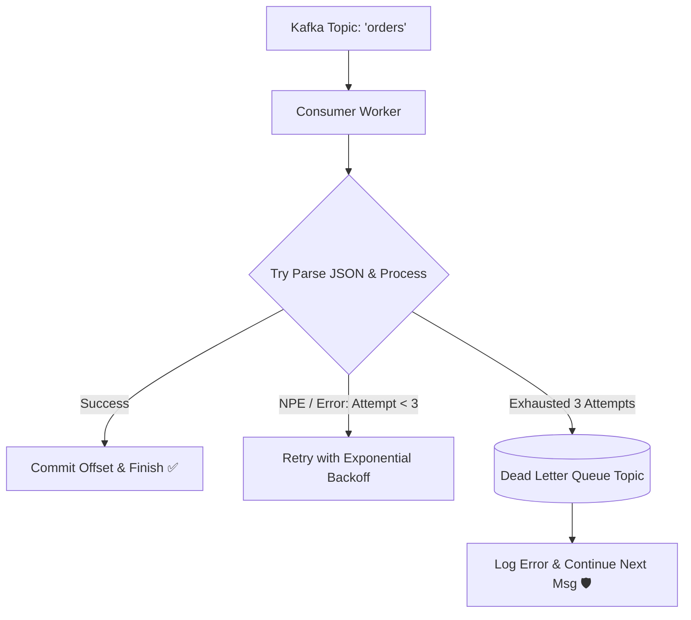

# Production Outage Post-Mortem 06: Poison Pill Message & Infinite Consumer Crash Loop

> **Severity**: SEV-1 Outage
> **Impacted Domain**: Distributed Reliability & Fault Tolerance
> **Post-Mortem Framework**: Cause $\to$ Symptoms $\to$ Detection $\to$ Mitigation $\to$ Recovery $\to$ Prevention

---

## 1. Incident Summary
A malformed JSON message with an unexpected null field was published to a Kafka order topic. Every consumer worker that polled the message crashed with a `NullPointerException`, failed to commit its offset, restarted, re-read the exact same message, and crashed again in an infinite crash loop, paralyzing order processing.

---

## 2. Root Cause Analysis
Lack of Dead-Letter Queue (DLQ) isolation and missing top-level exception handling around message deserialization.

---

## 3. Symptoms & Blast Radius
- **Consumer Fleet Paralyzed**: All 50 order processing worker pods entered `CrashLoopBackOff`.
- **Queue Backlog**: 2,000,000 legitimate orders queued up over 3 hours.

---

## 4. Detection & Time to Detect (TTD)
- **Time to Detect (TTD)**: $10\text{ minutes}$ (Kubernetes pod crash loop alert).

---

## 5. Immediate Mitigation (Stop the Bleeding)
1. Operator manually skipped the poisoned Kafka offset by advancing the consumer group commit offset by 1.

---

## 6. Full Recovery & Time to Recovery (TTR)
- **Time to Recovery (TTR)**: $35\text{ minutes}$.

---

## 7. Architectural Prevention

- Wrap all consumer processing in **Top-Level `try-catch` blocks**.
- Implement a **Dead-Letter Queue (DLQ)**: route unprocessable messages to a separate topic after 3 failed retries.
- Schema Registry enforcement to reject malformed JSON payloads at producer time.

---

## 8. Code & Configuration Fix
```java
// Spring Kafka Dead-Letter Topic Configuration
@Bean
public DefaultErrorHandler errorHandler(KafkaTemplate<String, Object> template) {
    // Retry 3 times with 1s backoff, then publish to Dead Letter Topic
    DeadLetterPublishingRecoverer recoverer = new DeadLetterPublishingRecoverer(template,
        (record, ex) -> new TopicPartition(record.topic() + ".DLT", record.partition()));

    FixedBackOff backOff = new FixedBackOff(1000L, 3L);
    return new DefaultErrorHandler(recoverer, backOff);
}
```

---

## 9. Key Lessons Learned
1. Never let an unhandled deserialization exception crash a consumer process.
2. Dead-Letter Queues (DLQ) are mandatory to isolate poison pills.
3. Enforce strict binary schemas (Avro/Protobuf) at the producer boundary.
