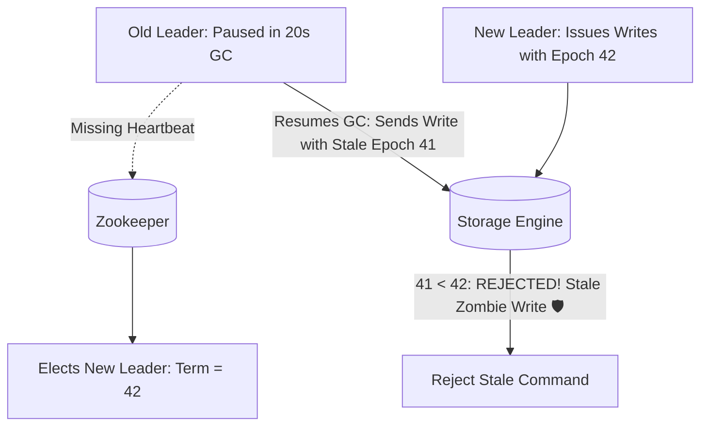

# Production Outage Post-Mortem 07: Stop-The-World GC Pause & Zombie Master Node

> **Severity**: SEV-1 Outage
> **Impacted Domain**: Distributed Reliability & Fault Tolerance
> **Post-Mortem Framework**: Cause $\to$ Symptoms $\to$ Detection $\to$ Mitigation $\to$ Recovery $\to$ Prevention

---

## 1. Incident Summary
A Java-based coordinator service experienced a 20-second Stop-The-World garbage collection pause due to high heap fragmentation. Zookeeper declared the coordinator dead after missing its 10-second heartbeat lease and elected a new leader. When the old coordinator resumed from GC, it executed stale buffered writes, causing split-brain data corruption.

---

## 2. Root Cause Analysis
Lack of Epoch Fencing Tokens on storage mutations. The zombie leader resumed without knowing it had been deposed, executing stale operations.

---

## 3. Symptoms & Blast Radius
- **Conflicting Mutations**: Double-allocation of resources across two coordinators.
- **Data Inconsistency**: Stale state overwrote newer state in storage.

---

## 4. Detection & Time to Detect (TTD)
- **Time to Detect (TTD)**: $15\text{ minutes}$ (Duplicate resource allocation alert).

---

## 5. Immediate Mitigation (Stop the Bleeding)
1. Restarted storage nodes and revoked the old coordinator's network credentials.

---

## 6. Full Recovery & Time to Recovery (TTR)
- **Time to Recovery (TTR)**: $2\text{ hours}$ of data audit.

---

## 7. Architectural Prevention

- Pass **Monotonically Increasing Epoch / Fencing Tokens** with every storage command.
- Storage engines must reject any command with an Epoch lower than the highest seen Epoch.
- Tune JVM Garbage Collection (use ZGC / Shenandoah with sub-millisecond pauses) to eliminate long STW pauses.

---

## 8. Code & Configuration Fix
```java
public class FencedStorageEngine {
    private long highestSeenEpoch = 0;

    public synchronized void executeMutation(String key, String value, long fencingEpoch) {
        if (fencingEpoch < highestSeenEpoch) {
            throw new StaleLeaderException("Rejected write! Stale epoch: " + fencingEpoch + " < " + highestSeenEpoch);
        }
        this.highestSeenEpoch = fencingEpoch;
        storageMap.put(key, value);
    }
}
```

---

## 9. Key Lessons Learned
1. In distributed systems, a node cannot know if it is still the leader without checking with quorum.
2. Fencing Tokens at the storage tier are the only foolproof defense against GC-paused zombie nodes.
3. Use low-latency JVM collectors (ZGC) for coordination services.
