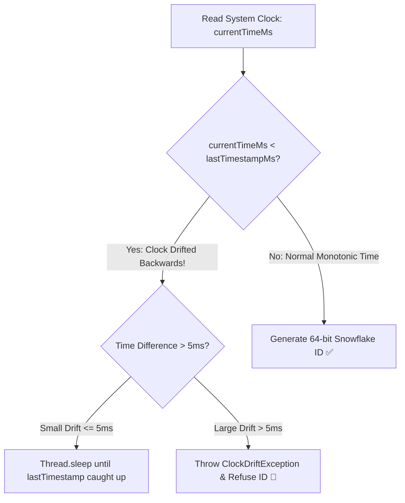

# Production Outage Post-Mortem 08: NTP Clock Backward Step & Snowflake ID Collisions

> **Severity**: SEV-1 Outage
> **Impacted Domain**: Distributed Reliability & Fault Tolerance
> **Post-Mortem Framework**: Cause $\to$ Symptoms $\to$ Detection $\to$ Mitigation $\to$ Recovery $\to$ Prevention

---

## 1. Incident Summary
A server running an NTP synchronization daemon experienced a backward clock step (-500ms). The Snowflake ID generator on that node continued issuing IDs using the backward timestamp, colliding with IDs generated half a second earlier and causing primary key duplicate crashes in PostgreSQL.

---

## 2. Root Cause Analysis
Allowing distributed ID generation to continue when the physical system clock drifts backwards.

---

## 3. Symptoms & Blast Radius
- **Database Write Failures**: $15,000$ duplicate key violation errors on user signups.
- **Signups Blocked**: 10 minutes of disrupted customer onboarding.

---

## 4. Detection & Time to Detect (TTD)
- **Time to Detect (TTD)**: $2\text{ minutes}$ (Database duplicate key exception alert).

---

## 5. Immediate Mitigation (Stop the Bleeding)
1. Temporarily routed ID generation traffic to other server nodes.
2. Configured NTP daemons to slew clock gradually (`adjtime`) instead of stepping backward.

---

## 6. Full Recovery & Time to Recovery (TTR)
- **Time to Recovery (TTR)**: $12\text{ minutes}$.

---

## 7. Architectural Prevention

- In Snowflake generators, track `lastTimestamp`. If `currentTimestamp < lastTimestamp`, either wait or throw an explicit exception.
- Configure NTP servers to use **clock slewing** (gradually adjusting clock speed) rather than hard backward clock stepping.

---

## 8. Code & Configuration Fix
```java
public synchronized long nextId() {
    long currentTimestamp = timeGen();

    if (currentTimestamp < lastTimestamp) {
        long offset = lastTimestamp - currentTimestamp;
        if (offset <= 5) {
            // Small drift: wait it out
            try { Thread.sleep(offset << 1); } catch (Exception e) {}
            currentTimestamp = timeGen();
        } else {
            throw new RuntimeException("Clock moved backwards! Refusing to generate ID for " + offset + "ms");
        }
    }
    // Proceed with bitwise layout generation...
    return ((currentTimestamp - epoch) << 22) | (workerId << 12) | sequence;
}
```

---

## 9. Key Lessons Learned
1. Never trust wall-clock time (`System.currentTimeMillis()`) for strict monotonic ordering.
2. Snowflake generators must fail-fast or wait when clock skew occurs.
3. Use clock slewing for production NTP daemons.
