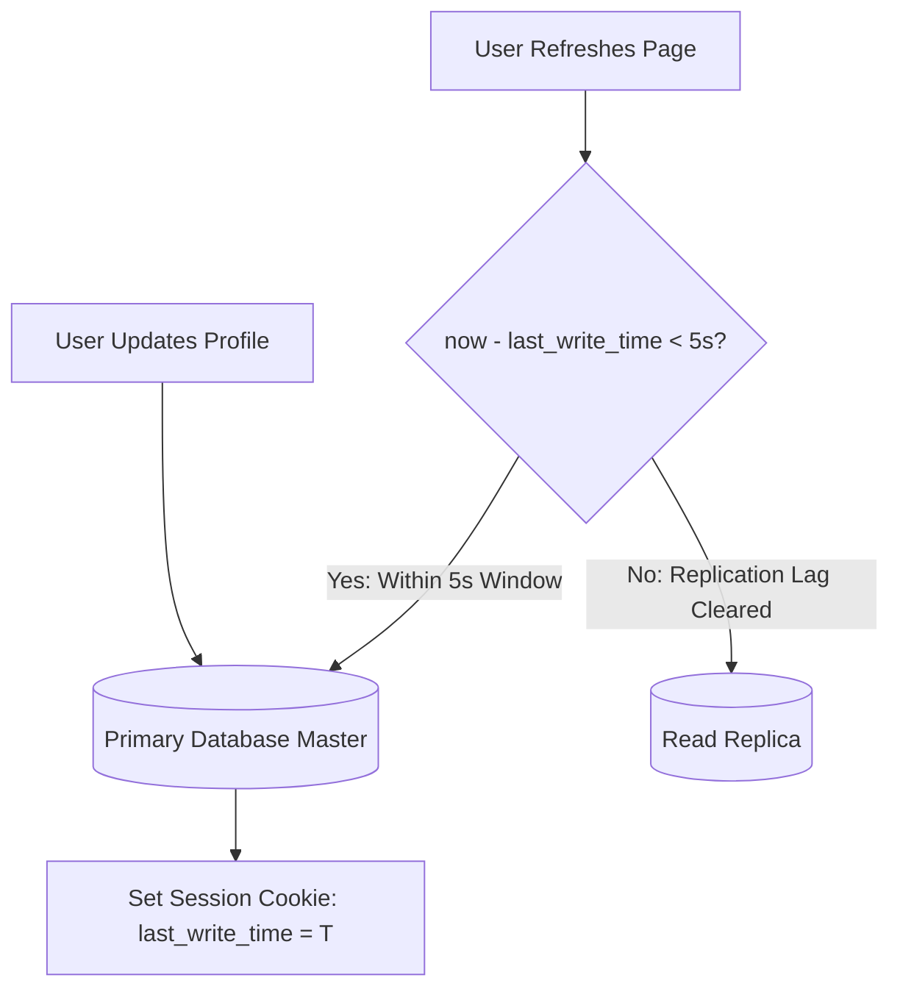

# Production Outage Post-Mortem 09: Read-Your-Own-Writes Violation & User Confusion

> **Severity**: SEV-1 Outage
> **Impacted Domain**: Distributed Reliability & Fault Tolerance
> **Post-Mortem Framework**: Cause $\to$ Symptoms $\to$ Detection $\to$ Mitigation $\to$ Recovery $\to$ Prevention

---

## 1. Incident Summary
A user updated their profile name, received a 200 OK success response, and immediately refreshed the page. The subsequent read request was routed to an asynchronous read replica that had a 500ms replication lag, displaying the old profile name and causing user panic.

---

## 2. Root Cause Analysis
Routing immediate post-write read requests to lagging asynchronous read replicas without enforcing 'Read-Your-Own-Writes' consistency.

---

## 3. Symptoms & Blast Radius
- **Customer Support Surge**: 5,000 support tickets regarding failed profile and password updates.
- **User Trust Erosion**: Users submitted duplicate updates, compounding replica lag.

---

## 4. Detection & Time to Detect (TTD)
- **Time to Detect (TTD)**: $30\text{ minutes}$ (Support ticket anomaly alert).

---

## 5. Immediate Mitigation (Stop the Bleeding)
1. Updated API Gateway routing rules to direct profile page reads to the Primary DB for 5 seconds following a write.

---

## 6. Full Recovery & Time to Recovery (TTR)
- **Time to Recovery (TTR)**: $10\text{ minutes}$.

---

## 7. Architectural Prevention

- Implement **Read-Your-Own-Writes Consistency**: route read requests from a user to the Primary DB for 5 seconds after any write operation.
- Use **Causal Consistency / Session Tokens** (embed replication LSN in client session cookie; replica only serves read if replica LSN $\ge$ cookie LSN).

---

## 8. Code & Configuration Fix
```java
// Spring Dynamic DataSource Routing
public class CausalRoutingDataSource extends AbstractRoutingDataSource {
    @Override
    protected Object determineCurrentLookupKey() {
        Long lastWriteTime = UserSessionContext.getLastWriteTimestamp();
        if (lastWriteTime != null && (System.currentTimeMillis() - lastWriteTime) < 5000) {
            return DataSourceType.PRIMARY; // Route to Master
        }
        return DataSourceType.REPLICA; // Route to Read Replica
    }
}
```

---

## 9. Key Lessons Learned
1. Asynchronous read replicas always have replication lag.
2. Enforce Read-Your-Own-Writes consistency for user profile and settings mutations.
3. Session tokens guarantee causal consistency without overloading the primary database.
