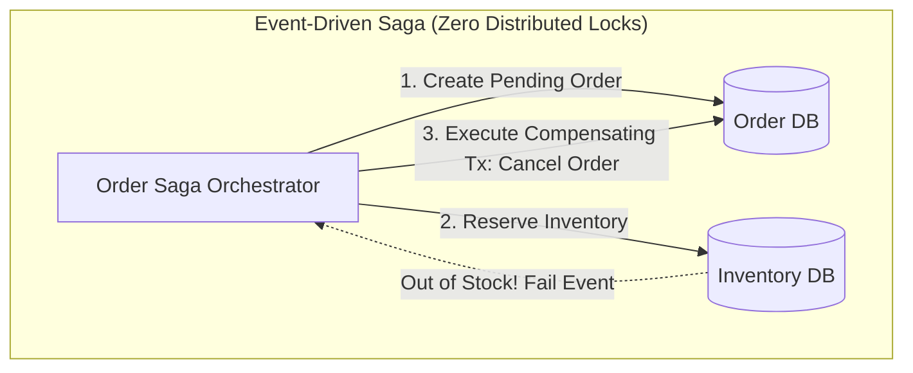

# Production Outage Post-Mortem 10: Distributed Deadlock in Two-Phase Commit (2PC)

> **Severity**: SEV-1 Outage
> **Impacted Domain**: Distributed Reliability & Fault Tolerance
> **Post-Mortem Framework**: Cause $\to$ Symptoms $\to$ Detection $\to$ Mitigation $\to$ Recovery $\to$ Prevention

---

## 1. Incident Summary
Two microservices executed distributed Two-Phase Commit (2PC) transactions locking resources across Order and Inventory databases in reverse order (Tx1: Order $\to$ Inventory; Tx2: Inventory $\to$ Order). Both transactions held exclusive locks and waited for each other indefinitely, locking up the database connection pool.

---

## 2. Root Cause Analysis
Inconsistent lock acquisition ordering across distributed transactions without global lock timeouts.

---

## 3. Symptoms & Blast Radius
- **Database Lock Contention**: All 500 database connection threads locked in `Waiting for Lock` state.
- **Total Checkout Outage**: 100% of e-commerce checkout transactions frozen.

---

## 4. Detection & Time to Detect (TTD)
- **Time to Detect (TTD)**: $3\text{ minutes}$ (Database lock wait timeout alarm).

---

## 5. Immediate Mitigation (Stop the Bleeding)
1. Killed blocking transaction sessions in PostgreSQL.
2. Disabled the synchronous 2PC coordinator.

---

## 6. Full Recovery & Time to Recovery (TTR)
- **Time to Recovery (TTR)**: $20\text{ minutes}$.

---

## 7. Architectural Prevention

- Replace synchronous Two-Phase Commit (2PC) with **Event-Driven Saga Pattern** with compensating transactions.
- If distributed locking is unavoidable, enforce a **Global Strict Resource Ordering** (always lock resource IDs in alphabetical/numerical order).

---

## 8. Code & Configuration Fix
```java
// Temporal / Saga Compensating Transaction
public class OrderSagaWorkflow {
    public void executeOrder(Order order) {
        try {
            orderService.createPendingOrder(order);
            inventoryService.reserveStock(order.getItems());
            paymentService.chargeCard(order.getAmount());
            orderService.markCompleted(order.getId());
        } catch (Exception e) {
            // Compensating Transaction: Roll back asynchronously
            inventoryService.releaseStock(order.getItems());
            orderService.cancelOrder(order.getId());
        }
    }
}
```

---

## 9. Key Lessons Learned
1. Distributed 2PC is fragile, unscalable, and prone to deadlocks.
2. Use the Saga Pattern with asynchronous compensating actions for cross-service workflows.
3. Always define strict lock acquisition order when locking multiple resources.
