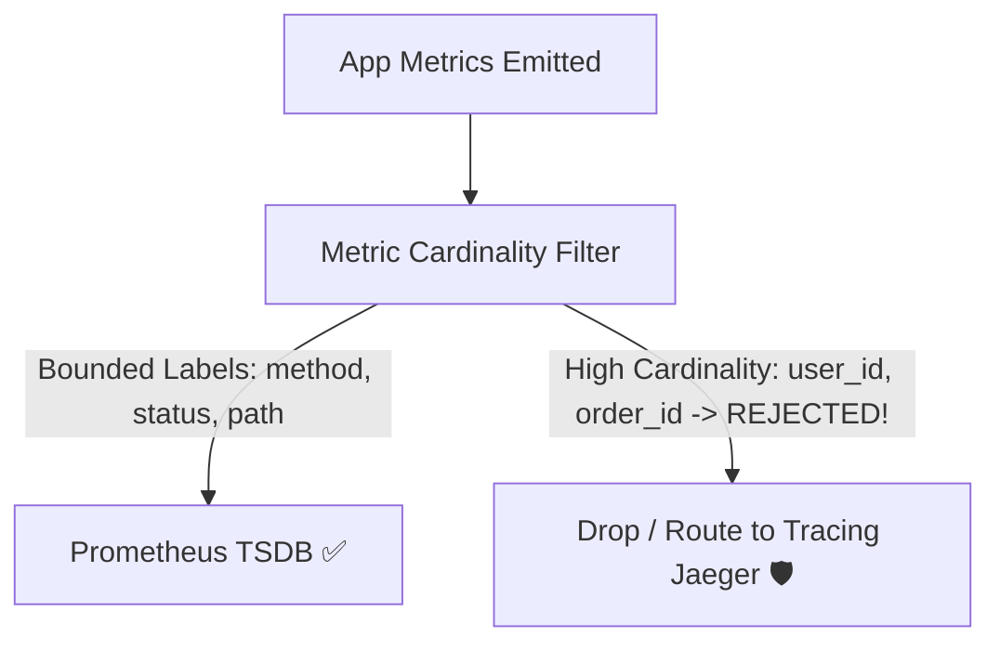

# Production Outage Post-Mortem 11: High-Cardinality Metric Explosion & Prometheus OOM

> **Severity**: SEV-1 Outage
> **Impacted Domain**: Distributed Reliability & Fault Tolerance
> **Post-Mortem Framework**: Cause $\to$ Symptoms $\to$ Detection $\to$ Mitigation $\to$ Recovery $\to$ Prevention

---

## 1. Incident Summary
A developer added the `user_id` (UUID) as a label to a Prometheus counter tracking API requests (`http_requests_total{user_id='uuid'}`). With 50 million active users, the time-series cardinality exploded from 1,000 to 50,000,000 series, causing Prometheus TSDB to exhaust all 128GB of RAM and crash in an OOM loop.

---

## 2. Root Cause Analysis
Injecting unbounded, high-cardinality dynamic strings (UUIDs, email addresses, order IDs) into metric labels.

---

## 3. Symptoms & Blast Radius
- **Monitoring Blindness**: Prometheus and Grafana dashboards went completely dark during peak traffic.
- **Alerting Disabled**: Alertmanager could not evaluate SLO alerts.

---

## 4. Detection & Time to Detect (TTD)
- **Time to Detect (TTD)**: $10\text{ minutes}$ (Prometheus instance crash alert).

---

## 5. Immediate Mitigation (Stop the Bleeding)
1. Rolled back the application deployment that introduced the `user_id` label.
2. Cleared Prometheus WAL and increased scrape drop rules.

---

## 6. Full Recovery & Time to Recovery (TTR)
- **Time to Recovery (TTR)**: $30\text{ minutes}$.

---

## 7. Architectural Prevention

- Strictly enforce **Low-Cardinality Metric Labels** (HTTP method, status code, bounded service name).
- Configure Prometheus scrape `metric_relabel_configs` to drop any label containing UUID regex patterns.
- Use distributed tracing (Jaeger/Zipkin) or structured logs (ClickHouse) for user-level tracking.

---

## 8. Code & Configuration Fix
```java
# Prometheus Scrape Configuration: Drop High-Cardinality Labels
scrape_configs:
  - job_name: 'spring-boot-app'
    metric_relabel_configs:
      - regex: 'user_id|order_id|email'
        action: labeldrop
```

---

## 9. Key Lessons Learned
1. Metric labels in TSDBs must have bounded cardinality ($< 1,000$ unique values).
2. Never use UUIDs or user IDs as Prometheus labels.
3. Use Distributed Traces for high-cardinality forensic debugging.
