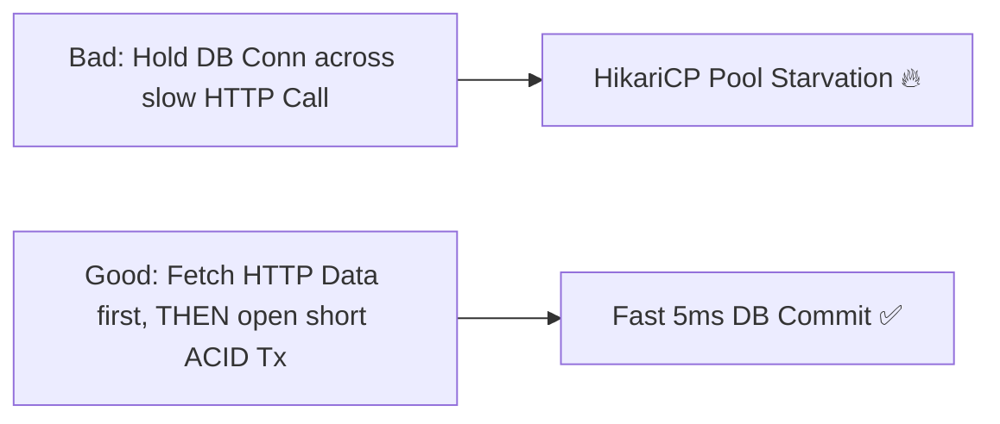

# Production Outage Post-Mortem 13: Nested DB Transactions & Connection Pool Deadlock

> **Severity**: SEV-1 Outage
> **Impacted Domain**: Distributed Reliability & Fault Tolerance
> **Post-Mortem Framework**: Cause $\to$ Symptoms $\to$ Detection $\to$ Mitigation $\to$ Recovery $\to$ Prevention

---

## 1. Incident Summary
A Spring Boot service opened an outer `@Transactional` database connection, executed a slow external HTTP API call, and then requested a second database connection from the same HikariCP pool. Under 50 concurrent requests, all 50 pool connections were held by outer transactions waiting for inner connections, causing total connection pool deadlock.

---

## 2. Root Cause Analysis
Holding database connections open across slow external network calls and requesting nested connections from the same thread pool.

---

## 3. Symptoms & Blast Radius
- **Connection Pool Starvation**: HikariCP threw `ConnectionTimeoutException: Connection is not available` on 100% of requests.
- **Service Freeze**: Application threads locked in `Waiting for Connection` state.

---

## 4. Detection & Time to Detect (TTD)
- **Time to Detect (TTD)**: $2\text{ minutes}$ (HikariCP pool acquisition timeout alert).

---

## 5. Immediate Mitigation (Stop the Bleeding)
1. Restarted application pods and scaled HikariCP pool size temporarily.

---

## 6. Full Recovery & Time to Recovery (TTR)
- **Time to Recovery (TTR)**: $15\text{ minutes}$.

---

## 7. Architectural Prevention

- **Never execute network I/O inside `@Transactional` blocks**.
- Keep database transactions as short as possible ($< 10\text{ms}$).
- Size connection pools using the Hikari formula: $\text{Pool Size} = (\text{Core Count} \times 2) + \text{Disk Spindle Count}$.

---

## 8. Code & Configuration Fix
```java
// Fix: Execute HTTP call outside Transactional boundary
public void processOrder(OrderRequest req) {
    // 1. Slow external HTTP call (Zero DB connections held!)
    PaymentResult result = paymentClient.charge(req.getAmount());

    // 2. Short, tight ACID transaction (holds DB conn for < 5ms)
    transactionTemplate.execute(status -> {
        return orderRepository.saveOrder(req, result);
    });
}
```

---

## 9. Key Lessons Learned
1. Never hold database connections open while waiting for external network RPCs.
2. Keep ACID transaction boundaries as narrow and fast as possible.
3. Monitor HikariCP connection wait time percentiles.
