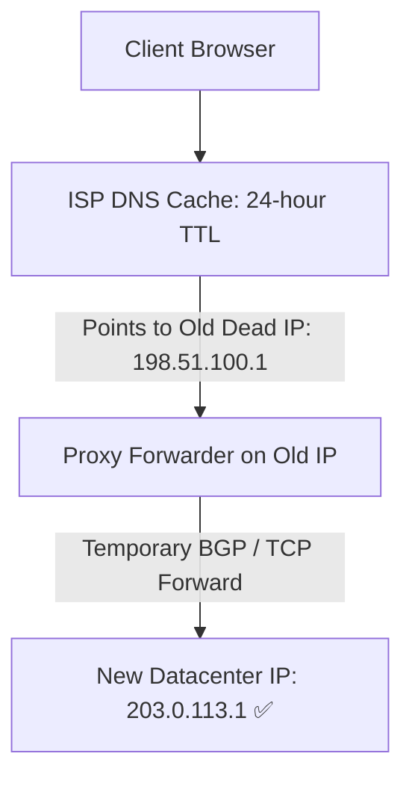

# Production Outage Post-Mortem 15: DNS TTL Misconfiguration & Traffic Black Hole

> **Severity**: SEV-1 Outage
> **Impacted Domain**: Distributed Reliability & Fault Tolerance
> **Post-Mortem Framework**: Cause $\to$ Symptoms $\to$ Detection $\to$ Mitigation $\to$ Recovery $\to$ Prevention

---

## 1. Incident Summary
During an emergency datacenter migration, engineers updated the DNS A-record to point to a new datacenter IP. However, the DNS record had a 24-hour TTL (`86400s`) configured. Global ISP recursive resolvers cached the old dead IP for 24 hours, sending $80\%$ of user traffic into a dead black hole.

---

## 2. Root Cause Analysis
Failing to reduce DNS TTL to 60 seconds days ahead of a planned IP migration.

---

## 3. Symptoms & Blast Radius
- **Traffic Black Hole**: $80\%$ of global users could not reach the platform for 24 hours.
- **Revenue Loss**: Millions in lost transactions during the 24-hour propagation window.

---

## 4. Detection & Time to Detect (TTD)
- **Time to Detect (TTD)**: $5\text{ minutes}$ (Ingress traffic drop alert).

---

## 5. Immediate Mitigation (Stop the Bleeding)
1. Quickly stood up a proxy forwarder at the old IP address to forward TCP traffic to the new datacenter IP.

---

## 6. Full Recovery & Time to Recovery (TTR)
- **Time to Recovery (TTR)**: $30\text{ minutes}$ (via proxy forwarder).

---

## 7. Architectural Prevention

- **Reduce DNS TTL to 60 seconds** at least 48 hours before any planned IP migration.
- Use **Anycast BGP Routing** or Cloud Load Balancers (Route 53 / Cloudflare) where the ingress IP remains permanent and traffic is steered internally.

---

## 8. Code & Configuration Fix
```java
# BIND Zone File Configuration: Short TTL
$TTL 60 ; 1-minute TTL for fast failover
@   IN  SOA ns1.example.com. admin.example.com. ( ... )
api IN  A   198.51.100.1
```

---

## 9. Key Lessons Learned
1. DNS TTL controls how long client resolvers cache IP addresses; high TTL prevents fast failovers.
2. Lower DNS TTLs to 60 seconds days before migrating production endpoints.
3. Keep old IP addresses active with TCP reverse proxies until all global caches expire.
