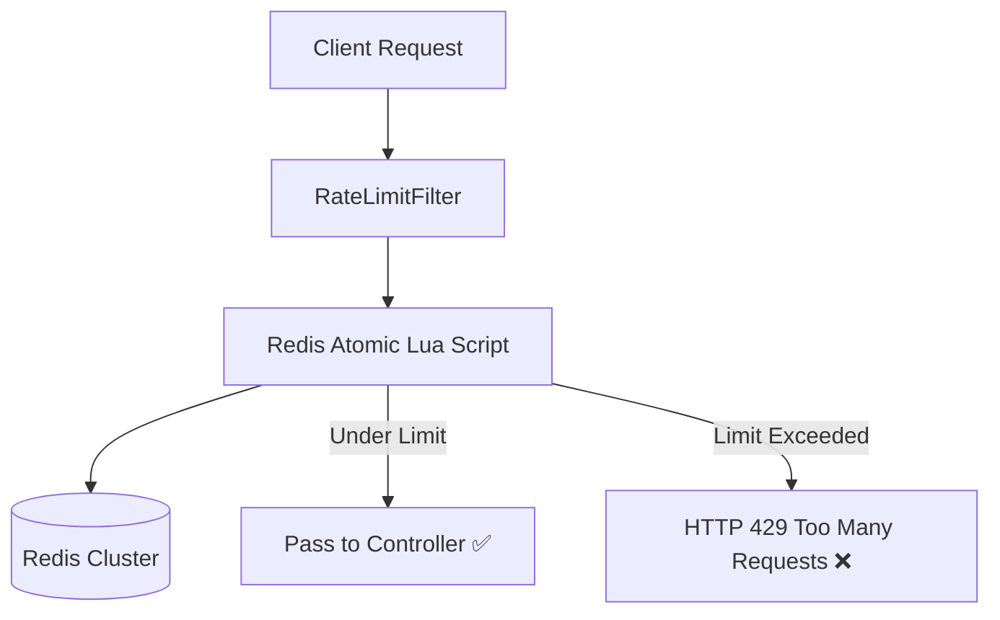

# Implementation 01: Distributed Rate Limiter (Redis & Lua)

A production-grade, distributed rate limiter built with **Java 21, Spring Boot 3.3, and Redis**. Implements both **Token Bucket** and **Sliding Window Counter** algorithms using atomic Redis Lua scripts to eliminate race conditions.

---

## 🏗️ Architecture



---

## 🚀 Key Files & Structure

```
01-distributed-rate-limiter/
├── pom.xml
├── docker-compose.yml
├── src/main/java/com/systemdesign/ratelimiter/
│   ├── RateLimiterApplication.java
│   ├── config/RedisConfig.java
│   ├── filter/RateLimitFilter.java
│   ├── service/SlidingWindowRateLimiter.java
│   └── controller/ApiController.java
└── src/main/resources/
    ├── application.yml
    └── scripts/sliding_window.lua
```

---

## 💻 Core Implementation (Sliding Window Redis Lua)

```lua
-- sliding_window.lua
local key = KEYS[1]
local now = tonumber(ARGV[1])
local window = tonumber(ARGV[2])
local limit = tonumber(ARGV[3])

local clearBefore = now - window
redis.call('ZREMRANGEBYSCORE', key, '-inf', clearBefore)
local currentRequests = redis.call('ZCARD', key)

if currentRequests < limit then
    redis.call('ZADD', key, now, now)
    redis.call('EXPIRE', key, math.ceil(window / 1000))
    return 1
else
    return 0
end
```

---

## 🏃 How to Run Locally

```bash
docker-compose up -d
mvn clean spring-boot:run
curl -i http://localhost:8080/api/v1/resource
```
