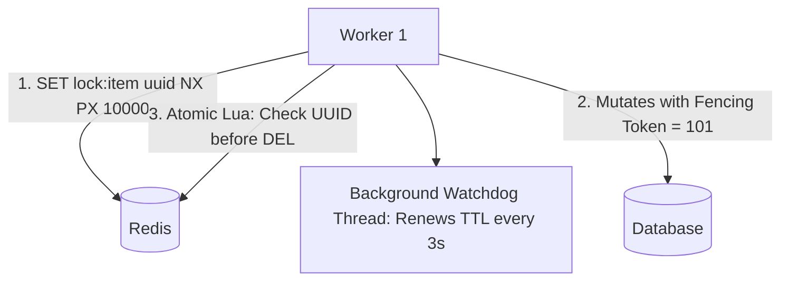

# Implementation 02: Distributed Lock Manager (Redlock & Fencing)

A robust, fault-tolerant distributed lock implementation using **Redis, Spring Boot 3, and Redisson/Jedis** with automatic background lease renewal (watchdog) and **Monotonic Fencing Tokens**.

---

## 🏗️ Architecture



---

## 💻 Core Implementation

```java
public class DistributedLock {
    private final JedisPool jedisPool;
    private static final String UNLOCK_LUA =
        "if redis.call('get', KEYS[1]) == ARGV[1] then " +
        "   return redis.call('del', KEYS[1]) " +
        "else " +
        "   return 0 " +
        "end";

    public boolean tryLock(String lockKey, String requestId, int expireTimeMs) {
        try (Jedis jedis = jedisPool.getResource()) {
            SetParams params = SetParams.setParams().nx().px(expireTimeMs);
            String result = jedis.set(lockKey, requestId, params);
            return "OK".equals(result);
        }
    }

    public boolean releaseLock(String lockKey, String requestId) {
        try (Jedis jedis = jedisPool.getResource()) {
            Object result = jedis.eval(UNLOCK_LUA, 1, lockKey, requestId);
            return Long.valueOf(1).equals(result);
        }
    }
}
```
