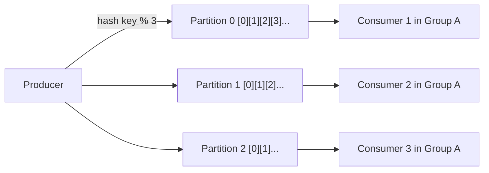

# Apache Kafka Architecture Cheat Sheet

## Key Invariants
- **Partitions**: Unit of parallelism in Kafka. Total active consumers in a consumer group $\le$ number of topic partitions.
- **Ordering**: Kafka guarantees strict chronological message order **only within a single partition**, not across partitions.
- **In-Sync Replicas (ISR)**: Follower replicas that are caught up with the leader. Set `min.insync.replicas = 2` and `acks = all` for zero data loss.
- **Zero-Copy I/O**: Reads directly from OS Page Cache to Network Socket via `sendfile()` bypassing user-space JVM memory.
