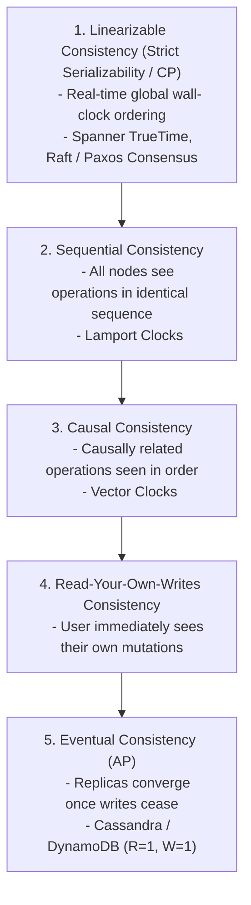

# Consistency Models Hierarchy

```mermaid
flowchart TD
    Linearizable["1. Linearizable Consistency (Strict Serializability / CP)
    - Real-time global wall-clock ordering
    - Spanner TrueTime, Raft / Paxos Consensus"]

    Sequential["2. Sequential Consistency
    - All nodes see operations in identical sequence
    - Lamport Clocks"]

    Causal["3. Causal Consistency
    - Causally related operations seen in order
    - Vector Clocks"]

    ReadAfterWrite["4. Read-Your-Own-Writes Consistency
    - User immediately sees their own mutations"]

    Eventual["5. Eventual Consistency (AP)
    - Replicas converge once writes cease
    - Cassandra / DynamoDB (R=1, W=1)"]

    Linearizable --> Sequential --> Causal --> ReadAfterWrite --> Eventual
```
