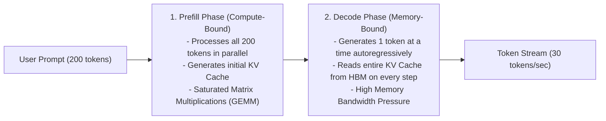

# LLM Inference Fundamentals: Prefill vs Decode Phases

Serving Large Language Models (LLMs) requires understanding the fundamental mechanical difference between how prompts are ingested and how tokens are generated.

---

## 1. The Two Inference Phases

---

## 2. Prefill Phase (Prompt Ingestion)
- **Nature**: **Compute-Bound** (Compute-to-Memory Ratio is high).
- The model ingests the entire prompt in parallel in a single forward pass.
- Highly efficient GPU Tensor Core utilization via large matrix multiplications ($\text{GEMM}$).
- Latency determines **Time to First Token (TTFT)**.

---

## 3. Decode Phase (Autoregressive Token Generation)
- **Nature**: **Memory Bandwidth-Bound** (Compute-to-Memory Ratio is extremely low $\approx 1$).
- Generates one token at a time: $y_t = f(y_{<t}, X)$.
- For every single generated token, the GPU must fetch all model weights (e.g. 140GB for 70B FP16 model) and all historical KV cache from High Bandwidth Memory (HBM) into SRAM.
- Hardware bottleneck is GPU **HBM Memory Bandwidth (TB/s)**, not TFLOPs!
- Latency determines **Inter-Token Latency (ITL)** / Tokens Per Second.
